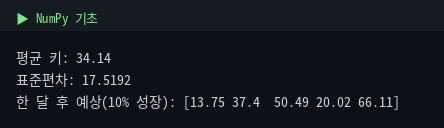
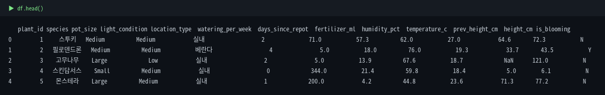
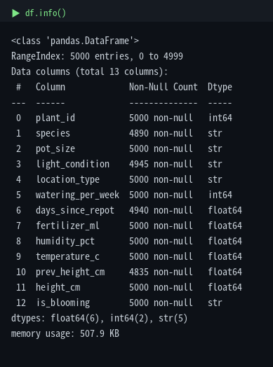
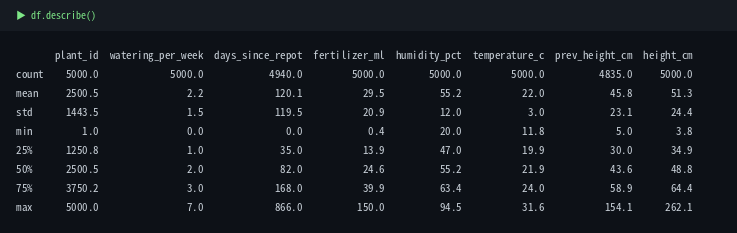
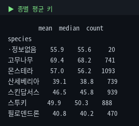
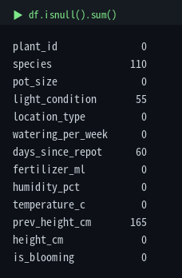

# 1. NumPy & Pandas 기초

실제 `plant_growth.csv`(5,000행)를 불러와서 코드와 실행 결과를 함께 봅니다.

::: warning 수치 기준
모든 수치는 원본 5,000행 기준입니다. 15행 [mini CSV](/data)로는 다른 숫자가 나옵니다.
:::

## 1-0. NumPy와 Pandas가 뭔가요?

본격적으로 코드를 보기 전에, 앞으로 계속 쓸 두 도구가 무엇인지부터 잡고 갑니다.

### NumPy — 숫자 계산의 토대


NumPy는 파이썬에서 **숫자 계산을 빠르게** 해주는 라이브러리입니다.  
핵심은 `ndarray`라는 자료구조 하나입니다 — 같은 타입의 숫자를 격자(배열)에 담아둔 것으로, 파이썬 기본 리스트와 비슷해 보이지만 결정적인 차이가 있습니다.

- **벡터 연산**: 배열 전체에 한 번에 계산이 적용됩니다. `arr * 1.1`이면 원소 하나하나를 반복문으로 돌지 않고 전부 곱해집니다.
- **속도**: 내부가 C로 구현돼 있어, 5,000개든 500만 개든 반복문보다 훨씬 빠릅니다.

한 줄로 요약하면, **NumPy = 숫자 배열 + 빠른 연산**입니다.

### Pandas — 표(table) 데이터 다루기


Pandas는 **NumPy 를 바탕으**, 엑셀 같은 표 데이터를 다루는 라이브러리입니다.  
핵심 자료구조는 두 가지입니다.

| 구조 | 차원 | 쉬운 비유 |
|---|---|---|
| `Series` | 1차원 | 엑셀의 한 **열** (이름표가 붙은 숫자 배열) |
| `DataFrame` | 2차원 | 엑셀 **시트 전체** (여러 Series가 모인 표) |

우리가 다루는 `plant_growth.csv`는 하나의 **DataFrame**입니다.  
그 안의 `height_cm` 열 하나는 **Series**입니다.  
그래서 보통 **NumPy가 계산의 바탕**이 되고, **Pandas는 그 위에서 표 데이터를 더 쉽게 다루게 해줍니다.**

::: tip 핵심
- **NumPy**의 핵심은 `ndarray`(숫자 배열), **Pandas**의 핵심은 `Series`(한 열)와 `DataFrame`(표 전체).
- DataFrame의 각 열은 Series로 이루어지며, Pandas는 보통 NumPy를 바탕으로 동작합니다.
- 덕분에 5,000행 데이터도 반복문 없이 한 줄로 평균 계산, 조건 필터링, 그룹별 집계를 할 수 있습니다.
:::

## 1-1. NumPy 기초 — Pandas의 토대

::: tip 핵심
`arr * 1.1`처럼 배열 전체에 스칼라를 곱하면 각 원소에 적용됩니다(브로드캐스팅). 반복문 없이 벡터 연산이 가능한 것이 NumPy와 Pandas의 핵심입니다.
:::

```python
import numpy as np

arr = np.array([12.5, 34.0, 45.9, 18.2, 60.1])  # 식물 5개 키(cm)
print('평균 키:', arr.mean())
print('표준편차:', arr.std())
print('한 달 후 예상 (10% 성장 가정):')
print(arr * 1.1)
```



## 1-2. 데이터 불러오기 & 첫 탐색

```python
import pandas as pd
df = pd.read_csv('plant_growth.csv')
df.head()
```



| 명령어 | 확인하는 것 |
|---|---|
| `df.head(n)` / `df.tail(n)` | 앞/뒤 n개 행 미리보기 |
| `df.shape` | (행, 열) 개수 |
| `df.info()` | 열별 자료형 + 결측치 현황 |
| `df.describe()` | 수치형 기술통계 요약 |

```python
df.info()
```



::: tip 여기서 결측치를 확인할 수 있다
`info()`의 Non-Null Count를 보면 `species`, `light_condition`, `days_since_repot`, `prev_height_cm`에 결측치가 있음을 바로 확인할 수 있습니다.
:::

```python
df.describe()
```



## 1-3. 인덱싱 — loc / iloc / Boolean

| 방식 | 기준 | 예시 |
|---|---|---|
| `df.loc[]` | 라벨 기준 | `df.loc[0, 'height_cm']` |
| `df.iloc[]` | 정수 위치 기준 | `df.iloc[0, 0]` |
| Boolean Indexing | 조건식 True인 행 | `df[df['height_cm'] > 50]` |

::: warning Pandas 조건식은 일반적인 if 조건식과 다릅니다
여러 조건을 합칠 때는 `and`/`or` 대신 **`&`(and) / `|`(or)**를 쓰고, 각 조건은 반드시 괄호로 감싸야 합니다.
:::

```python
# 몬스테라이면서 키 60cm 이상
tall = df[(df['species'] == '몬스테라') & (df['height_cm'] >= 60)]
```

## 1-4. 그룹화 — groupby

::: tip 핵심
`groupby().agg()`로 그룹별 통계를 한 번에 냅니다. 통합마스터가이드 3장의 "종별 평균이 다른가?"를 코드로 확인하는 셈입니다.
:::

```python
df.groupby('species')['height_cm'].agg(['mean', 'median', 'count'])
```



`'정보없음'`이 별도 그룹으로 잡히는 게 보입니다. 이건 NaN이 아니라 **결측을 나타내려고 따로 입력한 문자열**입니다. 즉, NaN과는 다른 **정제되지 않은 범주형 값**이며, 5장에서 NaN으로 통일합니다.

## 1-5. 결측치 확인 — isnull()

```python
df.isnull().sum()
```



```python
# 결측치 비율(%)
(df.isnull().sum() / len(df) * 100).round(2)

# 중앙값으로 채우기 (전처리는 5장에서 본격적으로)
df['prev_height_cm'] = df['prev_height_cm'].fillna(df['prev_height_cm'].median())
```

::: warning 채우기 전에 "왜 비었는지"부터
무조건 중앙값/평균으로 채우기 전에 근본 원인(측정 안 함 / 0을 결측처럼 입력함 / 수집 오류)을 먼저 확인하세요. 고장난 온도계를 고치지 않고 숫자만 채우는 것과 같을 수 있습니다.
:::

## 1-6. 그 외 자주 쓰는 것들

```python
# 정렬
df.sort_values('height_cm', ascending=False).head()

# 새 컬럼 (벡터 연산이 apply보다 빠름)
df['growth_rate'] = (df['height_cm'] - df['prev_height_cm']) / df['prev_height_cm']
# 주의: prev_height_cm이 0이거나 결측이면 무한대/NaN 발생

# 병합 / 저장
pd.merge(df_a, df_b, on='plant_id', how='left')
df.to_csv('processed.csv', index=False)
```

## ✅ 체크리스트

- `read_csv` 후 `head/info/describe`로 첫 탐색을 할 수 있다
- `loc`/`iloc`/Boolean Indexing의 차이를 설명할 수 있다
- `groupby().agg()`로 그룹별 통계를 낼 수 있다
- `isnull().sum()`으로 결측치를 확인할 수 있다
