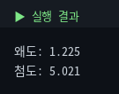
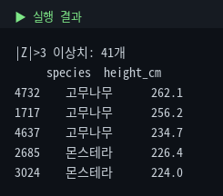
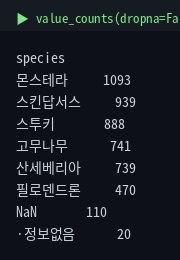

# 2. 기술통계를 코드로

통합마스터가이드 1장을 실제 코드로 옮깁니다. describe()가 뭘 계산하는지 수동 검증하고, IQR·Z-score로 이상치를 탐지하고, 텍스트형 가짜 결측치까지 잡아냅니다.

::: warning 수치 기준
모든 수치는 원본 5,000행 기준입니다.
:::

## 2-1. describe() — 한 방에 보기

::: tip 핵심
`describe()` 하나로 개수·평균·표준편차·사분위수를 전부 확인. **평균(51.28) > 중앙값(48.75)**이면 오른쪽으로 치우친 분포를 의심하라.
:::

```python
import pandas as pd
df = pd.read_csv('plant_growth.csv')
df['height_cm'].describe()
```


| 항목 | 의미 |
|---|---|
| count | 결측 제외 유효 개수 |
| mean / std | 평균 / 표준편차 |
| 25% / 50% / 75% | Q1 / 중앙값 / Q3 |

## 2-2. 수동 계산으로 검증

::: tip 핵심
라이브러리를 맹신하지 말고 같은 값을 직접 계산해 일치하는지 확인하는 습관.
:::

```python
mean = df['height_cm'].mean()
median = df['height_cm'].median()
std = df['height_cm'].std()
print(f'평균: {mean:.2f}')
print(f'중앙값: {median:.2f}')
print(f'표준편차: {std:.2f}')
print(f'평균 - 중앙값: {mean-median:.2f}')
```


평균-중앙값이 양수(+2.53)라는 건 소수의 큰 값이 평균을 끌어올렸다는 뜻 — 오른쪽 꼬리(양의 왜도) 가능성을 시사합니다.

## 2-3. 왜도 · 첨도

::: tip 핵심
`skew()`가 크면(대략 1.5) 한쪽으로 치우친 분포. 회귀 전 로그 변환 고려 신호. (단 왜도 해석 기준은 절대적 규칙이 아니라 분야에 따라 다름)
:::

```python
skew = df['height_cm'].skew()
kurt = df['height_cm'].kurt()
print(f'왜도(skewness): {skew:.3f}')
print(f'첨도(kurtosis): {kurt:.3f}')
```



## 2-4. 이상치 탐지 ① IQR

::: tip 핵심
`Q1-1.5×IQR` ~ `Q3+1.5×IQR` 범위 밖이 이상치 후보. 여기선 95개(1.90%).
:::

```python
Q1 = df['height_cm'].quantile(0.25)
Q3 = df['height_cm'].quantile(0.75)
IQR = Q3 - Q1
lower, upper = Q1 - 1.5*IQR, Q3 + 1.5*IQR
outliers = df[(df['height_cm'] < lower) | (df['height_cm'] > upper)]
print(f'정상범위: {lower:.1f} ~ {upper:.1f}')
print(f'이상치: {len(outliers)}개')
```


::: warning 무작정 삭제 금지
종마다 정상 크기가 다르므로, 잡힌 95개 중 상당수는 원래 크게 자라는 고무나무·몬스테라일 수 있습니다. `groupby('species')`로 종별로 나눠 보는 게 더 정확합니다.
:::

## 2-5. 이상치 탐지 ② Z-score

```python
from scipy import stats
z = stats.zscore(df['height_cm'], nan_policy='omit')
z_outliers = df[abs(z) > 3]
print(f'|Z|>3 이상치: {len(z_outliers)}개')
```



::: warning 표준편차 0 주의
Z-score는 표준편차로 나누므로, 모든 값이 동일해 std가 0이면 에러가 납니다. 적용 전 `df[col].std() == 0` 확인 습관을.
:::

IQR과 Z-score 비교: IQR은 중앙값 기반이라 극단치 영향을 덜 받고, Z-score는 평균·표준편차 기반이라 왜도 있는 분포에서 왜곡될 수 있습니다. 우리처럼 왜도 있는 데이터엔 **IQR이 더 안전**합니다. 이 "가정이 깨지면 덜 의존하는 방법으로" 원칙은 4장에서 Welch 보정으로 다시 나옵니다.

## 2-6. 결측치 비율 & 가짜 결측치

```python
(df.isnull().mean() * 100).round(2)   # 결측 비율(%)
```


::: tip 핵심
`isnull()`은 진짜 NaN만 잡는다. `'·정보없음'` 같은 문자열 위장 결측치는 `value_counts()`로만 발견된다.
:::

```python
df['species'].value_counts(dropna=False)
```



```python
# 발견한 가짜 결측치를 진짜 NaN으로 통일 (여러 형태 한번에)
import numpy as np
df['species'] = df['species'].replace(['·정보없음', 'Unknown', '-', ''], np.nan)
```

## ✅ 체크리스트

- `describe()` 각 항목의 의미를 설명할 수 있다
- `skew()`로 분포의 치우침을 확인할 수 있다
- IQR과 Z-score 두 방식으로 이상치를 탐지하고 언제 뭘 쓸지 안다
- `isnull()`이 못 잡는 텍스트형 결측치를 `value_counts()`로 찾아낼 수 있다
