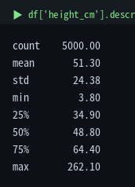
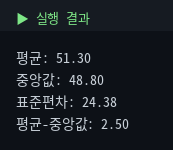
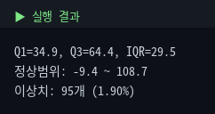
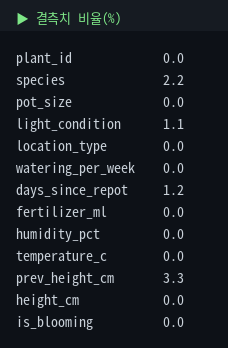

# 2. 기술통계를 코드로

통합마스터가이드 1장을 실제 코드로 옮깁니다. describe()가 뭘 계산하는지 수동 검증하고, IQR·Z-score로 이상치를 탐지하고, 텍스트형 가짜 결측치까지 잡아냅니다.

::: warning 수치 기준
모든 수치는 원본 5,000행 기준입니다.
:::

## 2-1. describe() — 한 방에 보기

::: tip 핵심
`describe()` 하나로 개수·평균·표준편차·사분위수를 한 번에 확인할 수 있습니다. **평균(51.28) > 중앙값(48.75)**이면 오른쪽으로 치우친 분포를 의심할 수 있습니다.
:::

```python
import pandas as pd
df = pd.read_csv('plant_growth.csv')
df['height_cm'].describe()
```



| 항목 | 의미 |
|---|---|
| count | 결측 제외 유효 개수 |
| mean / std | 평균 / 표준편차 |
| 25% / 50% / 75% | Q1 / 중앙값 / Q3 |

## 2-2. 수동 계산으로 검증

::: tip 핵심
라이브러리 결과를 그대로 넘기지 말고, 같은 값을 직접 계산해 일치하는지 확인하는 습관이 중요합니다.
:::

```python
mean = df['height_cm'].mean()
median = df['height_cm'].median()
std = df['height_cm'].std()
print(f'평균: {mean:.2f}')
print(f'중앙값: {median:.2f}')
print(f'표준편차: {std:.2f}')
print(f'평균 - 중앙값: {mean-median:.2f}')
```



평균 - 중앙값이 양수(+2.53)라는 것은 소수의 큰 값이 평균을 끌어올렸다는 뜻입니다. 즉, 오른쪽 꼬리(양의 왜도) 가능성을 시사합니다.

## 2-3. 왜도 · 첨도

::: tip 핵심
`skew()` 값이 **0보다 크면 오른쪽으로**, **0보다 작으면 왼쪽으로** 치우친 분포입니다. 값의 절대값이 클수록 치우침이 더 크다고 볼 수 있습니다.  
이 데이터처럼 왜도가 큰 경우에는 회귀 분석 전에 로그 변환을 검토할 수 있습니다. 단, 왜도 해석 기준은 절대적인 규칙이 아니라 분야와 맥락에 따라 달라집니다.
:::

```python
skew = df['height_cm'].skew()
kurt = df['height_cm'].kurt()
print(f'왜도(skewness): {skew:.3f}')
print(f'첨도(kurtosis): {kurt:.3f}')
```


## 2-4. 이상치 탐지 ① IQR

::: tip 핵심
IQR 방법은 **`Q1 - 1.5×IQR` ~ `Q3 + 1.5×IQR`** 범위를 벗어난 값을 이상치 **후보**로 봅니다. 이 데이터에서는 95개(1.90%)가 해당합니다.
:::

```python
Q1 = df['height_cm'].quantile(0.25)
Q3 = df['height_cm'].quantile(0.75)
IQR = Q3 - Q1
lower, upper = Q1 - 1.5*IQR, Q3 + 1.5*IQR
outliers = df[(df['height_cm'] < lower) | (df['height_cm'] > upper)]
print(f'정상범위: {lower:.1f} ~ {upper:.1f}')
print(f'이상치: {len(outliers)}개')
```



::: warning 무작정 삭제하지 말 것
식물은 종마다 정상적인 크기 범위가 다릅니다. 따라서 잡힌 95개 중에는 실제 이상치가 아니라, 원래 크게 자라는 고무나무나 몬스테라가 포함될 수 있습니다.  
더 정확하게 보려면 `groupby('species')`로 종별 기준을 따로 확인하는 것이 좋습니다.
:::

## 2-5. 이상치 탐지 ② Z-score

```python
from scipy import stats
z = stats.zscore(df['height_cm'], nan_policy='omit')
z_outliers = df[abs(z) > 3]
print(f'|Z|>3 이상치: {len(z_outliers)}개')
```


::: warning 표준편차가 0이면 계산 불가
Z-score는 표준편차로 나누는 방식이므로, 모든 값이 같아 표준편차가 0이면 계산할 수 없습니다. 적용 전에 `df[col].std() == 0`인지 확인하는 습관이 중요합니다.
:::

IQR과 Z-score는 기준이 다릅니다.  
IQR은 중앙값과 사분위수를 사용하므로 극단값의 영향을 덜 받고, Z-score는 평균과 표준편차를 사용하므로 왜도가 큰 분포에서는 왜곡될 수 있습니다.  
따라서 지금처럼 왜도가 있는 데이터에서는 **IQR이 더 안전한 선택**입니다. 이런 “가정이 덜 필요한 방법을 우선 고려한다”는 원칙은 4장의 Welch 보정에서도 다시 등장합니다.

## 2-6. 결측치 비율 & 가짜 결측치

```python
(df.isnull().mean() * 100).round(2)   # 결측 비율(%)
```



::: tip 핵심
`isnull()`은 **진짜 결측치(NaN)**만 잡습니다.  
반면 `'·정보없음'`, `'Unknown'`, `'-'`, `''`처럼 **문자열로 입력된 가짜 결측치**는 잡지 못하므로 `value_counts()` 같은 방법으로 따로 확인해야 합니다.
:::

```python
df['species'].value_counts(dropna=False)
```


```python
# 발견한 가짜 결측치를 진짜 NaN으로 통일
import numpy as np
df['species'] = df['species'].replace(['·정보없음', 'Unknown', '-', ''], np.nan)
```

## ✅ 체크리스트

- `describe()` 각 항목의 의미를 설명할 수 있다
- `skew()`로 분포의 치우침을 확인할 수 있다
- IQR과 Z-score 두 방식으로 이상치를 탐지하고 언제 뭘 쓸지 안다
- `isnull()`이 못 잡는 텍스트형 결측치를 `value_counts()`로 찾아낼 수 있다
