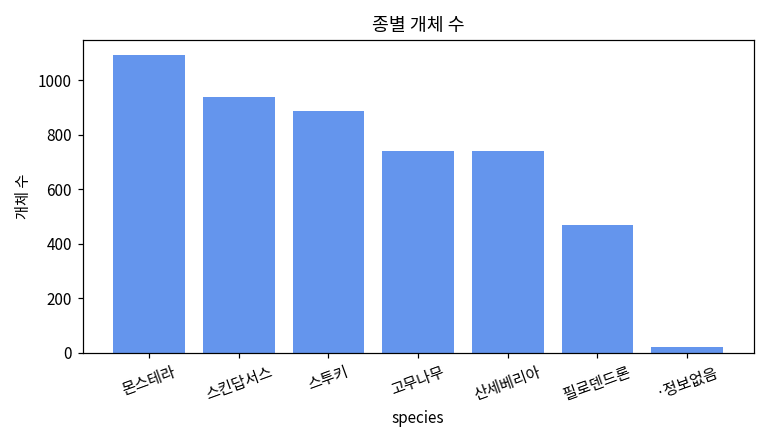
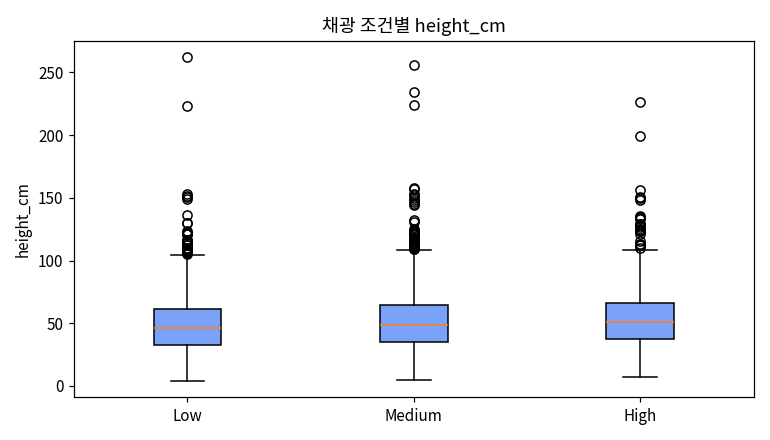
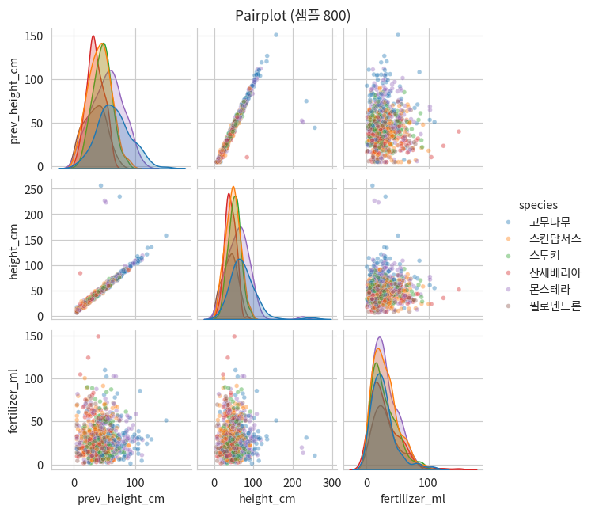

# 3. 시각화 — Matplotlib → Seaborn

통합 마스터가이드 2장의 개념을 실제 코드와 차트로 옮깁니다. 모든 차트는 `plant_growth.csv`로 그렸습니다.

::: warning 수치 기준
모든 차트는 원본 5,000행 기준입니다. 특히 mini CSV는 `is_blooming='Y'`가 1개뿐이라 아래 그룹 비교는 재현되지 않습니다.
:::

## 3-0. Matplotlib과 Seaborn이 뭔가요?

앞으로 사용할 두 시각화 도구가 무엇이고 어떻게 다른지부터 먼저 정리하겠습니다.

### Matplotlib — 파이썬 시각화의 토대

Matplotlib은 파이썬에서 **가장 기본이 되는 시각화 라이브러리**입니다.  
선 그래프, 막대그래프, 산점도, 히스토그램처럼 거의 모든 차트를 그릴 수 있고,
축, 색, 글꼴, 눈금까지 **세밀하게 직접 제어**할 수 있습니다.  
대신 그만큼 코드가 길어질 수 있습니다.

핵심 구조는 두 가지입니다.

| 구성 | 역할 | 비유 |
|---|---|---|
| `Figure` (`fig`) | 전체 그림이 놓이는 틀 | 도화지 |
| `Axes` (`ax`) | 실제 그래프가 그려지는 좌표축 | 도화지 위의 그래프 한 칸 |

그래서 많은 코드가 `fig, ax = plt.subplots()`로 시작합니다.

### Seaborn — 통계 시각화를 짧게

Seaborn은 **Matplotlib 위에 만들어진** 라이브러리입니다.  
통계 그래프를 더 적은 코드로 그릴 수 있고, `DataFrame`과 컬럼명을 그대로 넘겨서
사용할 수 있습니다. 또한 그룹별 색 구분(`hue`), 회귀선, 분포 추정 같은 기능도
기본으로 갖추고 있습니다.

### 언제 무엇을 쓰나

| | Matplotlib | Seaborn |
|---|---|---|
| 성격 | 저수준(low-level), 세부 요소를 직접 제어 | 고수준(high-level), 통계 그래프에 특화 |
| 입력 | 배열·리스트 위주 | `DataFrame` + 컬럼명 |
| 그룹 색 구분 | 반복문 등으로 직접 지정 | `hue='컬럼명'` 한 줄 |
| 코드량 | 많음(완전 제어) | 적음(빠른 탐색) |
| 추천 | 발표용 맞춤 그래프 | 탐색적 데이터 분석(EDA) |

::: tip 핵심
- **Matplotlib = 도화지(`fig`)와 좌표축(`ax`)을 직접 다루는 기본 도구**
- **Seaborn = Matplotlib 위에서 통계 그래프를 짧게 그리는 도구**
- Seaborn으로 그린 그래프도 결국 Matplotlib 축(`ax`) 위에 그려지므로, 세부 조정은 Matplotlib으로 이어서 할 수 있습니다.
:::

## 3-1. Matplotlib 기초 — fig, ax

::: tip 핵심
Matplotlib은 `fig`(도화지)와 `ax`(그 위 좌표축)를 나눠 다룹니다. 아래 골격이 매번 반복됩니다.
:::

```python
import matplotlib.pyplot as plt

# 종별 개체 수 세기
counts = df['species'].value_counts()

fig, ax = plt.subplots(figsize=(7, 4))          # 1) 도화지와 축을 만든다
ax.bar(counts.index, counts.values, color='cornflowerblue')  # 2) 막대를 그린다
ax.set_title('종별 개체 수')                     # 3) 제목과 축 이름을 붙인다
ax.set_xlabel('species')
ax.set_ylabel('개체 수')
```



몬스테라가 가장 많고 필로덴드론이 가장 적습니다. 오른쪽 끝의 작은 `·정보없음` 막대는 2장에서 본 **문자열로 들어간 가짜 결측치**로, 실제 품종이 아니라 정제 대상입니다.  
`fig → ax → 그리기 → 꾸미기` 이 네 단계가 모든 Matplotlib 코드의 기본 뼈대입니다.

## 3-2. 기본 차트 — 히스토그램 / 박스플롯 / 산점도

어떤 차트를 언제 쓰나: **선=흐름, 막대=범주별 크기, 히스토그램=값 분포, 박스플롯=중앙값·퍼짐·이상치, 산점도=두 변수 관계.**

```python
# 히스토그램 — 분포 모양
fig, ax = plt.subplots(figsize=(7,4))
ax.hist(df['height_cm'].dropna(), bins=40)
ax.set_title('height_cm 분포')
ax.set_xlabel('height_cm')
ax.set_ylabel('개체 수')      # 빈도(count)
plt.show()
```


30~70cm 구간에 대부분이 몰려 있고, 오른쪽으로 긴 꼬리가 이어집니다.  
이는 소수의 매우 큰 개체가 분포의 오른쪽 꼬리를 만든다는 뜻이며, 2장에서 확인한 **양의 왜도(평균 51.30 > 중앙값 48.80)**의 시각적 근거입니다.  
분포가 한쪽으로 치우쳐 있으므로, 대푯값으로는 평균보다 중앙값을 함께 보는 것이 더 안전합니다.

```python
# 박스플롯 — 채광 조건별 분포
groups = [df[df['light_condition'] == l]['height_cm'].dropna()
          for l in ['Low', 'Medium', 'High']]

fig, ax = plt.subplots(figsize=(7, 4))
ax.boxplot(groups, tick_labels=['Low', 'Medium', 'High'])
ax.set_title('채광 조건별 height_cm 분포')
ax.set_xlabel('light_condition')
ax.set_ylabel('height_cm')
plt.show()
```



박스는 Q1~Q3(가운데 50%), 박스 안 선은 중앙값, 수염 밖의 점은 이상치 후보입니다.  
채광(Low·Medium·High) 그룹 간 중앙값이 크게 다르지 않다면 "빛 조건만으로 키가 크게 갈리지는 않는다"는 신호입니다.  
다만 이 시각적 인상이 **통계적으로 유의한지**는 눈으로 단정할 수 없고, 4장의 그룹 비교 검정(분산분석)에서 확인합니다.

::: warning 버전 주의
`tick_labels` 인자는 Matplotlib 버전에 따라 이름이 다를 수 있습니다.
구버전에서는 `labels`를 사용합니다.
:::

```python
# 산점도 — 이전 키 vs 현재 키
fig, ax = plt.subplots(figsize=(7, 4))
ax.scatter(df['prev_height_cm'], df['height_cm'], alpha=0.3)
ax.set_title('prev_height_cm vs height_cm')
ax.set_xlabel('prev_height_cm')
ax.set_ylabel('height_cm')
plt.show()
```


거의 직선에 가까운 강한 양의 상관으로 보입니다. 정확한 상관계수는 4장에서 `pearsonr()`로 계산합니다(스포일러: r≈0.95).
점들이 좁은 띠를 이루며 하나의 직선을 따라간다는 것은 **선형 예측이 잘 통한다**는 뜻입니다. 그래서 이 `prev_height_cm`은 6장 회귀에서 키를 예측하는 가장 강력한 변수가 됩니다.

## 3-3. Seaborn — boxplot + hue

::: tip 핵심
`hue=`로 두 범주형 변수를 동시에 비교. 종(x축) 안에서 다시 개화여부로 색을 나눕니다.
:::

```python
import seaborn as sns
sns.boxplot(data=df, x='species', y='height_cm', hue='is_blooming')
```


대부분의 종에서 개화(Y) 개체의 중앙값이 더 높게 보입니다. 다만 그룹별 표본 수가 다르므로, 이 시각적 인상이 통계적으로 유의한지는 4장에서 검정으로 확인합니다.

통계적으로 주의할 점은 종마다 개화(Y) 개체 수가 다르다는 것입니다.  
표본 수가 다르면 눈에 보이는 중앙값 차이가 **우연일 가능성**도 함께 커지므로, 이 차이가 진짜인지는 4장의 그룹 비교 검정으로 확인해야 합니다.

## 3-4. Seaborn — heatmap (상관계수)

```python
num_cols = ['watering_per_week','fertilizer_ml','humidity_pct','temperature_c','prev_height_cm','height_cm']
sns.heatmap(df[num_cols].corr(), annot=True, fmt='.2f', cmap='RdBu_r', vmin=-1, vmax=1)
```


`prev_height_cm ↔ height_cm`(0.95)가 압도적으로 강하고, 나머지는 대체로 약한 상관입니다.  
대각선은 자기 자신과의 상관이라 항상 1.00입니다. `prev_height_cm ↔ height_cm`(0.95)를 빼면 나머지는 대부분 |상관| < 0.1로 약합니다. 즉 **키를 선형으로 예측할 단서가 사실상 '이전 키' 하나뿐**이라는 뜻이고, 이것이 6장에서 단순 선형회귀가 의외로 강한 이유로 이어집니다.

## 3-5. Seaborn — pairplot

```python
sub = df[['prev_height_cm','height_cm','fertilizer_ml','species']].dropna()
sns.pairplot(sub, hue='species', plot_kws={'alpha':0.4})
```



대각선엔 각 변수의 단변량 분포(버전/옵션에 따라 히스토그램 또는 KDE, `diag_kind='kde'`로 지정 가능), 나머지 칸엔 산점도. 처음 데이터를 받으면 가장 먼저 돌려볼 "한눈에 훑기" 명령어입니다.  
`hue='species'`로 색을 나누면 **어떤 종이 어느 크기 구간에 몰려 있는지**까지 한눈에 보여, 첫 EDA에서 분포·관계·군집·이상치를 동시에 훑는 용도로 씁니다.

::: warning
변수가 많으면(6개 이상) 칸이 급증해 느려집니다. 핵심 3~5개만 추리세요.
:::

## ✅ 체크리스트

- `fig, ax` 패턴으로 기본 차트를 그릴 수 있다
- Matplotlib과 Seaborn을 언제 각각 쓰는지 안다
- `hue=`로 그룹별 비교 시각화를 만들 수 있다
- `heatmap`·`pairplot`으로 여러 변수를 빠르게 탐색할 수 있다
