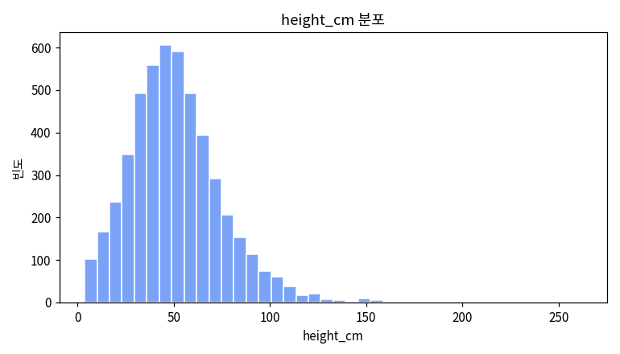
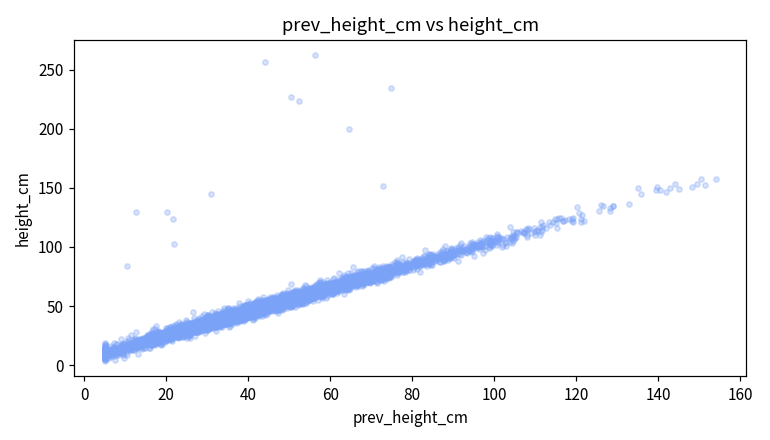
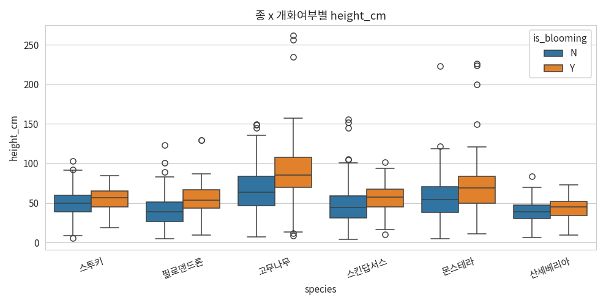
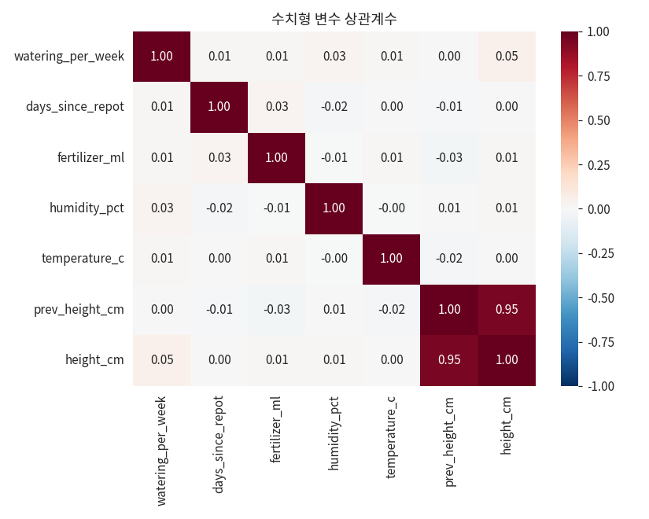

# 3. 시각화 — Matplotlib → Seaborn

통합마스터가이드 2장을 실제 코드+차트로 옮깁니다. 모든 차트는 `plant_growth.csv`로 그렸습니다.

::: warning 수치 기준
모든 차트는 원본 5,000행 기준입니다. 특히 mini CSV는 `is_blooming='Y'`가 1개뿐이라 아래 그룹 비교는 재현되지 않습니다.
:::

## 3-1. Matplotlib 기초 — fig, ax

::: tip 핵심
Matplotlib은 `fig`(도화지)와 `ax`(그 위 좌표축)를 나눠 다룹니다. 아래 골격이 매번 반복됩니다.
:::

```python
import matplotlib.pyplot as plt
fig, ax = plt.subplots(figsize=(7,4))
ax.plot(x, y)
ax.set_title('제목'); ax.set_xlabel('x'); ax.set_ylabel('y')
plt.show()
```

## 3-2. 기본 차트 — 히스토그램 / 박스플롯 / 산점도

어떤 차트를 언제 쓰나: **선=흐름, 막대=범주별 크기, 히스토그램=값 분포, 박스플롯=중앙값·퍼짐·이상치, 산점도=두 변수 관계.**

```python
# 히스토그램 — 분포 모양
fig, ax = plt.subplots(figsize=(7,4))
ax.hist(df['height_cm'].dropna(), bins=40)
ax.set_title('height_cm 분포')
```



```python
# 박스플롯 — 채광 조건별 분포
groups = [df[df['light_condition']==l]['height_cm'].dropna() for l in ['Low','Medium','High']]
ax.boxplot(groups, tick_labels=['Low','Medium','High'])
```


::: warning 버전 주의
`tick_labels` 인자는 Matplotlib 버전에 따라 이름이 다릅니다(구버전은 `labels`).
:::

```python
# 산점도 — 이전 키 vs 현재 키
ax.scatter(df['prev_height_cm'], df['height_cm'], alpha=0.3)
```



거의 직선에 가까운 강한 양의 상관으로 보입니다. 정확한 상관계수는 4장에서 `pearsonr()`로 계산합니다(스포일러: r≈0.95).

## 3-3. Matplotlib vs Seaborn

| | Matplotlib | Seaborn |
|---|---|---|
| 장점 | 세밀한 완전 커스터마이징 | 통계 시각화를 적은 코드로 |
| hue(그룹 색상) | 직접 반복문 | `hue='컬럼'` 한 줄 |
| 추천 | 발표자료 맞춤 | 탐색적 분석(EDA) |

## 3-4. Seaborn — boxplot + hue

::: tip 핵심
`hue=`로 두 범주형 변수를 동시에 비교. 종(x축) 안에서 다시 개화여부로 색을 나눕니다.
:::

```python
import seaborn as sns
sns.boxplot(data=df, x='species', y='height_cm', hue='is_blooming')
```



대부분의 종에서 개화(Y) 개체의 중앙값이 더 높게 보입니다. 다만 그룹별 표본 수가 다르므로, 이 시각적 인상이 통계적으로 유의한지는 4장에서 검정으로 확인합니다.

## 3-5. Seaborn — heatmap (상관계수)

```python
num_cols = ['watering_per_week','fertilizer_ml','humidity_pct','temperature_c','prev_height_cm','height_cm']
sns.heatmap(df[num_cols].corr(), annot=True, fmt='.2f', cmap='RdBu_r', vmin=-1, vmax=1)
```



`prev_height_cm ↔ height_cm`(0.95)가 압도적으로 강하고, 나머지는 대체로 약한 상관입니다.

## 3-6. Seaborn — pairplot

```python
sub = df[['prev_height_cm','height_cm','fertilizer_ml','species']].dropna()
sns.pairplot(sub, hue='species', plot_kws={'alpha':0.4})
```


대각선엔 각 변수의 단변량 분포(버전/옵션에 따라 히스토그램 또는 KDE, `diag_kind='kde'`로 지정 가능), 나머지 칸엔 산점도. 처음 데이터를 받으면 가장 먼저 돌려볼 "한눈에 훑기" 명령어입니다.

::: warning
변수가 많으면(6개 이상) 칸이 급증해 느려집니다. 핵심 3~5개만 추리세요.
:::

## ✅ 체크리스트

- `fig, ax` 패턴으로 기본 차트를 그릴 수 있다
- Matplotlib과 Seaborn을 언제 각각 쓰는지 안다
- `hue=`로 그룹별 비교 시각화를 만들 수 있다
- `heatmap`·`pairplot`으로 여러 변수를 빠르게 탐색할 수 있다
