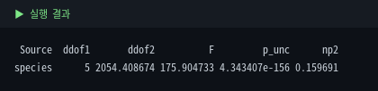
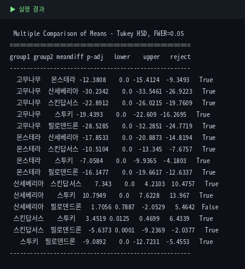
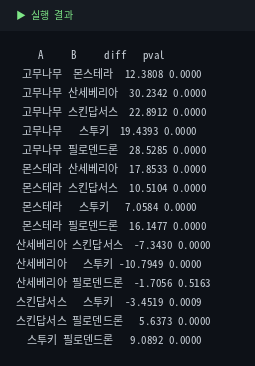

# 4. 통계 검정 — SciPy / statsmodels

모듈 2에서는 이상치와 분포를, 모듈 3에서는 "개화한 개체가 더 커 보인다"는 인상을 **시각적으로** 확인했습니다.  
하지만 눈으로 본 차이가 **실제로 존재하는 차이인지, 아니면 우연히 그렇게 보인 것인지**는 그래프만으로 단정할 수 없습니다.

통계 검정은 바로 이 질문에 답하는 도구입니다.  
즉, "이 차이가 우연만으로 설명 가능한가?"를 수치로 판단합니다.  
이 모듈은 기초통계 9장에서 배운 **가설검정과 p-value** 개념을 실제 `plant_growth.csv`에 적용하는 과정입니다.

각 절은 **① 개념(무엇을·왜·언제) → ② 코드 → ③ 결과 해석** 순서로 진행합니다.

::: warning 수치 기준
모든 검정 결과는 원본 5,000행 기준입니다.  
mini CSV는 표본이 너무 작아(특히 `is_blooming='Y'`가 1개뿐이라) 같은 결과가 재현되지 않습니다.
:::

## 4-1. 정규성 (Shapiro-Wilk)

::: tip 정규성 검정이란?
데이터가 **정규분포(종 모양)를 따르는지** 확인하는 검정입니다.

**왜 확인하나요?** t-검정·ANOVA 같은 많은 검정은 정규성 가정을 바탕으로 만들어졌습니다.  
따라서 본 검정에 들어가기 전에 이 가정이 **어느 정도 성립하는지 먼저 확인**해 두는 것입니다.

**언제 하나요?** 그룹 비교나 평균 검정을 하기 직전, 준비 단계로 실행합니다.

기초통계 6장에서 본 정규분포 개념을 바탕으로, 여기서는 먼저 전체 `height_cm` 분포가 그 모양에 가까운지 **탐색적으로 점검**합니다.
:::

```python
from scipy import stats

# height_cm에서 결측치를 제거한 뒤, 500개만 무작위 추출합니다.
# - Shapiro-Wilk 검정은 표본이 너무 크면 아주 작은 비정규성에도 민감하게 반응할 수 있습니다.
# - random_state=1은 실행할 때마다 같은 표본이 뽑히도록 고정하는 설정입니다.
sample = df['height_cm'].dropna().sample(500, random_state=1)

# Shapiro-Wilk 정규성 검정을 수행합니다.
# - stat: 검정통계량
# - p: p-value
stat, p = stats.shapiro(sample)

# 결과를 소수점 자리수에 맞춰 출력합니다.
# 보통 p-value < 0.05이면 "정규분포를 따른다"는 가정을 기각합니다.
print(f'통계량={stat:.4f}, p-value={p:.6f}')
```


**결과 해석:** p-value가 유의수준(0.05)보다 훨씬 작으므로 "정규분포를 따른다"는 가정을 **기각**합니다. 즉 `height_cm`은 정규분포가 아니며, 이는 모듈 2·3에서 이미 본 **오른쪽으로 치우친 분포(양의 왜도)**와 일치하는 결과입니다.

::: details 더 깊이 — Shapiro의 표본 크기 함정과 대처법
**왜 500개만 뽑았나요?** Shapiro-Wilk는 표본이 크면(수천 개) 아주 미세한 비정규성에도 극단적으로 작은 p를 내놓습니다. 5,000개 전부 넣으면 "무조건 비정규"로 나오기 쉬워, 여기서는 500개만 무작위로 뽑아 검정했습니다.

**숫자만 믿지 마세요.** 검정 수치와 함께 **히스토그램·Q-Q 플롯**으로 눈으로도 확인하는 것이 좋습니다.(체온계로 재고 얼굴색도 같이 보는 것)

**정규분포가 아니면 어떻게 하나요?** 두 가지 길이 있습니다.
- 표본이 크면 **중심극한정리** 덕분에 t-검정·ANOVA가 비정규에도 비교적 견고합니다(그래서 이 모듈은 계속 진행합니다).
- 표본이 작고 비정규가 심하면 **비모수 검정**(Mann-Whitney U, Kruskal-Wallis)을 대안으로 씁니다.
:::

## 4-2. 등분산성 (Levene)

::: tip 등분산성 검정이란?
여러 그룹의 **분산(퍼짐 정도)이 서로 같은지** 확인하는 검정입니다.

**무엇으로 검정하나요?** 여기서는 **Levene(레빈) 검정**을 사용합니다. 여러 그룹의 분산이 같다는 것을 귀무가설로 두고, 이를 통계적으로 확인하는 방법입니다. p-value가 작으면(<0.05) "분산이 모두 같다"를 기각합니다 — 즉 **그룹마다 퍼짐이 다르다**고 봅니다.

**왜 확인하나요?** 뒤에 나올 t-검정·ANOVA는 "비교하는 그룹들의 분산이 같다"는 가정 위에 만들어졌습니다. 이 가정이 깨지면 검정 결과가 왜곡될 수 있어, 본 검정 전에 미리 확인합니다.

**언제 하나요?** 두 개 이상 그룹의 평균을 비교하기 직전에, 정규성 검정과 함께 준비 단계로 실행합니다.

기초통계 5장에서 배운 **분산·표준편차**를, 이제 "종마다 **퍼짐 정도가 비슷한가?**"라는 질문으로 바꿔 검사하는 셈입니다.
:::

```python
from scipy import stats

# 종(species)별로 height_cm를 나눠 리스트로 모읍니다.
# - 앞 절과 같은 전처리 기준을 적용한 데이터(df_clean)를 사용합니다.
# - 각 원소는 한 종의 키 값들(Series)입니다.
groups = [df_clean[df_clean['species'] == s]['height_cm'].dropna()
          for s in df_clean['species'].unique()]

# Levene 등분산 검정: 그룹들의 분산이 같은지 확인합니다.
# - stat: 검정통계량, p: p-value
stat, p = stats.levene(*groups)

# p-value < 0.05이면 "분산이 모두 같다"는 가정을 기각합니다(= 그룹마다 퍼짐이 다름).
print(f'통계량={stat:.4f}, p-value={p:.6f}')
print('등분산 가정 기각 -> Welch 필요' if p < 0.05 else '등분산 가정 유지')
```

::: details 이 코드 자세히 보기 — 종별로 키를 나눠 담기
`stats.levene`는 "그룹별 값 묶음들"을 각각 받아야 합니다. 그래서 종마다 키를 따로 담은 리스트를 먼저 만듭니다.

```python
# 종(species)별로 height_cm 값을 따로 모아 리스트로 만듭니다.
# 이 한 줄은 아래 for문을 짧게 줄여 쓴 것입니다(리스트 컴프리헨션).
#
#   groups = []
#   for s in df_clean['species'].unique():        # 종 이름을 하나씩 (스투키, 몬스테라, ...)
#       one = df_clean[df_clean['species'] == s]  # 그 종의 행만 골라내고
#       groups.append(one['height_cm'].dropna())  # 그 종의 키(결측 제외)를 리스트에 담는다
groups = [df_clean[df_clean['species'] == s]['height_cm'].dropna()
          for s in df_clean['species'].unique()]
```
**안쪽부터 바깥으로 분해하면:**

1. `df_clean['species'].unique()` — 데이터에 있는 **종 이름을 중복 없이** 뽑습니다(스투키·필로덴드론·고무나무·스킨답서스·몬스테라·산세베리아, 6종).
2. `df_clean['species'] == s` — 각 행이 그 종인지 **True/False**로 표시합니다(2장에서 본 Boolean 인덱싱).
3. `df_clean[ ... ]` — True인 행, 즉 **그 종의 개체만** 골라냅니다.
4. `['height_cm'].dropna()` — 그 종의 **키 열만, 결측치는 제외**하고 가져옵니다.

이 과정을 6개 종에 대해 반복해 **길이 6짜리 리스트**를 만듭니다. 각 원소는 한 종의 키 값 묶음입니다(예: 몬스테라 1,093개, 필로덴드론 470개).

마지막으로 `stats.levene(*groups)`의 `*`는 이 리스트를 **낱개 인자로 풀어서** 넘긴다는 뜻입니다 — `levene(그룹1, 그룹2, …, 그룹6)`처럼 6개를 각각 전달합니다.
:::


**결과 해석:** p-value가 사실상 0에 가까우므로 "분산이 모두 같다"는 가정을 **기각**합니다.  
즉 종마다 키의 퍼짐 정도가 다르며, 따라서 다음 단계의 그룹 비교에서는 **등분산을 가정하지 않는 방법**을 사용해야 합니다.

::: tip Welch 보정이란? (여기서 처음 나오는 용어)
t-검정·ANOVA는 기본적으로 "그룹들의 분산이 같다"는 가정을 바탕으로 합니다.  
방금 그 가정이 깨졌으므로, **분산이 다를 수 있음을 반영해 자유도를 보정하는 방법**이 Welch 방식입니다.

- **두 그룹 비교**에서는 Welch t-검정(`stats.ttest_ind(..., equal_var=False)`)을 사용합니다.
- **세 그룹 이상 비교**에서는 Welch ANOVA처럼 등분산을 가정하지 않는 방법을 사용합니다.
:::

::: details 더 깊이 — Levene 검정은 어떻게 분산을 비교하나
**아이디어:** 각 값이 자기 그룹의 중앙값(또는 평균)에서 **얼마나 떨어져 있는지**(절대편차)를 구한 뒤, 그 편차들의 평균이 그룹 간에 다른지를 검정합니다. 편차가 큰 그룹은 더 넓게 퍼진 그룹이므로, "편차의 평균 차이 = 퍼짐의 차이"를 보는 셈입니다.

**왜 Bartlett이 아니라 Levene인가요?** 등분산 검정에는 Bartlett도 있지만, Bartlett은 데이터가 정규분포일 때만 신뢰할 수 있습니다. 4-1에서 이미 정규성이 깨진 걸 확인했으므로, **비정규 데이터에도 견고한 Levene**가 더 안전합니다. (SciPy `stats.levene`은 기본적으로 중앙값 기준으로 계산해 이상치에도 강합니다.)

**등분산이 깨지면 반드시 문제인가요?** 아닙니다. "가정이 깨졌다"는 사실을 알고 그에 맞는 방법(Welch)으로 바꾸는 것이 핵심입니다.
:::

## 4-3. 독립표본 t-검정

::: tip 독립표본 t-검정이란?
서로 **독립된 두 그룹의 평균이 통계적으로 다른지** 확인하는 검정입니다. '독립표본'은 두 그룹이 서로 다른 개체로 이루어졌다(짝지어지지 않았다)는 뜻입니다.

**왜 하나요?** Module 3에서 개화(Y) 개체가 더 커 보였습니다. 그 평균 차이가 **진짜인지, 우연인지**는 그래프로 단정할 수 없어 검정으로 확인합니다.

**언제 하나요?** 독립된 **두 그룹**의 평균을 비교할 때 씁니다. 그룹이 셋 이상이면 4-4의 ANOVA로 넘어갑니다.

기초통계 9장의 가설검정을 처음으로 적용하는 사례입니다: 귀무가설은 "두 그룹의 평균이 같다"이고, p-value가 작으면 이를 기각합니다.
:::

4-1에서 정규성은 완벽하지 않았지만, 표본 수가 충분하므로 t-검정을 적용합니다.  
다만 4-2에서 등분산 가정이 깨졌으므로 `equal_var=False`로 **Welch t-검정**을 사용합니다.

```python
from scipy import stats

# 개화 여부(is_blooming)로 두 독립 그룹을 나눕니다.
# - 'Y' = 개화한 개체
# - 'N' = 개화하지 않은 개체
# - height_cm만 사용하며 결측치는 제거합니다.
y_group = df[df['is_blooming'] == 'Y']['height_cm'].dropna()
n_group = df[df['is_blooming'] == 'N']['height_cm'].dropna()

# 독립표본 t-검정(Welch)
# - 두 그룹의 평균이 같은지 검정합니다.
# - equal_var=False: 등분산을 가정하지 않는 Welch 보정 옵션
# - t: 검정통계량
# - p: p-value
t, p = stats.ttest_ind(y_group, n_group, equal_var=False)

print(f'Y그룹 평균: {y_group.mean():.2f} (n={len(y_group)})')
print(f'N그룹 평균: {n_group.mean():.2f} (n={len(n_group)})')
print(f't={t:.3f}, p-value={p:.2e}')
```


```
**결과 해석:** Y그룹 평균이 N그룹 평균보다 더 큽니다.  
p-value가 매우 작으므로, "두 그룹의 평균이 같다"는 귀무가설을 **기각**합니다.  
즉 개화 여부에 따라 키 평균이 **유의하게 다르다**고 볼 수 있습니다.

단, 이는 **평균 차이의 존재**를 보여줄 뿐이며, 곧바로 인과관계를 뜻하지는 않습니다.
```

이어서 **효과크기**를 확인합니다.

```
p-value는 "차이가 우연인지"만 알려줄 뿐, "차이가 얼마나 큰지"는 말해주지 않습니다.
그래서 효과크기(Cohen's d)를 함께 봅니다.
```


::: details Cohen's d를 직접 계산하기
```python
import numpy as np

# Cohen's d
# - 두 그룹 평균 차이를 표준편차 단위로 나타내는 효과크기입니다.
# - 값이 클수록 두 그룹 차이가 더 큽니다.
def cohens_d(a, b):
    na, nb = len(a), len(b)

    # 각 그룹의 표준편차(ddof=1: 표본표준편차)
    sa = a.std(ddof=1)
    sb = b.std(ddof=1)

    # 합동 표준편차(pooled standard deviation)
    pooled = np.sqrt(((na - 1) * sa**2 + (nb - 1) * sb**2) / (na + nb - 2))

    # 평균 차이 ÷ 합동 표준편차
    return (a.mean() - b.mean()) / pooled

print(f"Cohen's d = {cohens_d(y_group, n_group):.3f}")
```
:::

**결과 해석:** Cohen's d=0.739로 개화 여부에 따른 키 차이는 **중간~큰 효과**입니다. (이미지에 함께 나온 eta-squared=0.160은 4-4에서 다룰 **종→키**의 효과크기, Cramer's V=0.107은 4-6에서 다룰 **종×개화 연관**의 크기이니, 각 절에서 다시 설명합니다.) p-value가 극도로 작아도 Cramer's V가 낮다는 점은 "**표본이 크면 약한 연관도 유의해진다**"는 좋은 예입니다 — p는 '차이가 있나', 효과크기는 '그 차이가 실질적으로 큰가'를 따로 알려줍니다.

::: details 더 깊이 — Cohen's d 해석 기준과, 정규성이 깨졌는데 왜 t-검정을 쓰나
**Cohen's d 대략 기준:** 0.2 작은 효과 · 0.5 중간 · 0.8 큰 효과. 0.739는 중간과 큰 효과의 사이입니다(절대 규칙은 아니고 분야마다 다름).

**정규성이 깨졌는데 t-검정을 써도 되나요?** 표본이 충분히 크면 **중심극한정리** 덕분에 "표본 평균의 분포"가 정규분포에 가까워집니다. 그래서 원자료가 다소 비정규여도 t-검정이 비교적 견고하게 작동합니다. 표본이 작고 비정규가 심하면 비모수 검정(Mann-Whitney U)을 대안으로 씁니다.

**pooled std가 뭔가요?** 두 그룹의 표준편차를 표본 크기로 가중평균해 하나의 공통 퍼짐 척도로 합친 값입니다. 평균 차이를 이 값으로 나눠, "차이가 표준편차 몇 개 분량인지"를 단위 없는 숫자로 만듭니다.
:::

## 4-4. ANOVA — 종에 따라 다른가

::: tip ANOVA(분산분석)란?
**셋 이상의 그룹**의 평균이 서로 같은지 한 번에 검정하는 방법입니다.

**왜 하나요?** 4-3의 t-검정은 두 그룹 전용입니다. 종은 6개나 되는데, "종에 따라 키가 다른가?"를 확인하려면 세 그룹 이상을 동시에 비교할 도구가 필요합니다.

**왜 t-검정을 여러 번 하면 안 되나요?** 쌍마다 t-검정을 반복하면(6종이면 15쌍) 우연히 유의하게 나올 확률이 쌓여 **거짓 양성**이 늘어납니다. ANOVA는 이를 한 번의 검정으로 통제합니다.

이름은 '분산분석'이지만 실제로 비교하는 것은 **평균**입니다 — 그룹 간 차이를 그룹 내 퍼짐과 견주어 판단하기 때문에 분산이라는 말이 붙었습니다.
:::

```python
from scipy import stats

# 4-2에서 만든 groups(종별 height_cm 리스트)를 그대로 사용합니다.
# 일원배치 ANOVA: 여러 그룹의 평균이 모두 같은지 한 번에 검정합니다.
# - f: F통계량, p: p-value
f, p = stats.f_oneway(*groups)

# p-value < 0.05이면 "모든 종의 평균이 같다"를 기각합니다(= 적어도 한 종은 다름).
print(f'F통계량={f:.3f}, p-value={p:.2e}')
```


**결과 해석:** F통계량=184.870, p-value=9.94e-181로, "모든 종의 키 평균이 같다"는 가정을 강하게 **기각**합니다. 즉 종에 따라 키가 유의하게 다릅니다. 다만 ANOVA는 "적어도 한 쌍은 다르다"까지만 말해줄 뿐, **어느 종끼리 다른지**는 알려주지 않습니다(→ 4-5 사후검정).

효과크기(eta-squared)도 함께 봅니다. 4-3에서 이미지에 나왔던 값입니다.

**eta-squared = 0.160** — 전체 키의 변동 중 약 16%가 "종 차이"로 설명된다는 뜻입니다. 통상 0.01/0.06/0.14를 작음/중간/큼의 대략 기준으로 보므로, 0.160은 **큰 효과**에 해당합니다.

이어서 Welch ANOVA입니다. 4-2에서 등분산이 깨졌으니 더 엄밀한 버전을 함께 씁니다.

::: warning 등분산이 깨졌으니 Welch's ANOVA도
`f_oneway`는 "그룹들의 분산이 같다"를 가정하는 ANOVA입니다. 4-2에서 그 가정이 깨졌으므로, 등분산을 가정하지 않는 **Welch's ANOVA**를 함께 확인하는 것이 안전합니다(4-3에서 t-검정에 Welch 보정을 쓴 것과 같은 이유).
:::

```python
import pingouin as pg

# Welch's ANOVA: 등분산을 가정하지 않는 분산분석.
# - dv: 종속변수(키), between: 그룹 구분(종)
pg.welch_anova(data=df_clean, dv='height_cm', between='species')
```



**결과 해석:** Welch's ANOVA도 F=175.90, p=4.34e-156으로 같은 결론입니다 — 종에 따라 키가 유의하게 다릅니다. `np2`(부분 eta-squared)=0.160도 앞의 효과크기와 일치합니다. 표본이 커서 두 방법의 결론이 같았지만, 표본이 작거나 분산 차이가 극단적이면 결과가 갈릴 수 있어 **처음부터 Welch를 쓰는 습관**이 안전합니다.

::: details 더 깊이 — F통계량이 뭔가, eta-squared는 어떻게 읽나
**F통계량의 직관:** F = (그룹 사이의 차이) ÷ (그룹 안의 퍼짐)입니다. 그룹 간 평균 차이가 그룹 내 잡음보다 훨씬 크면 F가 커지고, 그만큼 "우연으로 보기 어렵다"가 됩니다.

**eta-squared 대략 기준:** 0.01 작음 · 0.06 중간 · 0.14 큼. 0.160은 큰 효과이지만, 뒤집어 보면 키 변동의 84%는 종이 아닌 다른 요인(이전 키 등)으로 설명된다는 뜻이기도 합니다.

**f_oneway vs welch_anova:** 전자는 등분산 가정, 후자는 미가정. 가정이 깨졌을 때 후자가 더 신뢰할 만합니다.
:::

## 4-5. 사후검정 — Tukey HSD & Games-Howell

ANOVA는 "적어도 한 쌍은 다르다"까지만. 어느 쌍인지는 사후검정으로:

```python
from statsmodels.stats.multicomp import pairwise_tukeyhsd
pairwise_tukeyhsd(df_clean['height_cm'], df_clean['species'], alpha=0.05)
```



::: warning Tukey도 등분산 가정
등분산이 깨졌으면 Games-Howell(등분산 미가정)을 함께 확인하는 게 안전합니다.
:::

```python
pg.pairwise_gameshowell(data=df_clean, dv='height_cm', between='species')
```



15쌍 중 14쌍이 유의하고, 산세베리아-필로덴드론만 유의하지 않습니다(원래 평균이 비슷하게 설계됨).

## 4-6. 카이제곱 — 범주형 × 범주형

```python
ct = pd.crosstab(df_clean['species'], df_clean['is_blooming'])
chi2, p, dof, expected = stats.chi2_contingency(ct)
```


::: warning 기대빈도 주의
각 칸의 기대빈도가 너무 작으면(5 미만) 불안정합니다. 작은 표본에선 `stats.fisher_exact()`(2x2) 같은 정확검정을 고려하세요.
:::

## 4-7. 상관계수 — Pearson vs Spearman

```python
stats.pearsonr(sub['prev_height_cm'], sub['height_cm'])
stats.spearmanr(sub['prev_height_cm'], sub['height_cm'])
```


Pearson은 직선 관계, Spearman은 단조 관계(꼭 직선 아니어도 한쪽 커질 때 다른 쪽도 커지는지)를 봅니다. 둘 다 높고 비슷하다는 건 관계가 강하고 순위·선형 기준 모두 일관되게 증가한다는 뜻입니다.

## 4-8. 다중회귀 + VIF

```python
import statsmodels.api as sm
from statsmodels.stats.outliers_influence import variance_inflation_factor
X = df_clean[['prev_height_cm','watering_per_week','fertilizer_ml']].dropna()
model = sm.OLS(y, sm.add_constant(X)).fit()
```


::: warning 범주형은 더미변수로, VIF만 보면 끝 아님
`species` 같은 범주형을 회귀에 넣으려면 `pd.get_dummies(drop_first=True)`로 더미화해야 합니다. 또 VIF(다중공선성) 외에 잔차 진단(잔차 vs 예측값, Q-Q plot, Breusch-Pagan)도 실전에선 필요합니다.
:::

## 4-9. 검정 방법 치트시트

| 상황 | 함수 |
|---|---|
| 정규성 | `stats.shapiro(x)` |
| 등분산성 | `stats.levene(g1, g2, ...)` |
| 두 그룹 평균 | `stats.ttest_ind(g1, g2, equal_var=...)` |
| 세 그룹+ 평균 | `stats.f_oneway(...)` / `pg.welch_anova(...)` |
| 사후검정 | `pairwise_tukeyhsd(...)` / `pg.pairwise_gameshowell(...)` |
| 범주형×범주형 | `stats.chi2_contingency(교차표)` |
| 상관 | `stats.pearsonr` / `stats.spearmanr` |
| 다중회귀 | `sm.OLS(y, sm.add_constant(X)).fit()` |

## 4-10. 종합 결론

| 단계 | 결과 | 의미 |
|---|---|---|
| 정규성 | 기각 | 비정규 (오른쪽 왜도) |
| 등분산성 | 기각 | 종마다 분산 다름 → Welch |
| t-검정 | p=9.33e-35 | 개화 여부로 키 유의하게 다름 |
| ANOVA | p≈0 | 종에 따라 키 유의하게 다름 |
| Tukey/GH | 14/15쌍 유의 | 거의 모든 종이 구분됨 |
| 카이제곱 | p=9.10e-11 | 종·개화 연관 있음 |
| 상관 | r≈0.95 | prev_height_cm이 예측에 특히 중요 |
| 회귀+VIF | VIF<5 | 다중공선성 없이 안정적 |

::: tip 다음 모듈로
"prev_height_cm이 강력한 예측 변수"는 Module 6 회귀에서 재등장하고, "종·개화 연관성"은 분류 모델의 힌트가 됩니다.
:::
