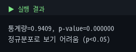
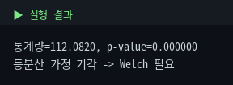
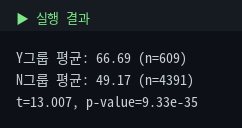
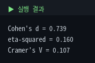
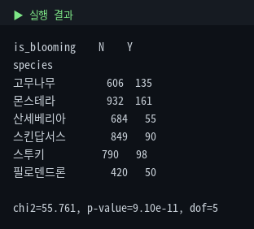
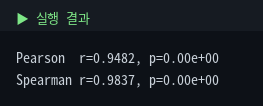
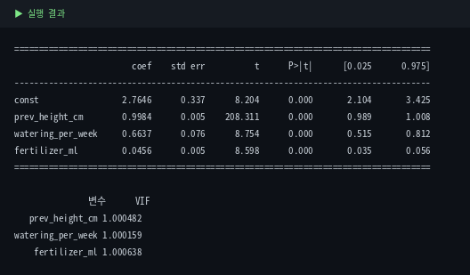

# 4. 통계 검정 — SciPy / statsmodels

통합마스터가이드 3장(집단비교)·4장(상관/인과)을 코드로 옮깁니다. Module 3에서 발견한 "개화 개체가 더 큰 것 같다"를 실제로 검정하는 것으로 시작합니다.

::: warning 수치 기준
모든 검정 결과는 원본 5,000행 기준입니다. mini CSV는 표본이 너무 작아(특히 `is_blooming='Y'`가 1개) 재현 불가합니다.
:::

## 4-1. 정규성 (Shapiro-Wilk)

```python
from scipy import stats
sample = df['height_cm'].dropna().sample(500, random_state=1)
stat, p = stats.shapiro(sample)
print(f'통계량={stat:.4f}, p-value={p:.6f}')
```



::: warning 표본 크기 주의
Shapiro는 표본이 크면 미세한 비정규성에도 극단적으로 작은 p가 나옵니다. 그래서 500개만 뽑아 검정했습니다. 숫자 검정과 함께 히스토그램·Q-Q plot으로 눈으로도 확인하는 게 좋습니다(체온계 + 얼굴색 보기).
:::

## 4-2. 등분산성 (Levene)

```python
groups = [df_clean[df_clean['species']==s]['height_cm'] for s in df_clean['species'].unique()]
stat, p = stats.levene(*groups)
```



::: tip Welch 보정이란? (여기서 처음 나오는 용어)
t-검정·ANOVA는 원래 "그룹들의 분산이 같다"는 가정 위에 만들어졌습니다. 방금 그 가정이 깨졌으니, **분산이 다르다는 걸 인정한 채 자유도를 보정**하는 게 Welch 보정입니다. 사용법은 옵션 하나: `stats.ttest_ind(..., equal_var=False)`.
:::

## 4-3. 독립표본 t-검정

정규성은 깨졌지만 표본이 커서 t-검정 자체는 견고합니다. 등분산이 깨졌으니 `equal_var=False`로 Welch 보정 적용:

```python
y_group = df[df['is_blooming']=='Y']['height_cm'].dropna()
n_group = df[df['is_blooming']=='N']['height_cm'].dropna()
t, p = stats.ttest_ind(y_group, n_group, equal_var=False)
```



::: tip 결과 해석
Y그룹(66.69) vs N그룹(49.17), p=9.33e-35. 귀무가설 하에서 이런 차이가 우연히 나올 가능성이 극도로 낮다는 뜻입니다. 단 이건 **연관성·평균 차이**일 뿐 "개화가 키를 키운다"는 인과가 아닙니다 — 둘 다 좋은 채광 같은 다른 요인의 결과일 수 있습니다.
:::

효과크기까지 함께 봅니다 (p-value는 "우연인지"만, 효과크기는 "얼마나 큰지"):

```python
def cohens_d(a, b):
    na, nb = len(a), len(b)
    pooled = np.sqrt(((na-1)*a.std()**2 + (nb-1)*b.std()**2) / (na+nb-2))
    return (a.mean() - b.mean()) / pooled
```



Cohen's d=0.739 (중간~큰 효과), eta-squared=0.160 (큰 효과), Cramer's V=0.107 (약한 연관). PR-value가 작아도 Cramer's V가 낮다는 건 "표본이 크면 약한 연관도 유의해진다"는 좋은 예시입니다.

## 4-4. ANOVA — 종에 따라 다른가

```python
f, p = stats.f_oneway(*groups)
```


::: warning 등분산 깨졌으니 Welch's ANOVA도
`f_oneway`는 등분산 가정 ANOVA입니다. 4-2에서 가정이 깨졌으므로 더 엄밀하게는 Welch's ANOVA를 씁니다.
:::

```python
import pingouin as pg
pg.welch_anova(data=df_clean, dv='height_cm', between='species')
```


표본이 커서 두 방법의 결론(종 간 유의한 차이)은 같았지만, 표본이 작거나 분산 차이가 극단적이면 결과가 갈릴 수 있어 처음부터 Welch를 쓰는 습관이 안전합니다.

## 4-5. 사후검정 — Tukey HSD & Games-Howell

ANOVA는 "적어도 한 쌍은 다르다"까지만. 어느 쌍인지는 사후검정으로:

```python
from statsmodels.stats.multicomp import pairwise_tukeyhsd
pairwise_tukeyhsd(df_clean['height_cm'], df_clean['species'], alpha=0.05)
```


::: warning Tukey도 등분산 가정
등분산이 깨졌으면 Games-Howell(등분산 미가정)을 함께 확인하는 게 안전합니다.
:::

```python
pg.pairwise_gameshowell(data=df_clean, dv='height_cm', between='species')
```


15쌍 중 14쌍이 유의하고, 산세베리아-필로덴드론만 유의하지 않습니다(원래 평균이 비슷하게 설계됨).

## 4-6. 카이제곱 — 범주형 × 범주형

```python
ct = pd.crosstab(df_clean['species'], df_clean['is_blooming'])
chi2, p, dof, expected = stats.chi2_contingency(ct)
```



::: warning 기대빈도 주의
각 칸의 기대빈도가 너무 작으면(5 미만) 불안정합니다. 작은 표본에선 `stats.fisher_exact()`(2x2) 같은 정확검정을 고려하세요.
:::

## 4-7. 상관계수 — Pearson vs Spearman

```python
stats.pearsonr(sub['prev_height_cm'], sub['height_cm'])
stats.spearmanr(sub['prev_height_cm'], sub['height_cm'])
```



Pearson은 직선 관계, Spearman은 단조 관계(꼭 직선 아니어도 한쪽 커질 때 다른 쪽도 커지는지)를 봅니다. 둘 다 높고 비슷하다는 건 관계가 강하고 순위·선형 기준 모두 일관되게 증가한다는 뜻입니다.

## 4-8. 다중회귀 + VIF

```python
import statsmodels.api as sm
from statsmodels.stats.outliers_influence import variance_inflation_factor
X = df_clean[['prev_height_cm','watering_per_week','fertilizer_ml']].dropna()
model = sm.OLS(y, sm.add_constant(X)).fit()
```



::: warning 범주형은 더미변수로, VIF만 보면 끝 아님
`species` 같은 범주형을 회귀에 넣으려면 `pd.get_dummies(drop_first=True)`로 더미화해야 합니다. 또 VIF(다중공선성) 외에 잔차 진단(잔차 vs 예측값, Q-Q plot, Breusch-Pagan)도 실전에선 필요합니다.
:::

## 4-9. 검정 방법 치트시트

| 상황 | 함수 |
|---|---|
| 정규성 | `stats.shapiro(x)` |
| 등분산성 | `stats.levene(g1, g2, ...)` |
| 두 그룹 평균 | `stats.ttest_ind(g1, g2, equal_var=...)` |
| 세 그룹+ 평균 | `stats.f_oneway(...)` / `pg.welch_anova(...)` |
| 사후검정 | `pairwise_tukeyhsd(...)` / `pg.pairwise_gameshowell(...)` |
| 범주형×범주형 | `stats.chi2_contingency(교차표)` |
| 상관 | `stats.pearsonr` / `stats.spearmanr` |
| 다중회귀 | `sm.OLS(y, sm.add_constant(X)).fit()` |

## 4-10. 종합 결론

| 단계 | 결과 | 의미 |
|---|---|---|
| 정규성 | 기각 | 비정규 (오른쪽 왜도) |
| 등분산성 | 기각 | 종마다 분산 다름 → Welch |
| t-검정 | p=9.33e-35 | 개화 여부로 키 유의하게 다름 |
| ANOVA | p≈0 | 종에 따라 키 유의하게 다름 |
| Tukey/GH | 14/15쌍 유의 | 거의 모든 종이 구분됨 |
| 카이제곱 | p=9.10e-11 | 종·개화 연관 있음 |
| 상관 | r≈0.95 | prev_height_cm이 예측에 특히 중요 |
| 회귀+VIF | VIF<5 | 다중공선성 없이 안정적 |

::: tip 다음 모듈로
"prev_height_cm이 강력한 예측 변수"는 Module 6 회귀에서 재등장하고, "종·개화 연관성"은 분류 모델의 힌트가 됩니다.
:::
