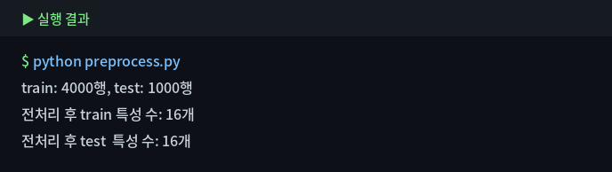

# 5. 전처리 — scikit-learn

머신러닝에 넣기 전, 데이터를 모델이 학습할 수 있는 형태로 다듬습니다. 결측치 채우기(SimpleImputer), 범주형 인코딩(OneHotEncoder), 스케일 맞추기(StandardScaler)와 이 셋을 묶는 Pipeline·ColumnTransformer까지 익힙니다. 여기서 만든 파이프라인은 Module 6에서 그대로 재사용합니다.

## 5-1. 가짜(텍스트형) 결측치 통일

::: tip 이 단계는 "채우기"가 아니라 "변환"입니다
`'·정보없음'`처럼 **글자로 입력된 가짜 결측치**를 진짜 결측값(`NaN`)으로 **바꾸는(변환)** 단계입니다. 빈 자리를 다른 값으로 채우는 것이 아니라, "이건 사실 빈 값"이라고 결측 표시를 한 종류로 **통일**하는 것입니다.

**왜 먼저 하나요?** 이걸 안 하면 `'·정보없음'`이 하나의 정상 카테고리처럼 취급되어, 이후 인코딩과 모델 학습이 잘못됩니다. 실제로 빈 값을 채워 넣는 처리는 5-3에서 합니다.
:::

```python
import numpy as np

# '·정보없음'은 "값이 없다"는 뜻으로 사람이 직접 적어 넣은 '텍스트형 가짜 결측치'입니다.
# 이 문자열을 진짜 결측값(NaN)으로 바꿔, 결측 표시를 한 종류(NaN)로 통일합니다.
df['species'] = df['species'].replace('·정보없음', np.nan)

# 통일 후 컬럼별 결측 개수 확인
df.isnull().sum()
```


**결과 해석:** `species`는 원래 결측 110개에 가짜 결측 20개가 더해져 **130개**가 됩니다. 이제 모든 결측이 `NaN` 한 종류로 통일되어, 5-3의 채우기를 일관되게 적용할 수 있습니다.

## 5-2. Output / Input / 제외 컬럼

::: tip 컬럼을 세 갈래로 나눕니다
전처리에 앞서, 각 컬럼을 **예측 대상(output)** · **예측에 쓸 재료(input)** · **제외**로 나눕니다.

- **Output(타깃)** — 우리가 맞히려는 값. 이번엔 키(`height_cm`)를 예측하므로 이것이 output입니다.
- **Input(특성)** — 예측의 단서로 쓸 컬럼들. output을 뺀 "설명변수"입니다.
- **제외** — 예측에 부적절한 컬럼. 아래 기준으로 걸러냅니다.

**제외 기준:**
- **식별자** — `plant_id`는 개체 번호일 뿐 키와 인과가 없습니다(넣으면 과적합·데이터 누수 위험).
- **다른 문제의 타깃** — `is_blooming`은 이번(회귀)의 예측 대상이 아니라 분류 문제의 타깃이라 뺍니다. 결과(개화)를 원인처럼 넣으면 안 됩니다.
:::

```python
# [1] 예측 대상(output): 이번에 맞히려는 값
output_col = 'height_cm'

# [2] 예측에 쓸 입력(input): output과 제외 컬럼을 뺀 나머지
input_cols = ['species', 'pot_size', 'light_condition', 'location_type',
              'watering_per_week', 'days_since_repot', 'fertilizer_ml',
              'humidity_pct', 'temperature_c', 'prev_height_cm']

# [3] input을 자료형에 따라 다시 셋으로 나눕니다.
#  - 전처리 방법(스케일링/인코딩)이 자료형마다 다르기 때문입니다.
#  - 수치형: 숫자. 스케일링 대상
num_cols = ['watering_per_week', 'days_since_repot', 'fertilizer_ml',
            'humidity_pct', 'temperature_c', 'prev_height_cm']
#  - 명목형: 순서 없는 범주. OneHot 대상
nominal_cols = ['species', 'location_type']
#  - 순서형: 순서 있는 범주. Ordinal 대상
ordinal_cols = ['pot_size', 'light_condition']
```

`plant_id`는 식별자라 제외하고, `is_blooming`은 이번 회귀의 타깃이 아니므로 제외합니다. `num_cols`·`nominal_cols`·`ordinal_cols` 구분은 5-4의 인코딩과 5-6의 파이프라인에서 그대로 쓰입니다.

## 5-3. 결측치 채우기 — SimpleImputer

::: tip 이 단계는 빈 값을 "채웁니다"
5-1에서 결측을 `NaN`으로 통일했다면, 이제 그 빈 자리를 실제 값으로 **채웁니다**. 대부분의 모델은 `NaN`이 있으면 학습을 못 하기 때문입니다.

**무엇으로 채우나요?** 자료형에 따라 다릅니다.
- **수치형 → 중앙값(median)** — 평균은 이상치에 끌려가므로, 2장에서 본 오른쪽 왜도가 있는 이 데이터엔 중앙값이 안전합니다.
- **범주형 → 최빈값(most_frequent)** — 범주엔 평균/중앙값이 없으니, 가장 자주 나온 값으로 채웁니다.
:::

```python
from sklearn.impute import SimpleImputer

# 수치형: 중앙값으로 채움 (평균은 이상치·왜도에 민감하므로 median 사용)
imp_num = SimpleImputer(strategy='median')

# 범주형: 최빈값으로 채움 (범주에는 평균/중앙값이 없으므로 most_frequent)
imp_cat = SimpleImputer(strategy='most_frequent')

# fit: 채울 값(중앙값/최빈값)을 학습 → transform: 실제로 빈 자리를 채움
# 예) 수치형 컬럼에 적용
imp_num.fit(df[num_cols])
print('채운 값(각 컬럼의 중앙값):', imp_num.statistics_)
```


**결과 해석:** `imputer.statistics_`에는 각 컬럼을 채우는 데 쓴 실제 값(수치형은 중앙값, 범주형은 최빈값)이 저장됩니다. 채운 뒤에는 이 값이 의도대로인지 확인하는 습관이 좋습니다.

::: warning 채우기 전에 "왜 비었는지"부터
무조건 중앙값·최빈값으로 채우기 전에, 결측의 원인(측정 안 함 / 0을 결측처럼 기록 / 수집 오류)을 먼저 살펴야 합니다. 원인에 따라 채우는 방법 자체가 달라질 수 있습니다.
:::

## 5-4. 인코딩 — 명목형 OneHot, 순서형 Ordinal

::: tip 인코딩이란?
모델은 숫자만 계산할 수 있어서, `species='몬스테라'` 같은 **글자(범주)를 숫자로 바꾸는** 작업이 필요합니다. 이것이 인코딩입니다. 단, 범주의 성격에 따라 방법이 갈립니다.

- **명목형(순서 없음) → OneHotEncoder** — `species`, `location_type`처럼 순서가 없는 범주.
- **순서형(순서 있음) → OrdinalEncoder** — `pot_size`(Small<Medium<Large), `light_condition`(Low<Medium<High)처럼 순서가 있는 범주.

**왜 명목형에 Ordinal을 쓰면 안 되나요?** 순서가 없는 `species`에 0,1,2,3…을 매기면, 모델이 "몬스테라(0) < 스투키(1)"처럼 **없는 크기 관계를 학습**합니다. 그래서 명목형은 OneHot으로 "순서 없이" 펼칩니다.
:::

::: details 두 인코더가 실제로 어떻게 바꾸나
**OneHotEncoder** — 범주마다 열을 하나씩 만들고, 해당하는 칸만 1로 표시합니다(나머지 0). 순서 정보가 생기지 않습니다.

```
location_type:  실내 → [0, 1]   (베란다=0, 실내=1)
                베란다 → [1, 0]
```
범주가 N개면 N개의 0/1 열로 펼쳐집니다.

**OrdinalEncoder** — 지정한 순서대로 정수를 매깁니다. 크기 관계가 의미 있는 순서형에만 씁니다.

```
pot_size:  Small → 0,  Medium → 1,  Large → 2
```
:::

```python
from sklearn.preprocessing import OneHotEncoder, OrdinalEncoder

# 명목형: 순서 없이 범주별 0/1 열로 펼침
# - handle_unknown='ignore': 학습 때 못 본 범주가 나와도 에러 대신 전부 0 처리
# - sparse_output=False: 결과를 일반 배열로 받음(보기 쉬움)
ohe = OneHotEncoder(handle_unknown='ignore', sparse_output=False)

# 순서형: 순서를 직접 지정해 정수로 매핑
# - categories=[...]로 각 컬럼의 순서를 명시(작은 값 → 큰 값)
ord_enc = OrdinalEncoder(categories=[['Small', 'Medium', 'Large'],
                                     ['Low', 'Medium', 'High']])
```


::: warning LabelEncoder를 여기 쓰지 않는 이유
`LabelEncoder`는 이름과 달리 **입력 특성(X)이 아니라 정답(y) 인코딩용**입니다. 입력 특성의 범주형에는 쓰지 않는 것이 원칙이며, 순서형은 `OrdinalEncoder(categories=...)`로 순서를 직접 지정하세요. (범주가 알파벳순으로 임의 매핑되는 부작용도 있지만 부차적 이유입니다.)
:::

## 5-5. 스케일링 — StandardScaler vs RobustScaler

::: tip 스케일링이란?
컬럼마다 **단위와 범위가 제각각**인 것을 비슷한 범위로 맞추는 작업입니다. 우리가 이번 실습에 쓰는 `plant_growth.csv`만 봐도 `prev_height_cm`은 5~154, `watering_per_week`는 0~7로 스케일이 크게 다릅니다.

**왜 필요한가요?** KNN·선형회귀·신경망처럼 **거리나 가중치**로 계산하는 모델은, 값이 큰 컬럼(예: 키)이 값이 작은 컬럼(예: 물 주기)보다 부당하게 큰 영향을 줍니다. 스케일을 맞추면 모든 특성이 공평하게 반영됩니다. (트리 계열은 스케일 영향이 적습니다.)
:::

::: tip 두 스케일러의 차이
- **StandardScaler** — `(값 − 평균) ÷ 표준편차`로 변환해, 평균 0·표준편차 1로 맞춥니다. 가장 일반적이지만 **평균·표준편차가 이상치에 흔들립니다**.
- **RobustScaler** — 평균 대신 **중앙값**, 표준편차 대신 **IQR**을 씁니다. 이상치의 영향을 가장 적게 받아, **이상치가 심한 데이터에 적합**합니다.

핵심 차이는 "무엇을 기준으로 중심과 퍼짐을 잡느냐"입니다 — 평균·표준편차(이상치에 민감) vs 중앙값·IQR(이상치에 강건).
:::

```python
from sklearn.preprocessing import StandardScaler, RobustScaler

# StandardScaler: (값 - 평균) / 표준편차 → 평균 0, 표준편차 1
scaler = StandardScaler()
X_scaled = scaler.fit_transform(X[num_cols])

# RobustScaler: (값 - 중앙값) / IQR → 이상치에 덜 흔들림
# robust = RobustScaler()
# X_robust = robust.fit_transform(X[num_cols])
```


**적용 전/후 비교:** 변환 전에는 컬럼마다 크기가 제각각이지만, StandardScaler 적용 후에는 모두 평균≈0, 표준편차≈1로 정렬됩니다.

| 컬럼 | 전(평균) | 전(범위) | 후(평균) | 후(표준편차) |
|---|---|---|---|---|
| `prev_height_cm` | 45.8 | 5 ~ 154 | ≈0 | 1.0 |
| `watering_per_week` | 2.2 | 0 ~ 7 | ≈0 | 1.0 |
| `fertilizer_ml` | 29.5 | 0.4 ~ 150 | ≈0 | 1.0 |

**결과 해석:** 스케일링 전에는 `prev_height_cm`(최대 154)이 `watering_per_week`(최대 7)보다 20배 넘게 큰 값이라, 거리·가중치 기반 모델에서 키가 과도한 영향을 줍니다. 스케일링 후에는 세 컬럼이 모두 같은 기준(평균 0·표준편차 1) 위에 놓여, 서로 공평하게 비교·학습됩니다.

::: warning StandardScaler도 이상치 영향을 받습니다
"이상치엔 StandardScaler가 안전"은 오해입니다. StandardScaler(평균·표준편차)와 MinMaxScaler(최소·최대) **모두 이상치에 흔들립니다**. 이상치가 심하면 중앙값·IQR 기반의 `RobustScaler`가 더 적합합니다.
:::

| 스케일러 | 기준 | 이상치 영향 |
|---|---|---|
| StandardScaler | 평균·표준편차 | 받음 |
| MinMaxScaler | 최소·최대 | 가장 크게 받음 |
| RobustScaler | 중앙값·IQR | 가장 적게 받음 |

## 5-6. Pipeline + ColumnTransformer

::: tip 파이프라인이란?
지금까지 한 단계들(결측 채우기 → 인코딩 → 스케일링)을 **하나로 묶어, 한 번에 실행**되게 만드는 것입니다.

- **Pipeline** — 여러 처리 단계를 **순서대로** 이어 붙입니다(채우기 → 스케일링처럼).
- **ColumnTransformer** — 컬럼 종류마다 **다른 파이프라인**을 적용합니다(수치형엔 이 처리, 명목형엔 저 처리).

**왜 묶나요?** ① 단계를 빠뜨리거나 순서를 틀릴 일이 없고, ② train에 맞춘 처리를 test에 **똑같이** 재현할 수 있으며(데이터 누수 방지, 5-7), ③ 한 덩어리라 Module 6에서 모델과 함께 그대로 재사용할 수 있습니다.
:::

```python
from sklearn.pipeline import Pipeline
from sklearn.compose import ColumnTransformer

# [1] 수치형: 중앙값으로 채운 뒤 스케일링
num_pipe = Pipeline([
    ('imputer', SimpleImputer(strategy='median')),
    ('scaler', StandardScaler())
])

# [2] 명목형: 최빈값으로 채운 뒤 OneHot 인코딩
nom_pipe = Pipeline([
    ('imputer', SimpleImputer(strategy='most_frequent')),
    ('encoder', OneHotEncoder(handle_unknown='ignore', sparse_output=False))
])

# [3] 순서형: 최빈값으로 채운 뒤 Ordinal 인코딩 → 스케일링
#     (0,1,2로 바뀐 순서값도 거리·가중치 모델을 위해 스케일 맞춤)
ord_pipe = Pipeline([
    ('imputer', SimpleImputer(strategy='most_frequent')),
    ('encoder', OrdinalEncoder(categories=[['Small', 'Medium', 'Large'],
                                           ['Low', 'Medium', 'High']])),
    ('scaler', StandardScaler())
])

# ColumnTransformer: 컬럼 종류별로 위 파이프라인을 각각 적용
# - 5-2에서 정의한 num_cols / nominal_cols / ordinal_cols를 그대로 사용
preprocessor = ColumnTransformer([
    ('num', num_pipe, num_cols),
    ('nom', nom_pipe, nominal_cols),
    ('ord', ord_pipe, ordinal_cols),
])
```


::: tip 순서형도 스케일링까지
KNN·선형·신경망은 거리·가중치에 민감하므로, OrdinalEncoder로 바뀐 순서값(0,1,2)도 스케일링해 다른 수치형과 기준을 맞춰줍니다.
:::

**실사용 예시:** 이렇게 만든 `preprocessor` 하나면, 원본 데이터를 넣는 즉시 결측 채우기·인코딩·스케일링이 자동으로 끝납니다.

```python
# 원본 X를 넣으면 → 채우기·인코딩·스케일링이 한 번에 실행됨
X_processed = preprocessor.fit_transform(X)
```

Module 6에서는 이 `preprocessor` 뒤에 모델만 이어 붙이면(`Pipeline([('prep', preprocessor), ('model', ...)])`) 전처리부터 예측까지 한 줄로 연결됩니다.

::: info 버전 참고
`OneHotEncoder(sparse_output=False)`는 최신 sklearn 기준입니다. 구버전은 `sparse=False`를 씁니다. (이 가이드는 1.8.0에서 검증)
:::

## 5-7. train_test_split — 데이터 누수 주의

::: tip 왜 train과 test로 나누나요?
모델의 진짜 실력은 **학습에 쓰지 않은 새 데이터**에서 얼마나 잘 맞히는지로 판단해야 합니다. 학습에 쓴 데이터로 다시 평가하면, 답을 외운 학생에게 같은 문제를 다시 내는 것과 같아 성능이 부풀려집니다.

그래서 데이터를 두 몫으로 나눕니다.
- **train(학습용, 보통 80%)** — 모델이 규칙을 배우는 데 사용
- **test(평가용, 보통 20%)** — 학습이 끝난 뒤 **처음 보는 데이터**로 성능을 측정

이렇게 나눠야 모델이 외운 것이 아니라, **새 데이터에도 통하는 규칙을 배웠는지** 공정하게 확인할 수 있습니다. 실제 성능 지표(회귀의 R²·MAE, 분류의 정확도 등)로 평가하는 단계는 **Module 6**에서 진행합니다.
:::

::: tip 전처리는 왜 나눈 뒤에 하나요? (데이터 누수)
**데이터 누수(data leakage)** 는 평가에 쓸 test의 정보가 학습 단계에 미리 섞여 들어가는 것입니다. 예를 들어 전체 데이터로 중앙값을 구해 결측치를 채우면, 그 중앙값에 test 값도 이미 포함되어 있어 "시험 문제를 미리 본" 셈이 됩니다.

그래서 순서가 중요합니다: **① 먼저 나누고 → ② 전처리는 train에만 `fit`**

- **`fit_transform`** — 결측 대체값, 평균, 표준편차, 범주 목록 같은 **기준을 학습(fit)** 하고 바로 적용 → **train에만**
- **`transform`** — train에서 학습한 기준을 **적용만** → **test에**

즉, train에서 배운 중앙값·평균·범주 기준으로 test를 처리해야 test를 진짜 **처음 보는 데이터**처럼 공정하게 평가할 수 있습니다.
:::

```python
from sklearn.model_selection import train_test_split

# 타깃(height_cm)에 결측이 있으면 먼저 제거합니다.
# - 입력 X의 결측은 전처리기(SimpleImputer)로 채우지만,
#   타깃 y의 결측은 정답이 없는 것이라 학습에 쓸 수 없어 행 자체를 제외합니다.
df_model = df.dropna(subset=[output_col]).copy()

# 5-2에서 정한 입력(input_cols)과 출력(output_col)으로 X, y를 만듭니다.
X = df_model[input_cols]
y = df_model[output_col]

# [1] 전처리보다 먼저 train/test로 나눕니다.
# - test_size=0.2  : 20%를 평가용 test로 분리
# - random_state=42: 매번 같은 분할이 나오도록 고정(재현성)
X_train, X_test, y_train, y_test = train_test_split(
    X, y, test_size=0.2, random_state=42
)
print(f'train: {len(X_train)}행, test: {len(X_test)}행')

# [2] 전처리: 기준은 train에서만 학습하고, test에는 적용만 합니다.
# - fit_transform: train으로 결측 대체값·평균·범주 목록 등을 학습하고 변환
# - transform    : 그 기준을 test에 적용만 함(데이터 누수 방지)
X_train_processed = preprocessor.fit_transform(X_train)
X_test_processed = preprocessor.transform(X_test)

print(f'전처리 후 train 특성 수: {X_train_processed.shape[1]}개')
print(f'전처리 후 test  특성 수: {X_test_processed.shape[1]}개')
```



**전처리 과정 정리:** 위 `preprocessor`(5-6) 안에서 각 컬럼은 종류별로 다음 순서로 처리됩니다. (컬럼 종류에 마우스를 올리면(모바일은 탭) 해당 컬럼 목록이 표시됩니다.)

| 컬럼 종류 | 처리 순서 | 결과 |
|---|---|---|
| <Tooltip content="watering_per_week(주당 물주기 횟수), days_since_repot(분갈이 후 경과일), fertilizer_ml(비료량 ml), humidity_pct(습도 %), temperature_c(온도 ℃), prev_height_cm(이전 키 cm)">수치형(6개)</Tooltip> | 중앙값 채우기 → 표준화 | train 기준으로 스케일링된 6개 특성 |
| <Tooltip content="species(품종), location_type(배치 장소)">명목형(2개)</Tooltip> | 최빈값 채우기 → OneHot | 여러 개의 0/1 열로 확장 |
| <Tooltip content="pot_size(화분 크기), light_condition(채광 조건)">순서형(2개)</Tooltip> | 최빈값 채우기 → Ordinal → 표준화 | 순서를 반영한 연속형 값 2개 |

이번 데이터에서는 원본 입력 **10개 컬럼이 전처리 후 16개 특성**으로 바뀝니다. 다만 최종 특성 수는 **범주형 변수에 실제로 등장한 범주 수**에 따라 달라질 수 있습니다. test에 train에 없던 범주가 나타나도, 5-6의 `handle_unknown='ignore'` 덕분에 오류 없이 처리되어 train·test의 특성 수가 어긋나지 않습니다.

::: warning fit은 train에서 한 번만
test나 전체 데이터에 `fit`하면, 중앙값·평균·범주 목록 같은 기준에 test 정보가 섞여 **데이터 누수**가 발생합니다. 원칙은 항상 같습니다 — **train은 `fit_transform`, test는 `transform`**.
:::

## ✅ 체크리스트

- 가짜 결측치를 먼저 정리했다
- 명목형 OneHot / 순서형 Ordinal을 구분하고, LabelEncoder는 y용임을 안다
- StandardScaler·MinMaxScaler·RobustScaler 차이를 안다
- Pipeline·ColumnTransformer로 한 번에 묶을 수 있다
- test에는 transform만 써야 하는 이유(데이터 누수)를 안다
