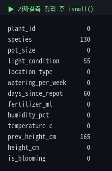
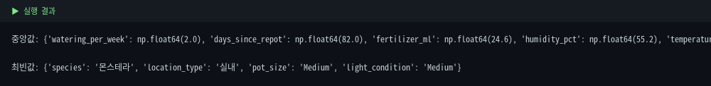
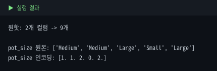
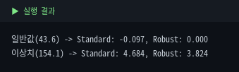
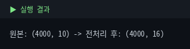

# 5. 전처리 — scikit-learn

통합마스터가이드 5장을 scikit-learn으로 옮깁니다. SimpleImputer·OneHotEncoder·StandardScaler와, 이 셋을 묶는 Pipeline·ColumnTransformer까지. 여기서 만든 파이프라인은 Module 6에서 그대로 재사용합니다.

::: warning 수치 기준
모든 수치는 원본 5,000행 기준입니다.
:::

## 5-1. 가짜 결측치부터 정리

::: tip 핵심
`'·정보없음'` 같은 텍스트형 가짜 결측치를 진짜 NaN으로 먼저 통일. 안 하면 이후 처리에서 하나의 카테고리로 취급됩니다.
:::

```python
df['species'] = df['species'].replace('·정보없음', np.nan)
df.isnull().sum()
```



species가 원래 결측 110개 + 가짜 결측 20개 = 130개가 됩니다.

## 5-2. Output / Input / 제외 컬럼

```python
output_col = 'height_cm'
input_cols = ['species','pot_size','light_condition','location_type',
              'watering_per_week','days_since_repot','fertilizer_ml',
              'humidity_pct','temperature_c','prev_height_cm']
```

`plant_id`는 식별자라 제외, `is_blooming`은 회귀 문제라 제외합니다.

## 5-3. 결측치 처리 — SimpleImputer

```python
from sklearn.impute import SimpleImputer
imp_num = SimpleImputer(strategy='median')       # 수치형
imp_cat = SimpleImputer(strategy='most_frequent')# 범주형
```



::: tip
`imputer.statistics_`에 실제 채운 값이 저장됩니다. 채운 후 의도대로 됐는지 검증하는 습관을.
:::

## 5-4. 인코딩 — 명목형 OneHot, 순서형 Ordinal

::: tip 핵심
명목형(순서 없음) → `OneHotEncoder`, 순서형(순서 있음) → `OrdinalEncoder(categories=...)`.
:::

```python
from sklearn.preprocessing import OneHotEncoder, OrdinalEncoder
ohe = OneHotEncoder(handle_unknown='ignore', sparse_output=False)
ord_enc = OrdinalEncoder(categories=[['Small','Medium','Large'], ['Low','Medium','High']])
```



::: warning LabelEncoder를 여기 쓰지 않는 이유
`LabelEncoder`는 이름과 달리 **입력 특성(X)이 아니라 정답(y) 인코딩용**입니다. 입력 특성의 범주형에는 쓰지 않는 게 원칙이며, 순서형은 `OrdinalEncoder(categories=...)`로 순서를 직접 지정하세요. (알파벳 순 임의 매핑되는 부작용도 있지만 부차적 이유)
:::

## 5-5. 스케일링 — StandardScaler vs RobustScaler

```python
from sklearn.preprocessing import StandardScaler, RobustScaler
```



::: warning StandardScaler도 이상치 영향받음
"이상치엔 StandardScaler가 안전"은 과장입니다. StandardScaler(평균·표준편차), MinMaxScaler(최소·최대) 모두 이상치 영향을 받습니다. **이상치가 심하면 중앙값·IQR 기반 `RobustScaler`**가 더 적합합니다.
:::

| 스케일러 | 기준 | 이상치 영향 |
|---|---|---|
| StandardScaler | 평균·표준편차 | 받음 |
| MinMaxScaler | 최소·최대 | 가장 크게 받음 |
| RobustScaler | 중앙값·IQR | 가장 적게 받음 |

## 5-6. Pipeline + ColumnTransformer

::: tip 순서형도 스케일링까지
KNN·선형·신경망은 거리·가중치에 민감하므로 OrdinalEncoder로 바뀐 순서형(0,1,2)도 스케일링해주는 게 일관적입니다.
:::

```python
from sklearn.pipeline import Pipeline
from sklearn.compose import ColumnTransformer

num_pipe = Pipeline([('imputer', SimpleImputer(strategy='median')),
                     ('scaler', StandardScaler())])
nom_pipe = Pipeline([('imputer', SimpleImputer(strategy='most_frequent')),
                     ('encoder', OneHotEncoder(handle_unknown='ignore', sparse_output=False))])
ord_pipe = Pipeline([('imputer', SimpleImputer(strategy='most_frequent')),
                     ('encoder', OrdinalEncoder(categories=[['Small','Medium','Large'],['Low','Medium','High']])),
                     ('scaler', StandardScaler())])

preprocessor = ColumnTransformer([
    ('num', num_pipe, num_cols),
    ('nom', nom_pipe, nominal_cols),
    ('ord', ord_pipe, ordinal_cols),
])
```



::: info 버전 참고
`OneHotEncoder(sparse_output=False)`는 sklearn 최신 기준. 구버전은 `sparse=False`. (이 가이드는 1.8.0 검증)
:::

## 5-7. train_test_split — 데이터 누수 주의

::: warning fit_transform vs transform
반드시 `train_test_split` 먼저 → train에만 `fit`, test는 `transform`만. 전체에 먼저 fit하면 test 정보가 학습에 새어들어가는 **데이터 누수**가 됩니다.
:::

```python
X_train, X_test, y_train, y_test = train_test_split(X, y, test_size=0.2, random_state=42)
X_train_processed = preprocessor.fit_transform(X_train)  # train: fit + transform
X_test_processed = preprocessor.transform(X_test)         # test: transform만
```

원본 10개 컬럼 → 전처리 후 16개(수치형 6 + 명목형 2→8 + 순서형 2).

## ✅ 체크리스트

- 가짜 결측치를 먼저 정리했다
- 명목형 OneHot / 순서형 Ordinal을 구분하고, LabelEncoder는 y용임을 안다
- StandardScaler·MinMaxScaler·RobustScaler 차이를 안다
- Pipeline·ColumnTransformer로 한 번에 묶을 수 있다
- test에는 transform만 써야 하는 이유(데이터 누수)를 안다
