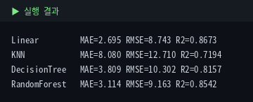
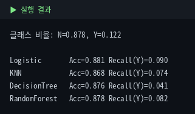
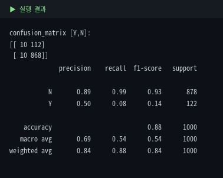
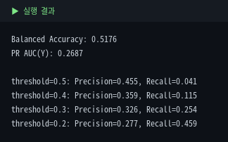
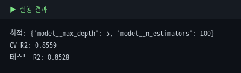
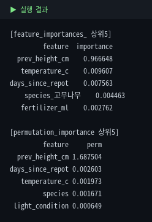

# 6. 머신러닝 — scikit-learn

Module 5의 전처리 파이프라인을 재사용해 회귀(height_cm)와 분류(is_blooming)를 모두 다룹니다.

::: warning 수치 기준
모든 수치는 원본 5,000행 기준입니다.
:::

## 6-1~6-2. 학습 유형 & Pipeline 결합

Output이 수치형이면 회귀, 범주형이면 분류. `preprocessor` 뒤에 모델을 붙여 `fit` 한 번으로 끝냅니다.

::: tip 변수명 구분
여러 모델 비교 시 `lr_pipe`, `knn_pipe`, `rf_pipe`처럼 이름을 나누세요. 같은 `pipe`를 덮어쓰면 나중에 헷갈립니다.
:::

## 6-3. 회귀 모델 4종 비교

```python
lr_pipe = Pipeline([('prep', preprocessor), ('model', LinearRegression())])
knn_pipe = Pipeline([('prep', preprocessor), ('model', KNeighborsRegressor(5))])
dt_pipe = Pipeline([('prep', preprocessor), ('model', DecisionTreeRegressor(random_state=42))])
rf_pipe = Pipeline([('prep', preprocessor), ('model', RandomForestRegressor(n_estimators=200, random_state=42))])

for name, pipe in [('Linear',lr_pipe),('KNN',knn_pipe),('DecisionTree',dt_pipe),('RandomForest',rf_pipe)]:
    pipe.fit(X_train, y_train)
    print(name, 'R2=', round(r2_score(y_test, pipe.predict(X_test)), 4))
```



::: tip 왜 Linear가 이겼을까
prev_height_cm과 height_cm이 거의 선형(r≈0.95)이라, 복잡한 트리 모델보다 단순한 선형모델이 더 잘 맞습니다. **트리 계열이 항상 좋은 건 아니며, 데이터의 실제 관계 구조에 맞는 모델을 고르는 게 중요합니다.**
:::

## 6-4. 교차검증 — KFold (회귀용)

::: tip 회귀는 KFold, 분류는 StratifiedKFold
분류에서는 클래스 비율을 fold마다 유지하는 `StratifiedKFold`를 씁니다.
:::

```python
from sklearn.model_selection import cross_val_score, KFold
cv = cross_val_score(rf_pipe, X, y, cv=KFold(5, shuffle=True, random_state=42), scoring='r2')
```


fold마다 0.78~0.92로 차이. 한 번의 분할 결과만 믿으면 운 좋은 fold를 전체 성능으로 착각할 위험을 보여줍니다.

## 6-5. 분류 모델 4종 — is_blooming

::: warning 정보 누수 주의 — height_cm 제외
height_cm은 개화와 연관되어 성능을 올리지만, **예측 시점에 그 값을 아는지**에 따라 씁니다. 미래 개화를 미리 예측하는데 아직 키를 안 쟀다면 정보 누수입니다. 아래는 안전하게 제외했습니다.
:::

```python
lr_clf = Pipeline([('prep', preprocessor_c), ('model', LogisticRegression(max_iter=1000))])
# ... KNN, DecisionTree, RandomForest 동일 패턴
```



::: warning Accuracy 함정
"무조건 N만 찍어도" Accuracy 87.8%가 나옵니다. 모든 모델 Accuracy는 87~88%로 높아 보이지만 Recall(Y)은 4~9%로 매우 낮습니다 — 개화 식물을 거의 놓치고 있다는 뜻입니다.
:::

## 6-6. 혼동행렬

```python
from sklearn.metrics import confusion_matrix, classification_report
print(confusion_matrix(y_test, pred, labels=['Y','N']))
print(classification_report(y_test, pred))
```



## 6-7. 불균형 대응 — balanced accuracy, PR AUC, 임계값 조정

```python
from sklearn.metrics import balanced_accuracy_score, average_precision_score
# class_weight='balanced'로 소수 클래스에 가중치
rf_balanced = RandomForestClassifier(n_estimators=200, class_weight='balanced', random_state=42)
```



임계값을 0.5→0.2로 낮추면 Recall이 4%→46%로 오르지만 Precision은 떨어지는 트레이드오프가 뚜렷합니다.

| 지표 | 의미 |
|---|---|
| Balanced Accuracy | 클래스별 재현율 평균 (비율 보정) |
| PR AUC | 불균형에서 소수 클래스 탐지 성능 |
| 임계값 조정 | 0.5 낮추면 Recall↑ Precision↓ |

## 6-8. GridSearchCV

```python
from sklearn.model_selection import GridSearchCV
param_grid = {'model__n_estimators': [100, 200], 'model__max_depth': [5, 10, None]}
grid = GridSearchCV(rf_pipe, param_grid, cv=3, scoring='r2', n_jobs=-1)
grid.fit(X_train, y_train)
```



max_depth를 제한 없이(None) 키운 것보다 얕게(5) 제한한 게 더 좋았습니다 — 과적합 방지 원칙이 실제로 확인된 사례입니다. (파라미터 앞 `model__`은 Pipeline 단계명 문법)

## 6-9. Feature Importance

```python
importances = best_model.named_steps['model'].feature_importances_
# 다른 방식으로도 재확인
from sklearn.inspection import permutation_importance
perm = permutation_importance(best_model, X_test, y_test, n_repeats=10)
```



::: warning feature_importances_는 절대적 진실 아님
트리 중요도는 상관된 변수끼리 나눠 갖거나 인코딩 영향을 받습니다. 위처럼 `permutation_importance`로 교차 확인하는 습관이 좋습니다. 두 방식 모두 prev_height_cm이 압도적이라는 같은 결론을 보여줍니다.
:::

## ✅ 체크리스트

- 회귀/분류를 Output 유형에 따라 구분한다
- 트리 계열이 항상 낫지 않다는 걸 실제 결과로 확인했다
- 입력 전 "예측 시점에 이 값을 아는가"(정보 누수)를 점검한다
- 클래스 불균형에서 Accuracy만 보면 안 되는 이유를 안다
- 회귀 KFold / 분류 StratifiedKFold를 구분한다
- GridSearchCV의 `model__` 문법을 쓸 수 있다
- feature_importances_와 permutation_importance로 교차 확인한다
