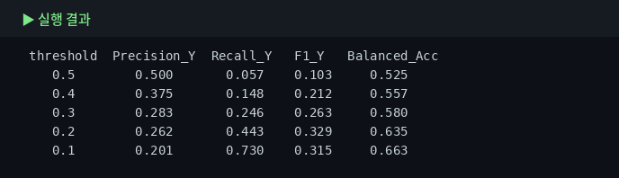
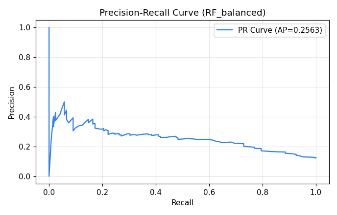

# 6. 머신러닝 — scikit-learn

Module 5에서 만든 전처리 파이프라인을 바탕으로, 이제 실제 머신러닝 모델을 학습하고 성능을 평가합니다. 이번 장에서는 **키(`height_cm`)를 예측하는 회귀**와 **개화 여부(`is_blooming`)를 맞히는 분류**를 모두 다룹니다.

먼저 **전처리기와 모델을 하나의 Pipeline으로 묶는 방법**을 익히고, 이어서 여러 모델의 성능을 비교합니다. 그다음 **교차검증**, **불균형 데이터 평가**, **하이퍼파라미터 탐색**, **특성 중요도 해석**까지 순서대로 살펴봅니다.

즉, Module 6은 "전처리된 데이터를 실제로 모델에 넣어 보고, 결과를 올바르게 해석하는 단계"입니다.

## 6-1. 학습 유형 — 회귀와 분류

::: tip 먼저 "무엇을 예측하는 문제인지"부터 구분합니다
머신러닝은 예측하려는 값의 형태에 따라 크게 **회귀(regression)** 와 **분류(classification)** 로 나뉩니다.

- **회귀** — 결과가 **숫자**일 때  
  예: 식물의 키(`height_cm`), 물 준 뒤 무게, 성장 일수
- **분류** — 결과가 **범주**일 때  
  예: 개화 여부(`is_blooming`), 병충해 유무, 품종 분류

즉, **output(타깃)이 수치형이면 회귀**, **범주형이면 분류**라고 생각하면 됩니다.
:::

이번 실습에서는 두 가지 문제를 모두 다룹니다.

- **회귀 문제** — 식물의 키 `height_cm` 예측
- **분류 문제** — 식물이 꽃을 피웠는지 `is_blooming` 예측

같은 데이터라도 **무엇을 output으로 잡느냐**에 따라 문제 유형이 달라집니다.  
예를 들어 `height_cm`를 맞히면 회귀, `is_blooming`을 맞히면 분류가 됩니다.


**왜 먼저 구분하나요?** 문제 유형이 달라지면 아래 요소가 함께 달라지기 때문입니다.

- 사용하는 **모델 종류**
- 성능을 재는 **평가 지표**
- 교차검증 방식과 결과 해석

예를 들어 회귀는 오차 크기(MAE, RMSE)나 설명력(R²)을 보고, 분류는 정확도(Accuracy), 재현율(Recall), 정밀도(Precision) 등을 봅니다. 이 평가지표들은 뒤 절에서 하나씩 확인합니다.

::: tip 이번 장의 흐름
먼저 **회귀 모델**로 `height_cm`를 예측해 보고,  
그다음 **분류 모델**로 `is_blooming`을 예측합니다.
:::

## 6-2. Pipeline 결합 — 전처리와 모델을 한 번에

Module 5에서는 `preprocessor`를 사용해 결측치 처리, 인코딩, 스케일링을 한 번에 수행했습니다.  
머신러닝 단계에서는 이 전처리기 뒤에 모델을 붙여 **전처리와 학습을 하나의 흐름으로 연결**합니다.

이렇게 하면 원본 데이터를 넣었을 때,  
**전처리 → 모델 학습 → 예측**이 같은 규칙으로 자동 실행됩니다.

```python
from sklearn.pipeline import Pipeline
from sklearn.linear_model import LinearRegression

lr_pipe = Pipeline([
    ('prep', preprocessor),
    ('model', LinearRegression())
])

# 전처리와 모델 학습을 한 번에 수행
lr_pipe.fit(X_train, y_train)

# 예측도 같은 흐름으로 처리
pred = lr_pipe.predict(X_test)
print(pred[:5])
```

`Pipeline`의 각 단계는 다음 의미를 가집니다.

- `prep` — 원본 데이터를 모델이 다룰 수 있는 형태로 변환
- `model` — 변환된 데이터로 규칙을 학습하고 예측 수행

즉, `Pipeline([('prep', preprocessor), ('model', 모델)])` 구조는  
Module 6에서 반복해서 사용하는 기본 틀입니다.

**왜 이렇게 묶을까요?**

- 전처리 순서를 실수하지 않음
- train에서 만든 기준을 test에도 같은 방식으로 적용 가능
- 교차검증과 GridSearchCV에도 그대로 재사용 가능
- 데이터 누수를 줄이는 데 유리함


::: tip 변수명 구분
여러 모델을 비교할 때는 `lr_pipe`, `knn_pipe`, `dt_pipe`, `rf_pipe`처럼 이름을 나누세요.  
같은 `pipe` 변수를 계속 덮어쓰면 어떤 결과가 어느 모델 것인지 헷갈리기 쉽습니다.
:::

## 6-3. 회귀 모델 4종 비교

이번에는 `height_cm`를 예측하는 **회귀 모델 4개**를 비교합니다.  
같은 전처리기를 연결한 뒤, 모델만 바꾸어 성능 차이를 확인합니다.

### 비교할 모델

- **Linear Regression**
  - 입력 변수와 결과 사이에 **선형 관계**가 있다고 가정하는 가장 기본적인 회귀 모델입니다.
  - 예를 들어, `prev_height_cm`가 커질수록 `height_cm`도 비슷한 비율로 커진다고 보는 방식입니다.
  - 구조가 단순해 **해석이 쉽고**, 데이터가 실제로 선형 관계를 가질 때 매우 강력합니다.

- **KNN Regressor**
  - 새로운 식물이 들어오면, 기존 데이터 중에서 **가장 비슷한 K개 이웃**을 찾습니다.
  - 그리고 그 이웃들의 `height_cm` 평균을 이용해 예측합니다.
  - 데이터의 패턴이 복잡해도 사용할 수 있지만, **거리 기반 모델**이라 스케일의 영향을 받기 쉽습니다.

- **Decision Tree Regressor**
  - 데이터를 여러 조건으로 나누면서 예측합니다.
  - 예를 들어, "`prev_height_cm`가 40 이상인가?", "`humidity_pct`가 60 이상인가?"처럼 기준을 나누어 최종 예측값을 정합니다.
  - 해석은 비교적 쉬우나, 트리 하나만 쓰면 **과적합**되기 쉽습니다.

- **Random Forest Regressor**
  - 여러 개의 결정트리를 만들고, 각 트리의 예측값을 평균 내어 최종 예측을 만듭니다.
  - 하나의 트리보다 **안정적이고 과적합에 덜 민감**한 편입니다.
  - 일반적으로 성능이 좋은 경우가 많지만, 데이터 구조가 단순하면 선형 회귀보다 꼭 우세하다고 할 수는 없습니다.

회귀에서는 **예측값이 실제값과 얼마나 가까운지** 여러 지표로 평가합니다.
이번에는 **R², MAE, RMSE** 세 가지를 함께 봅니다.

**R² (결정계수)**: 모델이 데이터를 얼마나 잘 설명하는지
**MAE (평균 절대 오차)**: 평균적으로 얼마나 빗나가는지
**RMSE (평균 제곱근 오차)**: 큰 오차를 더 크게 반영한 평균 오차
즉,
**R²는 높을수록 좋고, MAE·RMSE는 낮을수록 좋습니다.**

### R²(결정계수)란?

::: tip R²는 "설명력" 지표입니다
**R²(결정계수, coefficient of determination)** 는  
모델이 **정답(y)의 변동을 얼마나 설명했는지**를 나타내는 값입니다.

- **1에 가까울수록 좋음** → 실제값을 매우 잘 설명
- **0에 가까움** → 평균으로만 예측한 것과 비슷
- **0보다 작을 수도 있음** → 평균으로 찍는 것보다도 못한 모델
:::

쉽게 말하면,  
식물 키(`height_cm`)의 변화를 모델이 **얼마나 잘 따라갔는가**를 보는 점수입니다.

예를 들어:

- **R² = 0.91** → 키 변화의 약 **91%를 모델이 설명**
- **R² = 0.80** → 약 **80%를 설명**
- 따라서 **0.91 모델이 0.80 모델보다 전체 경향을 더 잘 맞춘다**고 볼 수 있습니다.

### R²는 어떻게 검증하나요?

R²는 **학습(train) 데이터가 아니라 평가(test) 데이터**에서 계산해야 합니다.

```python
r2_score(y_test, pred)
```

이 코드는:

- `y_test`: 실제 키
- `pred`: 모델이 예측한 키

를 비교해, 모델이 **처음 보는 데이터에서도 잘 맞는지** 확인합니다.

즉, 이번 과정에서 R²는  
**“이 모델이 새 식물 데이터의 키를 얼마나 잘 설명하는가?”** 를 비교하는 핵심 지표입니다.

다만 6-3의 train/test 한 번 결과만으로 단정하면 운의 영향이 있을 수 있으므로,  
**6-4에서 KFold 교차검증으로 더 안정적으로 다시 확인**합니다.

### MAE란?

::: tip MAE는 "평균적으로 얼마나 틀렸는가"를 봅니다
**MAE(Mean Absolute Error, 평균 절대 오차)** 는  
예측값과 실제값의 차이를 절댓값으로 바꾼 뒤 평균낸 값입니다.
:::

공식 개념은 아래와 같습니다.

- 각 행마다 `|실제값 - 예측값|` 계산
- 그것들을 평균냄

예를 들어 MAE가 **2.8**이면:

> 모델 예측이 실제 키에서 평균적으로 약 **2.8cm 정도 벗어난다**

는 뜻입니다.

#### MAE의 특징
- 단위가 원래 타깃과 같습니다 → 여기서는 **cm**
- 해석이 직관적입니다
- 오차 1cm와 10cm를 **있는 그대로 평균**냅니다

### RMSE란?

::: tip RMSE는 "큰 오차"에 더 민감합니다
**RMSE(Root Mean Squared Error, 평균 제곱근 오차)** 는  
오차를 제곱해서 평균낸 뒤 다시 제곱근을 씌운 값입니다.
:::

과정은:

1. `실제값 - 예측값` 계산
2. 제곱
3. 평균
4. 제곱근

이렇게 계산하면 **큰 오차가 더 크게 반영**됩니다.

예를 들어:

- 1cm 오차보다 10cm 오차를 훨씬 더 크게 벌점 줌
- 그래서 **큰 실수를 자주 하는 모델**은 RMSE가 많이 커집니다

#### RMSE의 특징
- 단위는 역시 **cm**
- MAE보다 **큰 오차에 민감**
- 예측 실수의 안정성을 볼 때 유용합니다

### MAE와 RMSE는 어떻게 같이 보나요?

둘 다 오차 지표지만 보는 관점이 조금 다릅니다.

- **MAE**: 평균적으로 얼마나 틀리는지
- **RMSE**: 큰 오차까지 감안하면 얼마나 틀리는지

해석 팁은 이렇습니다.

- **MAE와 RMSE가 비슷하다**  
  → 오차가 전반적으로 고르게 분포
- **RMSE가 MAE보다 훨씬 크다**  
  → 일부 샘플에서 매우 큰 오차가 있었다는 뜻

즉, RMSE는 **“평균은 괜찮아 보여도 큰 실수가 있었는가?”** 를 확인하는 데 좋습니다.

### 이번 실습에서 세 지표의 역할

이번 식물 키 예측에서는 세 지표가 서로 다른 역할을 합니다.

| 지표 | 무엇을 보는가 | 좋음 기준 |
|---|---|---|
| R² | 전체 경향을 얼마나 잘 설명하는가 | 클수록 좋음 |
| MAE | 평균적으로 몇 cm 정도 틀리는가 | 작을수록 좋음 |
| RMSE | 큰 오차까지 감안하면 얼마나 틀리는가 | 작을수록 좋음 |

즉,

- **R²** → 모델의 전체 설명력 비교
- **MAE** → 실제 사용 시 오차 크기 해석
- **RMSE** → 큰 실수 위험 확인

으로 보면 됩니다.

---

### 결과 해석 예시

예를 들어 결과가 아래처럼 나왔다고 가정해 봅시다.

| Model | MAE | RMSE | R2 |
|---|---:|---:|---:|
| Linear | 2.45 | 3.21 | 0.91 |
| RandomForest | 2.76 | 3.55 | 0.89 |
| KNN | 3.10 | 3.98 | 0.87 |
| DecisionTree | 3.85 | 4.72 | 0.80 |

이 경우 해석은 다음과 같습니다.

- **Linear**
  - R²가 가장 높음 → 전체 패턴 설명력이 가장 좋음
  - MAE, RMSE도 가장 낮음 → 평균 오차와 큰 오차 모두 가장 적음
- **RandomForest**
  - 전반적으로 좋은 편이지만 Linear보다 약간 뒤짐
- **KNN**
  - 나쁘진 않지만 거리 기반 특성상 패턴을 덜 잘 잡음
- **DecisionTree**
  - 단일 트리라 과적합이 쉬워 test 성능이 가장 낮을 수 있음

---

```python
from sklearn.pipeline import Pipeline
from sklearn.linear_model import LinearRegression
from sklearn.neighbors import KNeighborsRegressor
from sklearn.tree import DecisionTreeRegressor
from sklearn.ensemble import RandomForestRegressor
from sklearn.metrics import r2_score

# 1) 선형 회귀 파이프라인
# 전처리 후, 입력 변수와 키(height_cm) 사이의 선형 관계를 학습합니다.
lr_pipe = Pipeline([
    ('prep', preprocessor),
    ('model', LinearRegression())
])

# 2) KNN 회귀 파이프라인
# 가장 비슷한 이웃 5개의 키를 참고해 평균적으로 예측합니다.
knn_pipe = Pipeline([
    ('prep', preprocessor),
    ('model', KNeighborsRegressor(n_neighbors=5))
])

# 3) 결정트리 회귀 파이프라인
# 여러 조건으로 데이터를 나누며 예측 규칙을 만듭니다.
dt_pipe = Pipeline([
    ('prep', preprocessor),
    ('model', DecisionTreeRegressor(random_state=42))
])

# 4) 랜덤포레스트 회귀 파이프라인
# 결정트리 여러 개를 만들어 예측값을 평균내므로 더 안정적인 결과를 기대할 수 있습니다.
rf_pipe = Pipeline([
    ('prep', preprocessor),
    ('model', RandomForestRegressor(n_estimators=200, random_state=42))
])

# 비교할 모델들을 (이름, 파이프라인) 형태로 묶습니다.
models = [
    ('Linear', lr_pipe),
    ('KNN', knn_pipe),
    ('DecisionTree', dt_pipe),
    ('RandomForest', rf_pipe)
]

# 각 모델별로 학습 → 예측 → R² 계산을 반복합니다.
for name, pipe in models:
    # 훈련 데이터로 학습
    pipe.fit(X_train, y_train)

    # 테스트 데이터 예측
    pred = pipe.predict(X_test)

    # 실제값과 예측값을 비교해 R² 계산
    r2 = r2_score(y_test, pred)

    # 소수 넷째 자리까지 출력
    print(name, 'R2 =', round(r2, 4))
```

아래는 4개 회귀 모델의 실제 실행 결과와 시각화한 자료입니다.
각 모델에 대해 MAE, RMSE, R²를 함께 확인해 성능을 비교합니다.


- **R²(결정계수)**: 모델이 실제 값의 변동을 얼마나 잘 설명하는지 나타냅니다. 1에 가까울수록 좋습니다.
- **MAE**: 예측이 실제 값에서 평균적으로 얼마나 벗어났는지 보여줍니다. 낮을수록 좋습니다.
- **RMSE**: 큰 오차에 더 민감한 평균 오차 지표입니다. 낮을수록 좋습니다.

출력된 R² 값을 비교하면, **현재 데이터에서 어떤 모델이 더 잘 작동하는지** 확인할 수 있습니다.  
다만 한 번의 train/test 분할 결과만으로 단정하면 위험하므로, 다음 절에서 **교차검증**으로 다시 확인합니다.

::: tip 왜 Linear가 더 좋게 나올 수 있을까?
`prev_height_cm`와 `height_cm`의 관계가 매우 강한 선형 형태이기 때문입니다.  
이처럼 데이터의 실제 구조가 단순할 때는, 복잡한 트리 모델보다 **선형 회귀 같은 단순한 모델이 더 잘 맞을 수 있습니다.**

즉, **모델은 복잡할수록 좋은 것이 아니라**, 데이터의 관계 구조에 맞는 모델을 고르는 것이 중요합니다.
:::

## 6-4. 교차검증 — KFold (회귀용)

앞에서는 데이터를 한 번 `train/test`로 나누어 성능을 확인했습니다.  
하지만 이 방법은 **어떻게 나누었는지에 따라 결과가 달라질 수 있다**는 한계가 있습니다.

그래서 사용하는 방법이 **교차검증(cross-validation)** 입니다.  
교차검증은 데이터를 한 번만 나누지 않고, **여러 번 나누어 반복 평가**하는 방법입니다.

### KFold란?

`KFold`는 데이터를 **K개 조각(fold)** 으로 나눈 뒤,  
그중 1개는 검증용, 나머지는 학습용으로 사용하고,  
이 과정을 **K번 반복**하는 방식입니다.

예를 들어 `K=5`라면:

- 1번째 검증: 1번 fold를 검증용으로 사용
- 2번째 검증: 2번 fold를 검증용으로 사용
- ...
- 5번째 검증: 5번 fold를 검증용으로 사용

즉, **모든 데이터가 한 번씩은 검증용으로 사용**됩니다.  
이렇게 하면 한 번의 우연한 분할에 덜 의존하고, 모델의 **전반적인 안정성**을 더 잘 확인할 수 있습니다.

### 왜 회귀에서는 KFold를 쓸까?

회귀는 목표값이 연속형 수치이므로,  
보통은 데이터를 여러 조각으로 나누는 `KFold`를 기본으로 사용합니다.

반면 분류에서는 클래스 비율이 fold마다 크게 달라지면 평가가 왜곡될 수 있어서,  
클래스 비율을 비슷하게 맞춰 주는 `StratifiedKFold`를 더 자주 사용합니다.

::: tip 회귀와 분류의 교차검증 도구
회귀 → `KFold`  
분류 → `StratifiedKFold`
:::

이제 앞에서 만든 `rf_pipe`에 대해 5-fold 교차검증을 해보겠습니다.

```python
from sklearn.model_selection import cross_val_score, KFold
import numpy as np

# 데이터를 5개 fold로 나누어 교차검증합니다.
# shuffle=True는 데이터를 섞은 뒤 나누기 위한 옵션입니다.
# random_state=42는 실행할 때마다 같은 방식으로 섞이게 해 줍니다.
cv = KFold(n_splits=5, shuffle=True, random_state=42)

# rf_pipe를 5번 평가하고, 각 fold의 R² 점수를 배열로 받습니다.
scores = cross_val_score(
    rf_pipe,      # 평가할 파이프라인
    X,            # 입력 데이터
    y,            # 목표값
    cv=cv,        # 교차검증 방식
    scoring='r2'  # 회귀 성능 지표로 R² 사용
)

# 각 fold 결과 출력
print('fold별 R²:', np.round(scores, 4))

# 평균 성능 출력
print('평균 R²:', round(scores.mean(), 4))

# 점수의 흔들림 정도 출력
print('표준편차:', round(scores.std(), 4))
```


### 결과는 어떻게 보나요?

- **각 fold 점수** → 나눔마다 모델 성능이 얼마나 달라지는지
- **평균 점수** → 전반적인 성능 수준
- **표준편차** → 결과의 흔들림 정도

예를 들어 fold별 R²가 `0.78 ~ 0.92`처럼 차이가 난다면,  
모델 성능이 **분할 방식에 따라 꽤 달라질 수 있다**는 뜻입니다.

반대로 점수들이 서로 비슷하다면,  
그 모델은 **비교적 안정적**이라고 볼 수 있습니다.

### 핵심 해석

교차검증은 “한 번 잘 나온 결과”를 보는 것이 아니라,  
**여러 번 나누어도 비슷하게 잘 작동하는지** 확인하는 과정입니다.

따라서 모델 비교나 하이퍼파라미터 탐색 전에,  
먼저 **현재 모델이 안정적인지 점검하는 단계**로 매우 중요합니다.

## 6-5. 분류 모델 4종 — is_blooming

이번에는 식물의 현재 상태를 보고 **개화 여부(`is_blooming`)를 맞히는 분류 문제**를 다룹니다.

- **타깃(target)**: `is_blooming` — `Y`(개화함) / `N`(개화하지 않음)
- **문제 유형**: 출력값이 숫자가 아니라 범주(`Y`/`N`)이므로 **분류(classification)** 입니다.

### 왜 `height_cm`를 제외하나요?

`height_cm`는 개화 여부와 연관이 있어 성능을 높일 수 있습니다. 하지만 **예측 시점에 그 값을 이미 알고 있는가**를 먼저 따져야 합니다.

- "현재 측정된 키를 보고 지금 개화했는지 분류"하는 문제라면 사용할 수 있습니다.
- 하지만 "미래에 개화할지를 미리 예측"하는 문제라면 아직 모를 수 있으므로 **정보 누수(leakage)** 가 됩니다.

이 실습에서는 **안전한 기준**으로 `height_cm`를 제외하고 진행합니다.

::: warning 정보 누수 점검
모델 성능을 높이는 변수라고 해서 무조건 넣으면 안 됩니다. 항상 **예측 시점에 실제로 사용할 수 있는 정보인가?** 를 먼저 확인하세요.
:::

### 왜 Accuracy만 보면 안 되나요?

이 데이터는 `N`이 많고 `Y`가 적은 **클래스 불균형(class imbalance)** 상태입니다. 이 경우 모델이 대부분을 `N`으로만 예측해도 Accuracy는 높게 나올 수 있습니다.

예를 들어 전체의 87.8%가 `N`이라면, 아무 생각 없이 **전부 `N`으로 예측**해도 Accuracy는 **87.8%**가 됩니다. 즉 Accuracy가 높아 보여도 실제로는 **개화 식물(`Y`)을 거의 못 찾는 모델**일 수 있습니다.

그래서 이번 비교에서는 Accuracy만이 아니라 다음 지표도 함께 봅니다.

- **Precision(Y)**: `Y`라고 예측한 것 중 실제 `Y`의 비율
- **Recall(Y)**: 실제 `Y` 중 모델이 찾아낸 비율
- **F1(Y)**: Precision과 Recall의 균형 점수

### 비교할 4개 분류 모델

전처리 파이프라인 뒤에 분류 모델 4개를 붙여 비교합니다.

- **LogisticRegression** — 분류용 선형 모델. 각 특성이 개화(`Y`) 확률에 주는 영향을 선형적으로 학습합니다. 해석이 쉽고 기준선 모델로 좋습니다.
- **KNeighborsClassifier** — 가까운 이웃 샘플들의 다수결로 분류합니다. 주변 데이터 구조를 반영하지만 스케일·거리 계산에 민감합니다.
- **DecisionTreeClassifier** — 질문을 단계적으로 나누며 분류합니다. 규칙이 직관적이지만 단일 트리는 과적합되기 쉽습니다.
- **RandomForestClassifier** — 여러 트리를 만들어 투표로 예측합니다. 단일 트리보다 일반화 성능이 좋은 경우가 많습니다.

### 코드 절차와 주석

아래 코드는 ① 분류용 입력/출력을 준비하고 ② 데이터 비율을 유지하도록 분할한 뒤 ③ 4개 모델을 같은 방식으로 학습·평가하는 절차입니다.

```python
import pandas as pd

from sklearn.model_selection import train_test_split
from sklearn.pipeline import Pipeline
from sklearn.compose import ColumnTransformer
from sklearn.impute import SimpleImputer
from sklearn.preprocessing import OneHotEncoder, StandardScaler

from sklearn.linear_model import LogisticRegression
from sklearn.neighbors import KNeighborsClassifier
from sklearn.tree import DecisionTreeClassifier
from sklearn.ensemble import RandomForestClassifier

from sklearn.metrics import accuracy_score, precision_score, recall_score, f1_score

# --------------------------------------------------
# 1. 분류 문제용 입력(X) / 출력(y) 준비
# --------------------------------------------------
# 타깃은 is_blooming (Y/N)
y_cls = df['is_blooming']

# 입력에서 제외하는 컬럼:
# - is_blooming : 타깃 자신
# - height_cm   : 정보 누수 방지(예측 시점에 모를 수 있는 값)
# - plant_id    : 개체 번호라 예측에 의미 없는 식별자
X_cls = df.drop(columns=['is_blooming', 'height_cm', 'plant_id'])

# --------------------------------------------------
# 2. 학습/평가 데이터 분할
# --------------------------------------------------
# stratify=y_cls : train/test에 Y/N 비율을 비슷하게 유지(불균형 데이터에 중요)
Xc_train, Xc_test, yc_train, yc_test = train_test_split(
    X_cls, y_cls,
    test_size=0.2,
    random_state=42,
    stratify=y_cls
)

# --------------------------------------------------
# 3. 분류용 전처리기 정의
# --------------------------------------------------
# X_cls 기준으로 수치형/범주형 컬럼을 자동으로 나눕니다.
num_cols_c = X_cls.select_dtypes(include='number').columns.tolist()
cat_cols_c = X_cls.select_dtypes(exclude='number').columns.tolist()

# 수치형: 중앙값으로 채운 뒤 표준화
# 범주형: 최빈값으로 채운 뒤 OneHot 인코딩(handle_unknown='ignore'로 미등장 범주 안전 처리)
preprocessor_c = ColumnTransformer([
    ('num', Pipeline([
        ('imputer', SimpleImputer(strategy='median')),
        ('scaler', StandardScaler())
    ]), num_cols_c),
    ('cat', Pipeline([
        ('imputer', SimpleImputer(strategy='most_frequent')),
        ('encoder', OneHotEncoder(handle_unknown='ignore'))
    ]), cat_cols_c),
])

# --------------------------------------------------
# 4. 모델 4개 정의 (같은 전처리기를 붙여 조건을 공정하게)
# --------------------------------------------------
lr_clf = Pipeline([('prep', preprocessor_c), ('model', LogisticRegression(max_iter=1000))])
knn_clf = Pipeline([('prep', preprocessor_c), ('model', KNeighborsClassifier(n_neighbors=5))])
dt_clf = Pipeline([('prep', preprocessor_c), ('model', DecisionTreeClassifier(random_state=42))])
rf_clf = Pipeline([('prep', preprocessor_c), ('model', RandomForestClassifier(n_estimators=200, random_state=42))])

models = [
    ('LogisticRegression', lr_clf),
    ('KNN', knn_clf),
    ('DecisionTree', dt_clf),
    ('RandomForest', rf_clf)
]

# --------------------------------------------------
# 5. 클래스 비율 먼저 확인 (왜 Accuracy만 보면 안 되는지)
# --------------------------------------------------
print('전체 클래스 비율')
print(y_cls.value_counts(normalize=True).round(4))
print()

# --------------------------------------------------
# 6. 모델 학습 및 평가
# --------------------------------------------------
# pos_label='Y' : 개화 식물(Y)을 양성 클래스로 두고 지표 계산
results = []

for name, pipe in models:
    pipe.fit(Xc_train, yc_train)
    pred = pipe.predict(Xc_test)

    results.append({
        'Model': name,
        'Accuracy': round(accuracy_score(yc_test, pred), 4),
        'Precision_Y': round(precision_score(yc_test, pred, pos_label='Y', zero_division=0), 4),
        'Recall_Y': round(recall_score(yc_test, pred, pos_label='Y', zero_division=0), 4),
        'F1_Y': round(f1_score(yc_test, pred, pos_label='Y', zero_division=0), 4)
    })

result_df = pd.DataFrame(results)

# 소수 클래스(Y)를 얼마나 찾는지 보기 위해 Recall_Y 기준 정렬
result_df = result_df.sort_values(['Recall_Y', 'F1_Y'], ascending=False)

print(result_df)
```


### 결과 표를 해석할 때 보는 순서

1. **Accuracy** — 전체적으로 맞힌 비율. 단, 불균형 데이터에서는 단독 해석 금지
2. **Recall_Y** — 실제 개화 식물을 얼마나 놓치지 않았는가. 이번 문제에서 매우 중요
3. **Precision_Y** — 개화라고 예측한 것 중 진짜 개화의 비율. Recall만 높이면 오탐이 늘 수 있어 함께 봐야 함
4. **F1_Y** — Precision과 Recall의 균형. 소수 클래스 성능을 한 번에 비교할 때 유용

### 실행 결과 해석

**① Accuracy는 다 비슷하게 높게 보일 수 있습니다.** 모델들이 대개 0.80~0.88 수준의 Accuracy를 보입니다. 하지만 원래 `N`이 훨씬 많아 `N` 위주로 예측해도 Accuracy가 높아지므로, **높은 Accuracy가 곧 좋은 분류 성능을 뜻하지는 않습니다.**

**② 핵심은 Recall(Y)입니다.** 실제로는 `Recall(Y)`가 **대부분 0.1 미만**으로 매우 낮게 나옵니다(단순 트리 모델은 0.2 안팎으로 조금 높게 나오기도 합니다). 이 뜻은 실제 개화 식물 100개가 있어도 모델이 그중 **10개 안팎만 찾아낸다**는 의미입니다. 즉 Accuracy는 높아 보여도 정작 중요한 **개화 식물 탐지에는 거의 실패**하고 있을 수 있습니다.

**③ 분류 모델 비교의 관점을 바꿔야 합니다.** 따라서 "정확도가 가장 높은 모델"보다도, `Y`를 얼마나 놓치지 않는지 · `Y` 예측이 얼마나 믿을 만한지 · Precision과 Recall의 균형이 어떤지를 중심으로 봐야 합니다.

::: warning Accuracy 함정
불균형 데이터에서 Accuracy만 보면 "무조건 다수 클래스만 찍는 모델"도 좋아 보일 수 있습니다. 그래서 분류에서는 **무엇을 맞히고 싶은지**를 먼저 정하고, 그에 맞는 지표를 골라야 합니다.
:::

이 한계를 더 분명히 확인하려면 **혼동행렬(confusion matrix)** 이 필요합니다 — 실제 `Y`를 몇 개 맞혔는지, 몇 개 놓쳤는지, 실제 `N`을 몇 개 `Y`로 잘못 예측했는지를 칸으로 직접 보여주기 때문입니다. 그래서 다음 절 **6-6**에서 각 모델의 예측을 혼동행렬과 `classification_report`로 더 자세히 확인합니다.

## 6-6. 혼동행렬(Confusion Matrix)

6-5에서 Accuracy·Precision·Recall·F1을 비교했다면, 이번에는 **혼동행렬(confusion matrix)** 로 모델이 *어떤 종류의 실수*를 하는지 직접 확인합니다. 단순히 "몇 % 맞았는가"만 보는 것은 부족하고, 특히 `Y`가 적고 `N`이 많은 **불균형 데이터**에서는 더 그렇습니다.

### 혼동행렬이란?

혼동행렬은 **실제값**과 **예측값**을 표로 비교한 것입니다. 이번 실습은 `Y`(개화함)를 중요하게 보므로 `labels=['Y', 'N']`로 지정합니다. 그러면 각 칸의 의미는 다음과 같습니다.

| 실제 \ 예측 | Y | N |
|---|---:|---:|
| **Y** | 실제 Y를 Y로 맞힘 `[0,0]` | 실제 Y를 N으로 놓침 `[0,1]` |
| **N** | 실제 N을 Y로 잘못 예측 `[1,0]` | 실제 N을 N으로 맞힘 `[1,1]` |

- `[0,0]` 개화 식물을 제대로 찾은 수
- `[0,1]` 개화 식물을 놓친 수 → 클수록 **Recall(Y) 낮음**
- `[1,0]` 개화 안 했는데 개화로 잘못 판단한 수(오탐)
- `[1,1]` 개화 안 한 식물을 제대로 맞힌 수

### 왜 혼동행렬이 중요한가?

Accuracy가 높아도, 실제 `Y`를 거의 못 맞히고 대부분 `N`으로만 예측했다면 실전에서는 쓸모가 적습니다. 혼동행렬은 이런 상황을 한눈에 드러냅니다.

### classification_report도 함께 보는 이유

`classification_report`는 혼동행렬을 바탕으로 각 클래스의 Precision·Recall·F1-score·support(실제 개수)를 정리해 줍니다. 즉 **혼동행렬은 실수의 구조를 직관적으로**, **classification_report는 지표를 숫자로** 보여주는 역할입니다.

### 코드 절차와 주석

아래 코드는 6-5에서 만든 4개 분류 모델 각각에 대해 혼동행렬과 분류 리포트를 출력하고 heatmap으로 시각화합니다.

```python
import matplotlib.pyplot as plt
import seaborn as sns
from sklearn.metrics import confusion_matrix, classification_report

# 6-5에서 만든 models = [('LogisticRegression', lr_clf), ('KNN', knn_clf),
#                        ('DecisionTree', dt_clf), ('RandomForest', rf_clf)] 를 그대로 사용
for name, pipe in models:
    pipe.fit(Xc_train, yc_train)
    pred = pipe.predict(Xc_test)

    # labels=['Y','N']로 고정해 '개화(Y)'를 먼저 보도록 설정
    cm = confusion_matrix(yc_test, pred, labels=['Y', 'N'])
    print(f'\n===== {name} =====')
    print('Confusion Matrix [labels = Y, N]')
    print(cm)
    print('\nClassification Report')
    print(classification_report(yc_test, pred, labels=['Y', 'N'], zero_division=0))

    # heatmap 시각화
    plt.figure(figsize=(5, 4))
    sns.heatmap(cm, annot=True, fmt='d', cmap='Blues',
                xticklabels=['Pred Y', 'Pred N'],
                yticklabels=['True Y', 'True N'])
    plt.title(f'Confusion Matrix - {name}')
    plt.xlabel('Predicted Label'); plt.ylabel('True Label')
    plt.tight_layout()
    plt.show()
```

아래는 대표 모델(RandomForest)의 실제 출력입니다.


### 실행 결과 해석

혼동행렬 `[[12 110], [9 869]]`을 `labels=['Y','N']` 기준으로 읽으면:

- **12** — 실제 `Y`를 `Y`로 맞힘
- **110** — 실제 `Y`를 `N`으로 **놓침**
- **9** — 실제 `N`을 `Y`로 잘못 예측
- **869** — 실제 `N`을 `N`으로 맞힘

전형적인 불균형 패턴입니다. **오른쪽 아래(869)** 가 매우 커서 다수 클래스 `N`은 잘 처리하고 Accuracy도 0.88로 높아 보입니다. 하지만 정작 중요한 **왼쪽 위(12)** 는 작고, **실제 Y 122개 중 110개를 놓쳤습니다** → 이것이 classification_report의 낮은 `Recall(Y)=0.10`으로 나타납니다.

즉 이 모델은 **안전하게 `N` 위주로만 예측**하고 있어, "개화 식물을 잘 찾는가?"라는 이번 문제의 목적에는 미흡합니다. 다음 절 6-7에서 이 한계를 완화하는 **불균형 대응 지표(balanced accuracy, PR AUC)** 와 **임계값 조정**을 다룹니다.

::: tip 이번 절에서 꼭 확인할 점
혼동행렬을 볼 때는 전체 Accuracy보다 **실제 Y를 얼마나 놓쳤는지(`[0,1]`)** 를 먼저 보세요. 이번 문제의 핵심은 "개화 식물을 잘 찾는가?"이기 때문입니다.
:::

## 6-7. 불균형 대응 — balanced accuracy, PR AUC, 임계값 조정

6-6의 혼동행렬로 이번 분류 문제의 한계가 분명해졌습니다 — Accuracy는 높아 보이지만 실제 개화 식물(`Y`)은 대부분 놓칩니다. 이럴 때는 **불균형 데이터에 맞는 평가 방법**과 **소수 클래스를 더 잘 잡는 전략**이 필요합니다.

### ① Balanced Accuracy

Balanced Accuracy는 **각 클래스별 Recall의 평균**입니다. `Y`를 얼마나 잘 찾는지와 `N`을 얼마나 잘 찾는지를 **동등한 비중**으로 반영합니다.

일반 Accuracy는 `N`이 많으면 `N`만 잘 맞혀도 높아지지만, Balanced Accuracy는 그 착시를 줄여 "양쪽 클래스를 균형 있게 맞히는가?"를 보여줍니다.

### ② PR AUC (Average Precision)

PR AUC는 **Precision-Recall 곡선 아래 면적**으로, `average_precision_score`로 계산합니다. 불균형 데이터에서는 ROC AUC가 괜찮아 보여도 소수 클래스(`Y`) 탐지력은 가려질 수 있는데, PR AUC는 "`Y`를 얼마나 잘 찾고, `Y` 예측이 얼마나 믿을 만한지"를 더 직접 반영합니다. 그래서 "개화 식물을 찾는 것"이 중요한 이번 문제에서 더 실전적인 지표입니다.

### ③ class_weight='balanced'

모델 학습 단계에서부터 소수 클래스에 더 신경 쓰게 하려면 `class_weight='balanced'`를 쓸 수 있습니다. 클래스 빈도에 따라 자동으로 가중치를 조정해 적은 클래스(`Y`)를 더 중요하게 취급합니다.

::: warning class_weight가 항상 개선하지는 않습니다
`class_weight='balanced'`는 만능이 아닙니다. 뒤 결과에서 보듯, 이 데이터의 RandomForest에서는 오히려 Recall·Balanced Accuracy가 **약간 낮아집니다**. 모델·데이터에 따라 효과가 다르므로 **반드시 여러 지표로 비교**하고, 안 통하면 다음의 임계값 조정 같은 다른 지렛대를 써야 합니다.
:::

### ④ 임계값 조정(Threshold Tuning)

분류 모델은 `predict_proba()`로 확률을 출력하고 기본적으로 **0.5 이상이면 양성(`Y`)** 으로 분류합니다. 하지만 불균형 데이터에서 이 0.5는 너무 보수적일 수 있습니다. 예를 들어 `Y`일 확률이 0.32면 기본 기준으로는 `N`이지만, `Y`를 놓치지 않는 게 더 중요하다면 기준을 **0.3, 0.2로 낮춰** 더 적극적으로 `Y`를 잡을 수 있습니다.

임계값을 낮추면 보통 **Recall(Y)은 올라가고 Precision(Y)은 내려갑니다** — 더 많이 잡는 대신 더 많이 틀리는 **트레이드오프**입니다.

### 코드 절차와 주석

기본 RF와 `class_weight='balanced'` RF를 만들고, Accuracy·Balanced Accuracy·PR AUC로 비교합니다.

```python
import numpy as np
from sklearn.pipeline import Pipeline
from sklearn.ensemble import RandomForestClassifier
from sklearn.metrics import (accuracy_score, balanced_accuracy_score,
    precision_score, recall_score, f1_score, average_precision_score)

# 기본 RF와 class_weight='balanced' RF (전처리기는 6-5의 preprocessor_c 재사용)
rf_base = Pipeline([('prep', preprocessor_c),
                    ('model', RandomForestClassifier(n_estimators=200, random_state=42))])
rf_balanced = Pipeline([('prep', preprocessor_c),
                        ('model', RandomForestClassifier(n_estimators=200,
                                                         class_weight='balanced', random_state=42))])
rf_base.fit(Xc_train, yc_train)
rf_balanced.fit(Xc_train, yc_train)

# 클래스 순서를 확인해 Y의 확률 열을 고릅니다.
bal_classes = rf_balanced.named_steps['model'].classes_
bal_y_idx = list(bal_classes).index('Y')
bal_y_proba = rf_balanced.predict_proba(Xc_test)[:, bal_y_idx]
base_y_proba = rf_base.predict_proba(Xc_test)[:, list(rf_base.named_steps['model'].classes_).index('Y')]

def evaluate(y_true, y_pred, y_proba, name):
    return {
        'Model': name,
        'Accuracy': round(accuracy_score(y_true, y_pred), 4),
        'Balanced_Accuracy': round(balanced_accuracy_score(y_true, y_pred), 4),
        'Recall_Y': round(recall_score(y_true, y_pred, pos_label='Y', zero_division=0), 4),
        'PR_AUC': round(average_precision_score((y_true == 'Y').astype(int), y_proba), 4)
    }

import pandas as pd
compare_df = pd.DataFrame([
    evaluate(yc_test, rf_base.predict(Xc_test), base_y_proba, 'RF_base'),
    evaluate(yc_test, rf_balanced.predict(Xc_test), bal_y_proba, 'RF_balanced')
])
print(compare_df)
```


### 실행 결과 해석 ① — class_weight는 이 데이터에서 도움이 안 됐습니다

| 지표 | RF_base | RF_balanced |
|---|---|---|
| Accuracy | 0.881 | 0.877 |
| Balanced Accuracy | **0.544** | 0.521 |
| Recall(Y) | **0.098** | 0.049 |
| PR AUC | **0.273** | 0.256 |

`class_weight='balanced'`가 오히려 Recall·Balanced Accuracy·PR AUC를 **약간 낮췄습니다**. RandomForest는 부트스트랩 샘플링을 쓰기 때문에 클래스 가중치 효과가 약하거나 이렇게 역효과가 나기도 합니다. 이것이 앞의 경고처럼 "**항상 통하는 방법은 없다**"는 실제 사례이고, 그래서 다음의 **임계값 조정**이 이 문제에선 더 확실한 지렛대가 됩니다.

### 임계값을 낮춰 Recall을 높여 보기

같은 `bal_y_proba`(Y일 확률)에 여러 임계값을 적용해 Precision·Recall이 어떻게 변하는지 봅니다.

```python
def predict_with_threshold(y_prob, threshold=0.5):
    return np.where(y_prob >= threshold, 'Y', 'N')

rows = []
for th in [0.5, 0.4, 0.3, 0.2, 0.1]:
    pred_th = predict_with_threshold(bal_y_proba, threshold=th)
    rows.append({
        'threshold': th,
        'Precision_Y': round(precision_score(yc_test, pred_th, pos_label='Y', zero_division=0), 4),
        'Recall_Y': round(recall_score(yc_test, pred_th, pos_label='Y', zero_division=0), 4),
        'F1_Y': round(f1_score(yc_test, pred_th, pos_label='Y', zero_division=0), 4),
        'Balanced_Accuracy': round(balanced_accuracy_score(yc_test, pred_th), 4)
    })
print(pd.DataFrame(rows))
```



### 실행 결과 해석 ② — 임계값을 낮추면 Recall이 크게 오릅니다

이 절의 가장 중요한 실전 포인트입니다. 기본 기준 0.5에서는 `Recall(Y)`가 0.057로 거의 못 찾지만, **0.2로 낮추면 0.443까지 오릅니다**(0.1이면 0.730). 모델이 원래도 `Y` 가능성을 어느 정도 계산하고 있었지만, **기준 0.5가 너무 높아 `Y`로 잘 선언하지 않았던 것**입니다 — 즉 모델보다 판정 기준이 보수적이었습니다.

대신 **Precision은 0.500 → 0.262로 떨어집니다.** 더 많은 샘플을 `Y`로 분류하면서 실제 `N`까지 `Y`로 잡는 경우가 늘기 때문이며, 이는 임계값 조정의 자연스러운 트레이드오프입니다. Balanced Accuracy는 0.525 → 0.635로 오르므로, "양쪽을 균형 있게" 보는 관점에선 개선입니다.

### PR Curve로 함께 보기

PR AUC를 숫자만이 아니라 곡선으로도 확인합니다.

```python
import matplotlib.pyplot as plt
from sklearn.metrics import precision_recall_curve, average_precision_score

y_true_binary = (yc_test == 'Y').astype(int)
precision, recall, thresholds = precision_recall_curve(y_true_binary, bal_y_proba)
ap_score = average_precision_score(y_true_binary, bal_y_proba)

plt.figure(figsize=(6, 4))
plt.plot(recall, precision, label=f'PR Curve (AP={ap_score:.4f})')
plt.xlabel('Recall'); plt.ylabel('Precision')
plt.title('Precision-Recall Curve')
plt.legend(); plt.grid(alpha=0.3)
plt.tight_layout()
plt.show()
```



### 어떤 threshold가 좋은가는 목적에 따라 다릅니다

정답은 하나가 아닙니다.

- **개화 식물을 놓치면 안 되는 경우** — Recall을 중시 → 임계값을 낮추는 방향이 유리
- **개화라고 잘못 알리면 비용이 큰 경우** — Precision을 중시 → 임계값을 너무 낮추지 않는 것이 유리

즉 임계값은 "무조건 0.5"가 아니라 **문제의 목적과 비용 구조에 맞춰 정하는 값**입니다.

### 이번 절의 핵심 결론

이 데이터에서는 기본 Accuracy만으로 모델 성능을 판단하기 어렵습니다. 그래서 관점 전환이 필요합니다.

- **Accuracy 중심 → Balanced Accuracy / Recall / PR AUC 중심**
- **기본 threshold 0.5 고정 → 목적에 맞는 threshold 조정**
- **class_weight 시도 → 단, 효과는 반드시 검증(이 데이터에선 RF에 도움 안 됨)**

::: tip 이번 절에서 꼭 기억할 점
불균형 분류에서는 모델을 바꾸는 것만큼이나 **평가 지표를 바르게 고르는 것**과 **임계값을 목적에 맞게 조정하는 것**이 중요합니다. 그리고 `class_weight='balanced'` 같은 옵션도 **효과를 실제로 확인한 뒤** 채택해야 합니다.
:::

## 6-8. GridSearchCV

```python
from sklearn.model_selection import GridSearchCV
param_grid = {'model__n_estimators': [100, 200], 'model__max_depth': [5, 10, None]}
grid = GridSearchCV(rf_pipe, param_grid, cv=3, scoring='r2', n_jobs=-1)
grid.fit(X_train, y_train)
```


max_depth를 제한 없이(None) 키운 것보다 얕게(5) 제한한 게 더 좋았습니다 — 과적합 방지 원칙이 실제로 확인된 사례입니다. (파라미터 앞 `model__`은 Pipeline 단계명 문법)

## 6-9. Feature Importance

```python
importances = best_model.named_steps['model'].feature_importances_
# 다른 방식으로도 재확인
from sklearn.inspection import permutation_importance
perm = permutation_importance(best_model, X_test, y_test, n_repeats=10)
```


::: warning feature_importances_는 절대적 진실 아님
트리 중요도는 상관된 변수끼리 나눠 갖거나 인코딩 영향을 받습니다. 위처럼 `permutation_importance`로 교차 확인하는 습관이 좋습니다. 두 방식 모두 prev_height_cm이 압도적이라는 같은 결론을 보여줍니다.
:::

## ✅ 체크리스트

- 회귀/분류를 Output 유형에 따라 구분한다
- 트리 계열이 항상 낫지 않다는 걸 실제 결과로 확인했다
- 입력 전 "예측 시점에 이 값을 아는가"(정보 누수)를 점검한다
- 클래스 불균형에서 Accuracy만 보면 안 되는 이유를 안다
- 회귀 KFold / 분류 StratifiedKFold를 구분한다
- GridSearchCV의 `model__` 문법을 쓸 수 있다
- feature_importances_와 permutation_importance로 교차 확인한다
