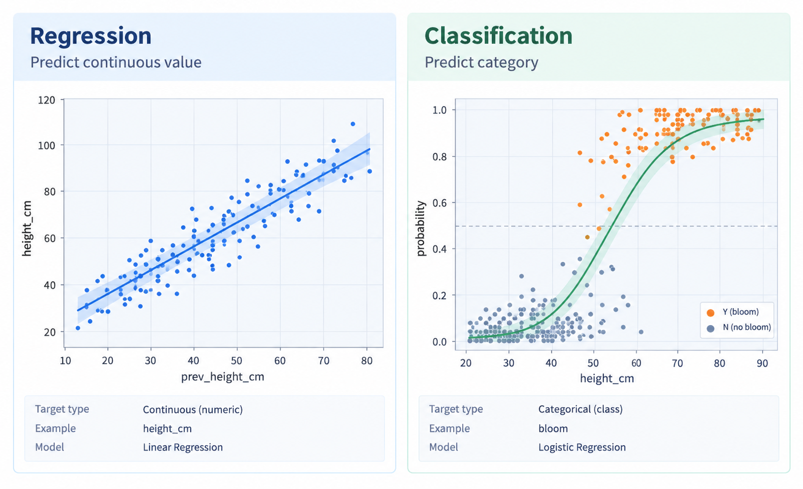
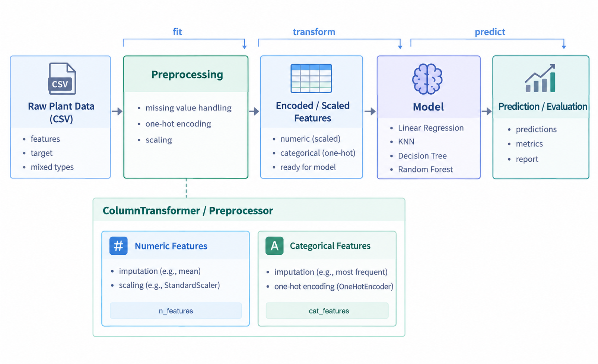
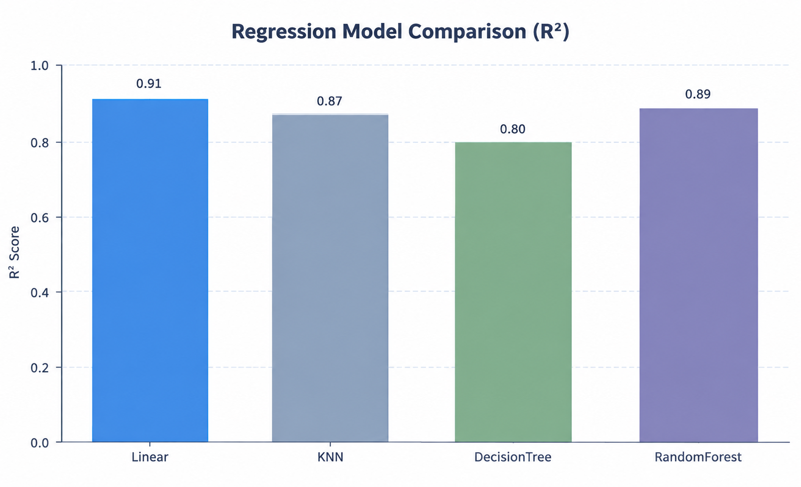
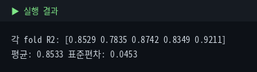
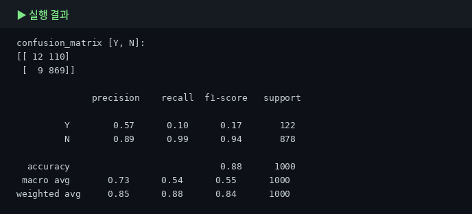
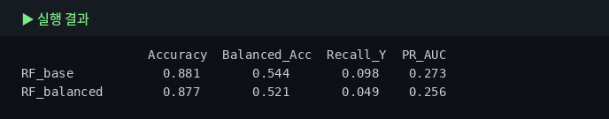

# 6. 머신러닝 — scikit-learn

Module 5에서 만든 전처리 파이프라인을 바탕으로, 이제 실제 머신러닝 모델을 학습하고 성능을 평가합니다. 이번 장에서는 **키(`height_cm`)를 예측하는 회귀**와 **개화 여부(`is_blooming`)를 맞히는 분류**를 모두 다룹니다.

먼저 **전처리기와 모델을 하나의 Pipeline으로 묶는 방법**을 익히고, 이어서 여러 모델의 성능을 비교합니다. 그다음 **교차검증**, **불균형 데이터 평가**, **하이퍼파라미터 탐색**, **특성 중요도 해석**까지 순서대로 살펴봅니다.

즉, Module 6은 "전처리된 데이터를 실제로 모델에 넣어 보고, 결과를 올바르게 해석하는 단계"입니다.

## 6-1. 학습 유형 — 회귀와 분류

::: tip 먼저 "무엇을 예측하는 문제인지"부터 구분합니다
머신러닝은 예측하려는 값의 형태에 따라 크게 **회귀(regression)** 와 **분류(classification)** 로 나뉩니다.

- **회귀** — 결과가 **숫자**일 때  
  예: 식물의 키(`height_cm`), 물 준 뒤 무게, 성장 일수
- **분류** — 결과가 **범주**일 때  
  예: 개화 여부(`is_blooming`), 병충해 유무, 품종 분류

즉, **output(타깃)이 수치형이면 회귀**, **범주형이면 분류**라고 생각하면 됩니다.
:::

이번 실습에서는 두 가지 문제를 모두 다룹니다.

- **회귀 문제** — 식물의 키 `height_cm` 예측
- **분류 문제** — 식물이 꽃을 피웠는지 `is_blooming` 예측

같은 데이터라도 **무엇을 output으로 잡느냐**에 따라 문제 유형이 달라집니다.  
예를 들어 `height_cm`를 맞히면 회귀, `is_blooming`을 맞히면 분류가 됩니다.



**왜 먼저 구분하나요?** 문제 유형이 달라지면 아래 요소가 함께 달라지기 때문입니다.

- 사용하는 **모델 종류**
- 성능을 재는 **평가 지표**
- 교차검증 방식과 결과 해석

예를 들어 회귀는 오차 크기(MAE, RMSE)나 설명력(R²)을 보고, 분류는 정확도(Accuracy), 재현율(Recall), 정밀도(Precision) 등을 봅니다. 이 평가지표들은 뒤 절에서 하나씩 확인합니다.

::: tip 이번 장의 흐름
먼저 **회귀 모델**로 `height_cm`를 예측해 보고,  
그다음 **분류 모델**로 `is_blooming`을 예측합니다.
:::

## 6-2. Pipeline 결합 — 전처리와 모델을 한 번에

Module 5에서는 `preprocessor`를 사용해 결측치 처리, 인코딩, 스케일링을 한 번에 수행했습니다.  
머신러닝 단계에서는 이 전처리기 뒤에 모델을 붙여 **전처리와 학습을 하나의 흐름으로 연결**합니다.

이렇게 하면 원본 데이터를 넣었을 때,  
**전처리 → 모델 학습 → 예측**이 같은 규칙으로 자동 실행됩니다.

```python
from sklearn.pipeline import Pipeline
from sklearn.linear_model import LinearRegression

lr_pipe = Pipeline([
    ('prep', preprocessor),
    ('model', LinearRegression())
])

# 전처리와 모델 학습을 한 번에 수행
lr_pipe.fit(X_train, y_train)

# 예측도 같은 흐름으로 처리
pred = lr_pipe.predict(X_test)
print(pred[:5])
```

`Pipeline`의 각 단계는 다음 의미를 가집니다.

- `prep` — 원본 데이터를 모델이 다룰 수 있는 형태로 변환
- `model` — 변환된 데이터로 규칙을 학습하고 예측 수행

즉, `Pipeline([('prep', preprocessor), ('model', 모델)])` 구조는  
Module 6에서 반복해서 사용하는 기본 틀입니다.

**왜 이렇게 묶을까요?**

- 전처리 순서를 실수하지 않음
- train에서 만든 기준을 test에도 같은 방식으로 적용 가능
- 교차검증과 GridSearchCV에도 그대로 재사용 가능
- 데이터 누수를 줄이는 데 유리함



::: tip 변수명 구분
여러 모델을 비교할 때는 `lr_pipe`, `knn_pipe`, `dt_pipe`, `rf_pipe`처럼 이름을 나누세요.  
같은 `pipe` 변수를 계속 덮어쓰면 어떤 결과가 어느 모델 것인지 헷갈리기 쉽습니다.
:::

## 6-3. 회귀 모델 4종 비교

이번에는 `height_cm`를 예측하는 **회귀 모델 4개**를 비교합니다.  
같은 전처리기를 연결한 뒤, 모델만 바꾸어 성능 차이를 확인합니다.

### 비교할 모델

- **Linear Regression**
  - 입력 변수와 결과 사이에 **선형 관계**가 있다고 가정하는 가장 기본적인 회귀 모델입니다.
  - 예를 들어, `prev_height_cm`가 커질수록 `height_cm`도 비슷한 비율로 커진다고 보는 방식입니다.
  - 구조가 단순해 **해석이 쉽고**, 데이터가 실제로 선형 관계를 가질 때 매우 강력합니다.

- **KNN Regressor**
  - 새로운 식물이 들어오면, 기존 데이터 중에서 **가장 비슷한 K개 이웃**을 찾습니다.
  - 그리고 그 이웃들의 `height_cm` 평균을 이용해 예측합니다.
  - 데이터의 패턴이 복잡해도 사용할 수 있지만, **거리 기반 모델**이라 스케일의 영향을 받기 쉽습니다.

- **Decision Tree Regressor**
  - 데이터를 여러 조건으로 나누면서 예측합니다.
  - 예를 들어, "`prev_height_cm`가 40 이상인가?", "`humidity_pct`가 60 이상인가?"처럼 기준을 나누어 최종 예측값을 정합니다.
  - 해석은 비교적 쉬우나, 트리 하나만 쓰면 **과적합**되기 쉽습니다.

- **Random Forest Regressor**
  - 여러 개의 결정트리를 만들고, 각 트리의 예측값을 평균 내어 최종 예측을 만듭니다.
  - 하나의 트리보다 **안정적이고 과적합에 덜 민감**한 편입니다.
  - 일반적으로 성능이 좋은 경우가 많지만, 데이터 구조가 단순하면 선형 회귀보다 꼭 우세하다고 할 수는 없습니다.

이번 비교에서는 **R² 점수**를 사용합니다.  
R²는 모델이 데이터를 얼마나 잘 설명하는지를 나타내며, **1에 가까울수록 좋고 0에 가까우면 설명력이 낮다**고 해석합니다.

```python
from sklearn.pipeline import Pipeline
from sklearn.linear_model import LinearRegression
from sklearn.neighbors import KNeighborsRegressor
from sklearn.tree import DecisionTreeRegressor
from sklearn.ensemble import RandomForestRegressor
from sklearn.metrics import r2_score

# 1) 선형 회귀 파이프라인
# 전처리 후, 입력 변수와 키(height_cm) 사이의 선형 관계를 학습합니다.
lr_pipe = Pipeline([
    ('prep', preprocessor),
    ('model', LinearRegression())
])

# 2) KNN 회귀 파이프라인
# 가장 비슷한 이웃 5개의 키를 참고해 평균적으로 예측합니다.
knn_pipe = Pipeline([
    ('prep', preprocessor),
    ('model', KNeighborsRegressor(n_neighbors=5))
])

# 3) 결정트리 회귀 파이프라인
# 여러 조건으로 데이터를 나누며 예측 규칙을 만듭니다.
dt_pipe = Pipeline([
    ('prep', preprocessor),
    ('model', DecisionTreeRegressor(random_state=42))
])

# 4) 랜덤포레스트 회귀 파이프라인
# 결정트리 여러 개를 만들어 예측값을 평균내므로 더 안정적인 결과를 기대할 수 있습니다.
rf_pipe = Pipeline([
    ('prep', preprocessor),
    ('model', RandomForestRegressor(n_estimators=200, random_state=42))
])

# 비교할 모델들을 (이름, 파이프라인) 형태로 묶습니다.
models = [
    ('Linear', lr_pipe),
    ('KNN', knn_pipe),
    ('DecisionTree', dt_pipe),
    ('RandomForest', rf_pipe)
]

# 각 모델별로 학습 → 예측 → R² 계산을 반복합니다.
for name, pipe in models:
    # 훈련 데이터로 학습
    pipe.fit(X_train, y_train)

    # 테스트 데이터 예측
    pred = pipe.predict(X_test)

    # 실제값과 예측값을 비교해 R² 계산
    r2 = r2_score(y_test, pred)

    # 소수 넷째 자리까지 출력
    print(name, 'R2 =', round(r2, 4))
```




출력된 R² 값을 비교하면, **현재 데이터에서 어떤 모델이 더 잘 작동하는지** 확인할 수 있습니다.  
다만 한 번의 train/test 분할 결과만으로 단정하면 위험하므로, 다음 절에서 **교차검증**으로 다시 확인합니다.

::: tip 왜 Linear가 더 좋게 나올 수 있을까?
`prev_height_cm`와 `height_cm`의 관계가 매우 강한 선형 형태이기 때문입니다.  
이처럼 데이터의 실제 구조가 단순할 때는, 복잡한 트리 모델보다 **선형 회귀 같은 단순한 모델이 더 잘 맞을 수 있습니다.**

즉, **모델은 복잡할수록 좋은 것이 아니라**, 데이터의 관계 구조에 맞는 모델을 고르는 것이 중요합니다.
:::

## 6-4. 교차검증 — KFold (회귀용)

앞에서는 데이터를 한 번 `train/test`로 나누어 성능을 확인했습니다.  
하지만 이 방법은 **어떻게 나누었는지에 따라 결과가 달라질 수 있다**는 한계가 있습니다.

그래서 사용하는 방법이 **교차검증(cross-validation)** 입니다.  
교차검증은 데이터를 한 번만 나누지 않고, **여러 번 나누어 반복 평가**하는 방법입니다.

### KFold란?

`KFold`는 데이터를 **K개 조각(fold)** 으로 나눈 뒤,  
그중 1개는 검증용, 나머지는 학습용으로 사용하고,  
이 과정을 **K번 반복**하는 방식입니다.

예를 들어 `K=5`라면:

- 1번째 검증: 1번 fold를 검증용으로 사용
- 2번째 검증: 2번 fold를 검증용으로 사용
- ...
- 5번째 검증: 5번 fold를 검증용으로 사용

즉, **모든 데이터가 한 번씩은 검증용으로 사용**됩니다.  
이렇게 하면 한 번의 우연한 분할에 덜 의존하고, 모델의 **전반적인 안정성**을 더 잘 확인할 수 있습니다.

### 왜 회귀에서는 KFold를 쓸까?

회귀는 목표값이 연속형 수치이므로,  
보통은 데이터를 여러 조각으로 나누는 `KFold`를 기본으로 사용합니다.

반면 분류에서는 클래스 비율이 fold마다 크게 달라지면 평가가 왜곡될 수 있어서,  
클래스 비율을 비슷하게 맞춰 주는 `StratifiedKFold`를 더 자주 사용합니다.

::: tip 회귀와 분류의 교차검증 도구
회귀 → `KFold`  
분류 → `StratifiedKFold`
:::

이제 앞에서 만든 `rf_pipe`에 대해 5-fold 교차검증을 해보겠습니다.

```python
from sklearn.model_selection import cross_val_score, KFold
import numpy as np

# 데이터를 5개 fold로 나누어 교차검증합니다.
# shuffle=True는 데이터를 섞은 뒤 나누기 위한 옵션입니다.
# random_state=42는 실행할 때마다 같은 방식으로 섞이게 해 줍니다.
cv = KFold(n_splits=5, shuffle=True, random_state=42)

# rf_pipe를 5번 평가하고, 각 fold의 R² 점수를 배열로 받습니다.
scores = cross_val_score(
    rf_pipe,      # 평가할 파이프라인
    X,            # 입력 데이터
    y,            # 목표값
    cv=cv,        # 교차검증 방식
    scoring='r2'  # 회귀 성능 지표로 R² 사용
)

# 각 fold 결과 출력
print('fold별 R²:', np.round(scores, 4))

# 평균 성능 출력
print('평균 R²:', round(scores.mean(), 4))

# 점수의 흔들림 정도 출력
print('표준편차:', round(scores.std(), 4))
```



### 결과는 어떻게 보나요?

- **각 fold 점수** → 나눔마다 모델 성능이 얼마나 달라지는지
- **평균 점수** → 전반적인 성능 수준
- **표준편차** → 결과의 흔들림 정도

예를 들어 fold별 R²가 `0.78 ~ 0.92`처럼 차이가 난다면,  
모델 성능이 **분할 방식에 따라 꽤 달라질 수 있다**는 뜻입니다.

반대로 점수들이 서로 비슷하다면,  
그 모델은 **비교적 안정적**이라고 볼 수 있습니다.

### 핵심 해석

교차검증은 “한 번 잘 나온 결과”를 보는 것이 아니라,  
**여러 번 나누어도 비슷하게 잘 작동하는지** 확인하는 과정입니다.

따라서 모델 비교나 하이퍼파라미터 탐색 전에,  
먼저 **현재 모델이 안정적인지 점검하는 단계**로 매우 중요합니다.

## 6-5. 분류 모델 4종 — is_blooming

::: warning 정보 누수 주의 — height_cm 제외
height_cm은 개화와 연관되어 성능을 올리지만, **예측 시점에 그 값을 아는지**에 따라 씁니다. 미래 개화를 미리 예측하는데 아직 키를 안 쟀다면 정보 누수입니다. 아래는 안전하게 제외했습니다.
:::

```python
lr_clf = Pipeline([('prep', preprocessor_c), ('model', LogisticRegression(max_iter=1000))])
# ... KNN, DecisionTree, RandomForest 동일 패턴
```


::: warning Accuracy 함정
"무조건 N만 찍어도" Accuracy 87.8%가 나옵니다. 모든 모델 Accuracy는 87~88%로 높아 보이지만 Recall(Y)은 4~9%로 매우 낮습니다 — 개화 식물을 거의 놓치고 있다는 뜻입니다.
:::

## 6-6. 혼동행렬

```python
from sklearn.metrics import confusion_matrix, classification_report
print(confusion_matrix(y_test, pred, labels=['Y','N']))
print(classification_report(y_test, pred))
```



## 6-7. 불균형 대응 — balanced accuracy, PR AUC, 임계값 조정

```python
from sklearn.metrics import balanced_accuracy_score, average_precision_score
# class_weight='balanced'로 소수 클래스에 가중치
rf_balanced = RandomForestClassifier(n_estimators=200, class_weight='balanced', random_state=42)
```



임계값을 0.5→0.2로 낮추면 Recall이 4%→46%로 오르지만 Precision은 떨어지는 트레이드오프가 뚜렷합니다.

| 지표 | 의미 |
|---|---|
| Balanced Accuracy | 클래스별 재현율 평균 (비율 보정) |
| PR AUC | 불균형에서 소수 클래스 탐지 성능 |
| 임계값 조정 | 0.5 낮추면 Recall↑ Precision↓ |

## 6-8. GridSearchCV

```python
from sklearn.model_selection import GridSearchCV
param_grid = {'model__n_estimators': [100, 200], 'model__max_depth': [5, 10, None]}
grid = GridSearchCV(rf_pipe, param_grid, cv=3, scoring='r2', n_jobs=-1)
grid.fit(X_train, y_train)
```


max_depth를 제한 없이(None) 키운 것보다 얕게(5) 제한한 게 더 좋았습니다 — 과적합 방지 원칙이 실제로 확인된 사례입니다. (파라미터 앞 `model__`은 Pipeline 단계명 문법)

## 6-9. Feature Importance

```python
importances = best_model.named_steps['model'].feature_importances_
# 다른 방식으로도 재확인
from sklearn.inspection import permutation_importance
perm = permutation_importance(best_model, X_test, y_test, n_repeats=10)
```


::: warning feature_importances_는 절대적 진실 아님
트리 중요도는 상관된 변수끼리 나눠 갖거나 인코딩 영향을 받습니다. 위처럼 `permutation_importance`로 교차 확인하는 습관이 좋습니다. 두 방식 모두 prev_height_cm이 압도적이라는 같은 결론을 보여줍니다.
:::

## ✅ 체크리스트

- 회귀/분류를 Output 유형에 따라 구분한다
- 트리 계열이 항상 낫지 않다는 걸 실제 결과로 확인했다
- 입력 전 "예측 시점에 이 값을 아는가"(정보 누수)를 점검한다
- 클래스 불균형에서 Accuracy만 보면 안 되는 이유를 안다
- 회귀 KFold / 분류 StratifiedKFold를 구분한다
- GridSearchCV의 `model__` 문법을 쓸 수 있다
- feature_importances_와 permutation_importance로 교차 확인한다
