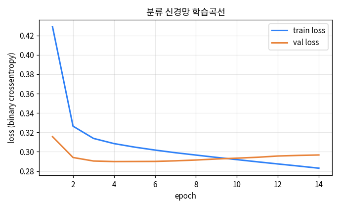
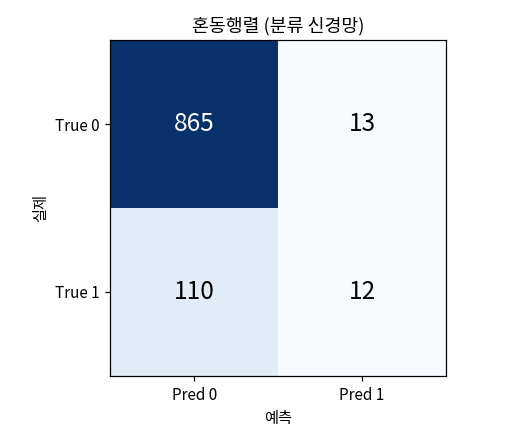
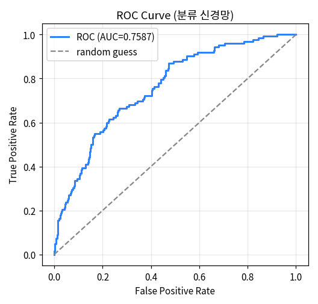

# 7. 딥러닝 — TensorFlow / Keras

Module 6까지는 scikit-learn으로 머신러닝을 다뤘습니다. 이번 모듈에서는 **딥러닝(신경망)** 으로 같은 두 문제 — 회귀(`height_cm` 예측)와 분류(`is_blooming` 예측) — 를 풀어 보고, **6장의 머신러닝 결과와 직접 비교**합니다.

핵심 질문은 하나입니다: **"딥러닝이 항상 더 좋은가?"** 결론부터 말하면 이 데이터에서는 그렇지 않습니다. 그 이유를 개념부터 차근차근 확인합니다.

## 7-1. 딥러닝 기본 개념

::: tip 딥러닝이란?
딥러닝은 **인공신경망(neural network)** 을 여러 층 쌓아 학습하는 머신러닝의 한 갈래입니다. 특히 **층(layer)이 깊은(deep)** 신경망을 쓴다고 해서 '딥'러닝입니다.

Module 6의 모델들이 사람이 정한 구조(선형식, 트리 분할)로 학습했다면, 신경망은 **여러 층의 가중치를 스스로 조정**하며 입력과 출력의 관계를 근사합니다.
:::


### 신경망의 기본 단위 — 뉴런과 층

가장 작은 단위는 **뉴런(퍼셉트론)** 입니다. 뉴런 하나는 이렇게 계산합니다.

1. 각 입력에 **가중치(weight)** 를 곱해 모두 더하고, **편향(bias)** 을 더합니다. (선형 결합)
2. 그 값을 **활성화 함수**에 통과시켜 출력합니다.


이 뉴런을 나란히 모은 것이 **층(layer)** 이고, 층을 여러 개 쌓은 것이 신경망입니다.

- **입력층** — 전처리된 특성이 들어오는 곳
- **은닉층(hidden layer)** — 중간에서 특징을 조합하는 층. 여기가 깊어질수록 '딥'
- **출력층** — 최종 예측. 회귀는 숫자 1개, 이진분류는 확률 1개


### 활성화 함수 — 왜 필요한가

활성화 함수가 없으면 층을 아무리 쌓아도 결국 **하나의 선형식**과 같아져 복잡한 관계를 학습할 수 없습니다. 활성화 함수는 **비선형성**을 넣어 신경망이 곡선 같은 복잡한 패턴도 표현하게 해줍니다.

- **ReLU** — 은닉층에서 가장 많이 씁니다. 음수는 0으로, 양수는 그대로 통과.
- **Leaky ReLU** — ReLU의 변형. 음수 구간을 완전히 0으로 죽이지 않고 살짝(예: 0.1배) 흘려보내, 뉴런이 학습을 멈추는 문제를 완화합니다.
- **Sigmoid** — 출력을 0~1로 눌러, **이진분류의 확률 출력**에 씁니다(4장 로지스틱 곡선과 같은 모양).
- **Tanh** — sigmoid와 비슷하나 출력이 **-1~1**로 중심이 0입니다. 출력이 0을 기준으로 대칭이라 은닉층에서 sigmoid보다 유리할 때가 있습니다.
- **Softmax** — 클래스가 **3개 이상인 다중분류**의 출력층에서, 각 클래스 확률을 합이 1이 되도록 냅니다(이번 모듈은 이진분류라 sigmoid 사용).


::: details 더 깊이 — 어디에 무엇을 쓰나
- **은닉층**: ReLU(기본), 죽는 뉴런이 걱정되면 Leaky ReLU
- **이진분류 출력층**: Sigmoid(확률 1개)
- **다중분류 출력층**: Softmax(확률 여러 개, 합=1)
- **회귀 출력층**: 활성화 없음(선형) — 키(cm) 같은 연속값을 0~1로 누르면 안 되기 때문
:::

### 학습은 어떻게 일어나나

신경망 학습은 "예측이 정답에 가까워지도록 가중치를 조금씩 고치는" 반복입니다.

1. **손실 함수(loss)** — 예측과 정답의 차이를 하나의 숫자로 잰다. 회귀는 **MSE**(평균제곱오차), 이진분류는 **binary crossentropy**.
2. **옵티마이저(optimizer)** — 손실을 줄이는 방향으로 가중치를 갱신한다. 보통 **Adam**.
3. **에폭(epoch)** — 전체 데이터를 한 번 다 학습하는 단위. 여러 에폭 반복.
4. **배치(batch)** — 데이터를 작게 나눠(예: 32개씩) 갱신.


::: details 더 깊이 — 경사하강법과 학습률
손실을 가중치로 미분하면 "손실이 가장 가파르게 증가하는 방향"이 나오는데, 그 **반대 방향**으로 가중치를 조금씩(학습률만큼) 옮기는 것이 **경사하강법**입니다. 학습률이 너무 작으면 수렴이 느리고, 너무 크면 최소점을 지나쳐 **발산**할 수 있습니다(위 오른쪽 그림). Adam은 여기에 관성·적응적 학습률을 더해 더 안정적으로 수렴하게 만든 옵티마이저입니다.
:::

### 과적합과 대응

층·뉴런이 많은 신경망은 표현력이 커서, 훈련 데이터를 **외워버리는 과적합**이 나기 쉽습니다. 이 모듈에서 쓰는 세 가지 안전장치는:

- **검증 데이터(validation)** — 학습 중 별도 데이터로 성능을 지켜봐 과적합 시작을 감지
- **EarlyStopping** — 검증 손실이 더 나아지지 않으면 학습을 자동으로 멈춤
- **Dropout** — 학습 중 일부 뉴런을 무작위로 꺼서 특정 뉴런에 과의존하지 않게 함


### 그래서 딥러닝을 언제 쓰나

딥러닝은 **이미지·음성·자연어**처럼 크고 복잡한 비정형 데이터에서 강력합니다. 반면 **이번 같은 표(tabular) 형태의 소규모 데이터**에서는, 6장에서 본 것처럼 단순한 선형모델이나 트리 기반 모델이 딥러닝만큼(때로는 더) 잘 맞고 학습도 빠릅니다.

::: warning 딥러닝이 항상 정답은 아닙니다
"신경망 = 최신 = 최고"가 아닙니다. 데이터의 크기·형태·관계 구조에 맞는 모델을 고르는 것이 핵심입니다. 이번 모듈에서 회귀·분류 각각을 6장의 머신러닝과 비교하며, **딥러닝이 언제 이점이 있고 언제 없는지**를 실제 수치로 확인합니다.
:::

## 7-2. 회귀 — height_cm 예측

6장에서 머신러닝으로 풀었던 **키(`height_cm`) 예측**을, 이번엔 신경망으로 풀고 결과를 비교합니다.

::: tip 회귀 신경망의 뼈대
- **입력** — Module 5의 전처리기(`preprocessor`)를 그대로 재사용합니다(수치 16개 특성).
- **은닉층** — `Dense(64) → Dense(32)`, 활성화 `ReLU`
- **출력층** — `Dense(1)`, **활성화 없음(선형)** — 키(cm)는 연속값이라 0~1로 누르면 안 됩니다.
- **손실** — `mse`(평균제곱오차), **옵티마이저** — `adam`
:::

```python
import numpy as np, random, tensorflow as tf
from tensorflow import keras
from tensorflow.keras import layers
from sklearn.metrics import mean_absolute_error, mean_squared_error, r2_score

# 재현성: 실행마다 결과가 흔들리지 않도록 시드를 고정합니다.
random.seed(42); np.random.seed(42); tf.random.set_seed(42)

# Module 5의 전처리기로 학습/테스트 입력을 변환합니다.
# - fit은 train에만(누수 방지), test는 transform만
X_train_p = preprocessor.fit_transform(X_train)
X_test_p = preprocessor.transform(X_test)

# 신경망 정의 (입력 → 은닉 64 → 은닉 32 → 출력 1)
model = keras.Sequential([
    layers.Input(shape=(X_train_p.shape[1],)),   # 특성 수(16)만큼 입력
    layers.Dense(64, activation='relu'),
    layers.Dense(32, activation='relu'),
    layers.Dense(1)                              # 회귀 출력: 활성화 없음(선형)
])

# 손실=mse, 옵티마이저=adam
model.compile(optimizer='adam', loss='mse', metrics=['mae'])

# EarlyStopping: 검증 손실이 10에폭 동안 안 나아지면 멈추고 최적 가중치 복원
es = keras.callbacks.EarlyStopping(patience=10, restore_best_weights=True)

# 학습: 훈련 데이터의 20%를 검증용으로 떼어 과적합을 감시
history = model.fit(
    X_train_p, y_train,
    validation_split=0.2,
    epochs=100, batch_size=32,
    callbacks=[es], verbose=0
)

# 평가
pred = model.predict(X_test_p, verbose=0).flatten()
mae = mean_absolute_error(y_test, pred)
rmse = np.sqrt(mean_squared_error(y_test, pred))
r2 = r2_score(y_test, pred)
print(f'MAE={mae:.3f}, RMSE={rmse:.3f}, R2={r2:.4f}')
```

### 학습곡선 — 과적합 감시

`history`에 저장된 훈련/검증 손실을 그려, 학습이 잘 수렴했는지 확인합니다.

```python
import matplotlib.pyplot as plt

plt.plot(history.history['loss'], label='train loss')
plt.plot(history.history['val_loss'], label='val loss')
plt.xlabel('epoch'); plt.ylabel('loss (MSE)')
plt.legend(); plt.show()
```


훈련·검증 손실이 함께 빠르게 내려가 낮은 값에서 수렴합니다. 두 곡선이 크게 벌어지지 않으므로 심한 과적합은 없고, EarlyStopping이 검증 손실이 가장 낮은 지점(약 23에폭)의 가중치를 복원한 뒤 33에폭에서 멈췄습니다.

### 결과 — 6장 머신러닝과 비교


| 모델 | R² | 비고 |
|---|---|---|
| **LinearRegression** | **0.8673** | 6장 최고 |
| DeepLearning (이번) | 0.8573 | 트리보다 약간 높음 |
| RandomForest | 0.8542 | 6장 |

**해석:** 딥러닝(R²=0.8573)은 RandomForest는 근소하게 앞서지만, **가장 단순한 LinearRegression(0.8673)은 넘지 못했습니다.** 이유는 6장에서 본 것과 같습니다 — 이 데이터는 `prev_height_cm`과 `height_cm`의 관계가 거의 선형이라, 복잡한 신경망보다 단순한 선형모델이 더 잘 맞습니다.

::: warning 딥러닝이 항상 이기지 않는다 — 실제 사례
표(tabular) 형태의 소규모 데이터에서는, 잘 맞는 선형·트리 모델을 신경망이 넘어서기 어려운 경우가 많습니다. 신경망은 층·뉴런·에폭 등 조정할 게 많고 학습도 느린데, 여기서는 그 비용 대비 이점이 없었습니다. **모델은 데이터 구조에 맞게 고르는 것**이 핵심입니다.
:::

## 7-3. 회귀 모델 검수 — 예측이 믿을 만한가

R²·MAE 같은 요약 숫자 하나로는 모델의 실제 행동을 다 알 수 없습니다. **예측이 어디서 잘 맞고 어디서 틀리는지**를 그림으로 확인하는 것이 검수(진단) 과정입니다. 회귀에서는 두 가지를 봅니다 — **예측값 vs 실제값**, 그리고 **잔차(residual)**.

### ① 예측값 vs 실제값

각 테스트 개체에 대해 (실제 키, 예측 키)를 점으로 찍습니다. 모든 예측이 완벽하다면 점들이 대각선 `y = x` 위에 정확히 놓입니다. 대각선에서 멀어질수록 그 개체의 예측이 크게 빗나간 것입니다.

```python
import matplotlib.pyplot as plt

plt.scatter(y_test, pred, s=10, alpha=0.35)
lim = [min(y_test.min(), pred.min()), max(y_test.max(), pred.max())]
plt.plot(lim, lim, '--', label='y = x (완벽 예측)')   # 기준선
plt.xlabel('실제 height_cm'); plt.ylabel('예측 height_cm')
plt.legend(); plt.show()
```


점들이 대체로 대각선을 따라 좁게 모여 있어, 대부분의 개체를 잘 예측합니다. 다만 두 가지 특징이 보입니다. 왼쪽 아래에 **실제 키와 무관하게 약 50cm로 예측된 수평 띠**가 있고(신경망이 특정 구간을 뭉뚱그린 흔적), 오른쪽 아래에는 **실제 220cm대를 50cm로 크게 틀린 이상치 몇 개**가 있습니다. 이런 점들이 뒤의 오차(RMSE)를 키우는 주범입니다.

### ② 잔차 분석

**잔차 = 실제값 − 예측값** 입니다. 좋은 모델의 잔차는 ⓐ **0 주변에 고르게 흩어지고**(예측값 크기와 무관하게), ⓑ **0을 중심으로 대칭인 종 모양**을 보입니다. 특정 구간에서 잔차가 한쪽으로 쏠리면, 그 구간을 모델이 체계적으로 틀리고 있다는 신호입니다.

```python
resid = y_test - pred   # 잔차

fig, (a1, a2) = plt.subplots(1, 2, figsize=(10, 4))
a1.scatter(pred, resid, s=8, alpha=0.35); a1.axhline(0, ls='--')
a1.set_xlabel('예측값'); a1.set_ylabel('잔차(실제-예측)'); a1.set_title('잔차 vs 예측값')

a2.hist(resid, bins=40); a2.axvline(0, ls='--')
a2.set_xlabel('잔차'); a2.set_title('잔차 분포')
plt.show()
```


잔차 대부분이 **0 근처에 몰려 있고 분포도 0을 중심으로 뾰족한 종 모양**이라, 전반적으로 편향 없이 잘 예측합니다. 다만 왼쪽 그림에서 **예측값 50 부근에 잔차가 세로로 크게 튀는 점들**이 보이는데, 이는 ①에서 본 "50cm 수평 띠"와 같은 개체들입니다. 잔차 평균은 약 −1.5로 0에 가깝지만, 소수의 큰 잔차가 표준편차(약 8.9)를 키웁니다.

### ③ MAE와 RMSE를 함께 읽기

- **MAE = 3.406** — 평균적으로 약 3.4cm 빗나갑니다(오차의 평균적 크기).
- **RMSE = 9.064** — MAE보다 훨씬 큽니다.

MAE와 RMSE의 **큰 차이 자체가 진단 정보**입니다. RMSE는 큰 오차를 제곱해 더 크게 반영하므로, 둘의 격차가 크다는 것은 **평소엔 잘 맞지만 가끔 크게 틀리는 개체(위의 이상치)** 가 있다는 뜻입니다. 실제로 ①·②에서 본 몇몇 큰 오차가 RMSE를 끌어올린 것입니다.

### ④ 검수 결론

- 신경망은 대부분의 개체를 편향 없이 잘 예측한다(잔차가 0 중심, 예측-실제가 대각선에 밀집).
- 소수의 큰 오차(50cm 뭉침 구간·극단 이상치)가 RMSE를 키운다.
- 그럼에도 최종 R²=0.8573으로, **6장의 LinearRegression(0.8673)을 넘지는 못한다** — 검수 그림에서도 신경망이 이 데이터에서 결정적 이점을 주지 못한 이유가 드러난다.

::: tip 검수를 왜 할까
요약 지표는 "얼마나 틀렸나"만 알려주지만, 예측-실제 그래프와 잔차는 **"어디서, 왜 틀렸나"** 를 보여줍니다. 실무에서 모델을 배포하기 전 반드시 거치는 단계입니다.
:::

## 7-4. 분류 — is_blooming 예측

6장에서 머신러닝으로 풀었던 **개화 여부(`is_blooming`) 예측**을, 이번엔 신경망으로 풀고 6장 결과와 비교합니다.

::: tip 분류 신경망의 뼈대
이 문제는 **이진분류**입니다(0=개화 안 함, 1=개화함). 회귀와 달리 출력층에서 **확률**을 내야 합니다.

- **입력** — 분류용 전처리기(`height_cm`은 정보 누수라 제외, `plant_id`도 제외)
- **은닉층** — `Dense(64) → Dense(32)`, 활성화 `ReLU`
- **출력층** — `Dense(1, activation='sigmoid')` → 출력을 0~1 확률로. 보통 **0.5 이상이면 1**로 예측.
- **손실** — `binary_crossentropy`, **옵티마이저** — `adam`

`sigmoid` 출력이 `0.92`면 개화 가능성 높음, `0.18`이면 낮음으로 읽습니다.
:::

분류는 loss만으로 부족해, 여러 지표를 함께 봅니다 — **Accuracy**(전체 정답률), **Precision**(1 예측 중 실제 1 비율), **Recall**(실제 1 중 찾아낸 비율), **F1**(둘의 균형), **ROC-AUC**(임계값 전반의 구분력).

::: warning 왜 Accuracy만 보면 안 되나
`is_blooming`은 개화(1)가 약 12%뿐인 **불균형 데이터**입니다. 전부 0으로만 찍어도 Accuracy가 88%에 이르므로, Precision·Recall·F1·ROC-AUC를 함께 봐야 합니다(6장 6-5·6-7과 같은 맥락).
:::

```python
import numpy as np, random, tensorflow as tf
from tensorflow import keras
from tensorflow.keras import layers
from sklearn.model_selection import train_test_split
from sklearn.compose import ColumnTransformer
from sklearn.pipeline import Pipeline
from sklearn.impute import SimpleImputer
from sklearn.preprocessing import OneHotEncoder, StandardScaler
from sklearn.metrics import (accuracy_score, precision_score, recall_score,
                             f1_score, roc_auc_score)

random.seed(42); np.random.seed(42); tf.random.set_seed(42)

# [1] 분류용 입력/출력 (회귀와 다른 분할!)
# - 타깃: is_blooming을 0/1로
# - 입력: height_cm(정보 누수)·plant_id(식별자)는 제외
y_clf = (df['is_blooming'] == 'Y').astype(int)
X_clf = df.drop(columns=['is_blooming', 'height_cm', 'plant_id'])

# stratify로 train/test에 Y/N 비율 유지 (불균형 데이터에 중요)
Xc_train, Xc_test, yc_train, yc_test = train_test_split(
    X_clf, y_clf, test_size=0.2, random_state=42, stratify=y_clf)

# [2] 분류용 전처리기 (수치=중앙값·표준화 / 범주=최빈값·OneHot)
num_c = X_clf.select_dtypes(include='number').columns.tolist()
cat_c = X_clf.select_dtypes(exclude='number').columns.tolist()
preprocessor_c = ColumnTransformer([
    ('num', Pipeline([('imputer', SimpleImputer(strategy='median')),
                      ('scaler', StandardScaler())]), num_c),
    ('cat', Pipeline([('imputer', SimpleImputer(strategy='most_frequent')),
                      ('encoder', OneHotEncoder(handle_unknown='ignore', sparse_output=False))]), cat_c),
])
Xc_train_p = preprocessor_c.fit_transform(Xc_train)   # train에만 fit
Xc_test_p = preprocessor_c.transform(Xc_test)         # test는 transform만

# [3] 이진분류 신경망 (출력층 sigmoid)
clf_model = keras.Sequential([
    layers.Input(shape=(Xc_train_p.shape[1],)),
    layers.Dense(64, activation='relu'),
    layers.Dense(32, activation='relu'),
    layers.Dense(1, activation='sigmoid')      # 0~1 확률 출력
])
clf_model.compile(optimizer='adam', loss='binary_crossentropy',
                  metrics=[keras.metrics.BinaryAccuracy(name='acc'),
                           keras.metrics.AUC(name='auc')])

es = keras.callbacks.EarlyStopping(patience=10, restore_best_weights=True)
history_clf = clf_model.fit(Xc_train_p, yc_train, validation_split=0.2,
                            epochs=100, batch_size=32, callbacks=[es], verbose=0)

# [4] 예측: predict()는 확률 → 0.5 기준으로 0/1 변환
pred_prob = clf_model.predict(Xc_test_p, verbose=0).flatten()
pred_cls = (pred_prob >= 0.5).astype(int)

# [5] 지표 계산
print(f'Accuracy ={accuracy_score(yc_test, pred_cls):.4f}')
print(f'Precision={precision_score(yc_test, pred_cls, zero_division=0):.4f}')
print(f'Recall   ={recall_score(yc_test, pred_cls, zero_division=0):.4f}')
print(f'F1       ={f1_score(yc_test, pred_cls, zero_division=0):.4f}')
print(f'ROC-AUC  ={roc_auc_score(yc_test, pred_prob):.4f}')
```

### 학습곡선 확인

```python
import matplotlib.pyplot as plt

plt.plot(history_clf.history['loss'], label='train loss')
plt.plot(history_clf.history['val_loss'], label='val loss')
plt.xlabel('epoch'); plt.ylabel('loss (binary crossentropy)')
plt.legend(); plt.show()
```



훈련·검증 손실이 함께 내려가 수렴하고, EarlyStopping이 14에폭에서 멈췄습니다.

### 결과 — 6장 머신러닝과 비교

이번 신경망은 **Accuracy=0.877, Precision=0.480, Recall=0.098, F1=0.163, ROC-AUC=0.759** 입니다. 6장 결과와 비교하면:

| 모델 | Accuracy | F1 | ROC-AUC | 비고 |
|---|---:|---:|---:|---|
| LogisticRegression | 0.880 | 0.167 | 0.762 | 6장 |
| RandomForest | 0.881 | 0.168 | 0.717 | 6장 |
| **DeepLearning (이번)** | 0.877 | 0.163 | 0.759 | 이번 절 |

**해석:** 세 모델의 Accuracy·F1이 거의 같고, **딥러닝이 6장 모델을 넘지 못했습니다.** Recall(0.098)도 6장과 마찬가지로 낮아, 기본 임계값(0.5)에서는 실제 개화 개체를 대부분 놓칩니다(불균형 데이터의 전형적 문제). ROC-AUC는 0.759로 Logistic(0.762)과 비슷합니다.

::: warning 분류에서도 딥러닝이 항상 최고는 아닙니다
회귀와 같은 결론입니다 — 표 형태의 작은 데이터에서는 로지스틱 회귀·트리 모델이 더 단순하고 빠르면서 비슷하거나 더 좋습니다. 중요한 것은 "최신 모델"이 아니라 **데이터에 맞는 모델 선택**입니다. 낮은 Recall을 끌어올리려면 6장 6-7에서 본 **임계값 조정**을 쓸 수 있는데, 이는 다음 7-5에서 다룹니다.
:::

## 7-5. 분류 모델 검수 — 예측이 믿을 만한가

분류도 숫자 하나로 끝내면 부족합니다. 모델이 **어떤 식으로 맞추고 틀리는지** 확인해야 합니다. 회귀에서 예측값·잔차를 봤듯, 분류에서는 **어느 클래스에서 실수하는지**와 **확률 기반으로도 잘 구분하는지**를 봅니다. 세 가지를 점검합니다 — 혼동행렬, 분류 리포트, ROC 곡선.

### ① 혼동행렬(confusion matrix)

혼동행렬은 예측을 네 칸으로 나눠 보여 줍니다.

- **TN** 실제 0, 예측 0 — 개화 안 함을 맞힘
- **FP** 실제 0, 예측 1 — 개화 안 했는데 개화한다고 잘못 예측
- **FN** 실제 1, 예측 0 — 개화했는데 놓침
- **TP** 실제 1, 예측 1 — 개화를 맞힘

즉 혼동행렬은 **"모델이 어떤 종류의 실수를 더 많이 하는가"** 를 가장 직접적으로 보여 줍니다.

```python
from sklearn.metrics import confusion_matrix, ConfusionMatrixDisplay
import matplotlib.pyplot as plt

cm = confusion_matrix(yc_test, pred_cls)
ConfusionMatrixDisplay(confusion_matrix=cm, display_labels=[0, 1]).plot(cmap='Blues', values_format='d')
plt.title('Confusion Matrix'); plt.show()
```



**결과:** `[[865, 13], [110, 12]]` 입니다 — TN=865, FP=13, FN=**110**, TP=12. **FN(110)이 압도적으로 큽니다.** 실제 개화 개체 122개(110+12) 중 12개만 잡고 110개를 놓쳤다는 뜻이라, Recall이 매우 낮습니다. 반대로 FP는 13으로 작아, "개화한다"고 말할 때는 비교적 조심스럽습니다(Precision은 그럭저럭).

::: tip FP와 FN 중 무엇이 더 문제인가
- **FN이 많다** → 실제 개화를 놓침 → **Recall 낮음** (지금 이 경우)
- **FP가 많다** → 개화 안 했는데 경보 → **Precision 낮음**

개화 개체를 놓치면 안 되는 상황이면 Recall을, 헛경보가 문제면 Precision을 더 중시합니다.
:::

### ② 분류 리포트(classification report)

혼동행렬이 실수의 종류라면, 분류 리포트는 이를 Precision·Recall·F1로 요약합니다.

```python
from sklearn.metrics import classification_report
print(classification_report(yc_test, pred_cls, digits=4))
```

각 지표의 정의는 다음과 같습니다(TP·FP·FN은 위 혼동행렬 값).

- **Precision = TP / (TP + FP)** — 1이라고 예측한 것 중 실제 1 비율. 높으면 "개화한다고 할 때 허위 경보가 적다".
- **Recall = TP / (TP + FN)** — 실제 1 중 찾아낸 비율. 높으면 "실제 개화를 잘 안 놓친다".
- **F1 = 2 × (Precision × Recall) / (Precision + Recall)** — 둘의 균형. 하나만 높으면 F1은 잘 안 오릅니다.

읽는 법: Precision↑·Recall↓ → 예측은 신중하나 실제 1을 많이 놓침 / Recall↑·Precision↓ → 잘 잡지만 헛경보 많음 / 둘 다 높음 → 양성 클래스를 안정적으로 구분. **이번 모델은 Precision 0.48·Recall 0.10으로, 개화를 거의 놓치는 쪽입니다.**

### ③ ROC 곡선과 ROC-AUC

앞은 **0.5로 잘라** 평가했지만, 신경망은 원래 **확률(`pred_prob`)** 을 냅니다. 이 확률의 구분력을 보려면 ROC 곡선을 봅니다. 임계값을 0~1로 바꿔 가며 **TPR(=Recall)** 과 **FPR** 의 관계를 그린 것입니다.

```python
from sklearn.metrics import roc_curve, roc_auc_score

fpr, tpr, thresholds = roc_curve(yc_test, pred_prob)
auc = roc_auc_score(yc_test, pred_prob)

plt.plot(fpr, tpr, label=f'ROC curve (AUC={auc:.4f})')
plt.plot([0, 1], [0, 1], '--', label='random guess')
plt.xlabel('False Positive Rate'); plt.ylabel('True Positive Rate')
plt.title('ROC Curve'); plt.legend(); plt.show()
```



ROC 곡선 아래 면적이 **ROC-AUC**입니다 — 1에 가까울수록 좋고, 0.5면 랜덤 추측 수준입니다. 이번 모델은 **AUC=0.759**로, 랜덤(0.5)보다 확실히 낫습니다. 즉 **확률 자체는 개화/비개화를 꽤 구분**하는데도, 0.5 임계값에서 Recall이 낮았던 것입니다 — Accuracy는 임계값에 따라 흔들리지만 ROC-AUC는 확률 전체를 보므로 더 안정적인 비교 지표입니다.

### ④ 임계값 0.5는 절대적인가

`0.5`가 항상 최선은 아닙니다. 개화를 **놓치면 안 되면** 임계값을 낮춰 Recall을, **헛경보가 문제면** 높여 Precision을 키웁니다.

```python
from sklearn.metrics import precision_score, recall_score, f1_score

for th in [0.5, 0.4, 0.3]:
    p = (pred_prob >= th).astype(int)
    print(f'threshold={th}: '
          f'P={precision_score(yc_test, p, zero_division=0):.3f} '
          f'R={recall_score(yc_test, p, zero_division=0):.3f} '
          f'F1={f1_score(yc_test, p, zero_division=0):.3f}')
```

이 데이터에서는 임계값을 **0.5 → 0.3으로 낮추면 Recall이 약 0.10 → 0.27로** 오릅니다(대신 Precision은 하락). "무엇을 더 줄이고 싶은가"에 따라 기준을 조정하는 것입니다(6장 6-7의 임계값 조정과 같은 원리).

### ⑤ 검수 결론

1. **혼동행렬** — FN(110)이 커 실제 개화를 대부분 놓친다(Recall 낮음).
2. **분류 리포트** — Precision 0.48·Recall 0.10·F1 0.16으로 양성 예측 품질이 낮다.
3. **ROC-AUC=0.759** — 확률 자체의 구분력은 나쁘지 않다. 문제는 임계값·불균형.
4. **6장과 비교** — Accuracy·F1·AUC 모두 로지스틱·랜덤포레스트와 비슷하고, 딥러닝이 이기지 못했다.

회귀와 마찬가지로, 이 표 형태 데이터에서는 딥러닝이 전통적 머신러닝보다 낫다고 말할 수 없습니다. 이는 딥러닝이 약해서가 아니라 **데이터 구조상 더 단순한 모델이 잘 맞았기 때문**입니다.

::: tip 분류 검수의 핵심
좋은 분류 모델은 많이 맞추는 모델이 아니라, **어떤 실수를 얼마나 하는지 설명할 수 있는 모델**입니다. 혼동행렬과 ROC-AUC가 그 설명을 가능하게 합니다.
:::