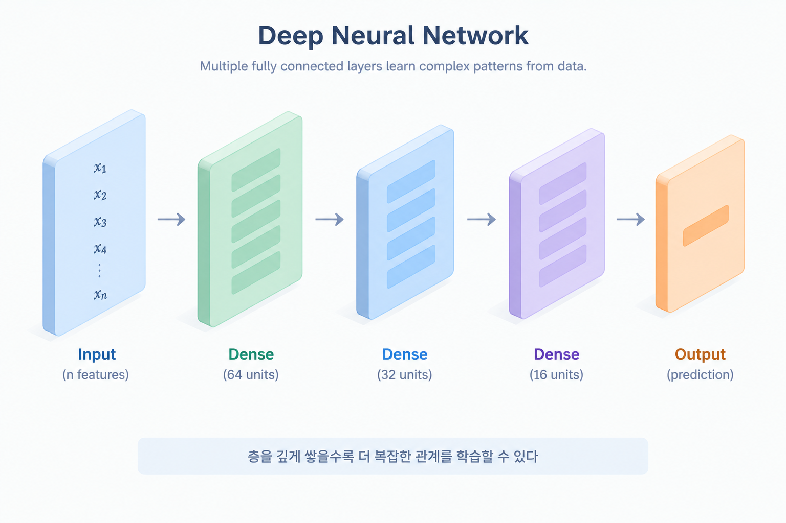
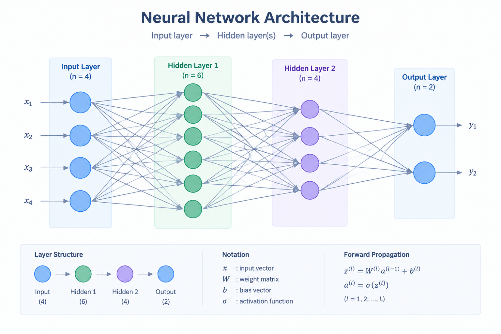
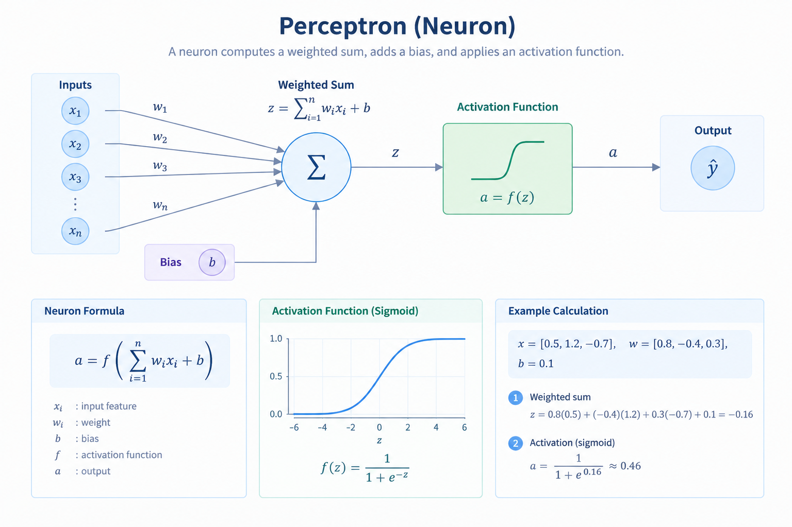
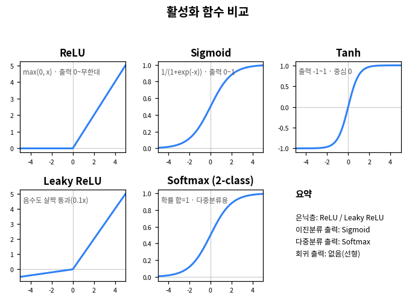
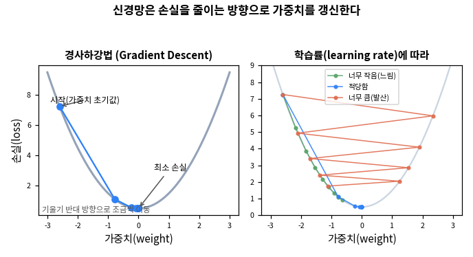
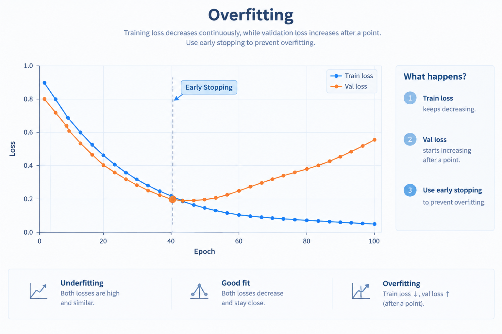

# 7. 딥러닝 — TensorFlow / Keras

Module 6까지는 scikit-learn으로 머신러닝을 다뤘습니다. 이번 모듈에서는 **딥러닝(신경망)** 으로 같은 두 문제 — 회귀(`height_cm` 예측)와 분류(`is_blooming` 예측) — 를 풀어 보고, **6장의 머신러닝 결과와 직접 비교**합니다.

핵심 질문은 하나입니다: **"딥러닝이 항상 더 좋은가?"** 결론부터 말하면 이 데이터에서는 그렇지 않습니다. 그 이유를 개념부터 차근차근 확인합니다.

## 7-1. 딥러닝 기본 개념

::: tip 딥러닝이란?
딥러닝은 **인공신경망(neural network)** 을 여러 층 쌓아 학습하는 머신러닝의 한 갈래입니다. 특히 **층(layer)이 깊은(deep)** 신경망을 쓴다고 해서 '딥'러닝입니다.

Module 6의 모델들이 사람이 정한 구조(선형식, 트리 분할)로 학습했다면, 신경망은 **여러 층의 가중치를 스스로 조정**하며 입력과 출력의 관계를 근사합니다.
:::

### 신경망의 기본 단위 — 뉴런과 층

가장 작은 단위는 **뉴런(퍼셉트론)** 입니다. 뉴런 하나는 이렇게 계산합니다.

1. 각 입력에 **가중치(weight)** 를 곱해 모두 더하고, **편향(bias)** 을 더합니다. (선형 결합)
2. 그 값을 **활성화 함수**에 통과시켜 출력합니다.

이 뉴런을 나란히 모은 것이 **층(layer)** 이고, 층을 여러 개 쌓은 것이 신경망입니다.

- **입력층** — 전처리된 특성이 들어오는 곳
- **은닉층(hidden layer)** — 중간에서 특징을 조합하는 층. 여기가 깊어질수록 '딥'
- **출력층** — 최종 예측. 회귀는 숫자 1개, 이진분류는 확률 1개

### 활성화 함수 — 왜 필요한가

활성화 함수가 없으면 층을 아무리 쌓아도 결국 **하나의 선형식**과 같아져 복잡한 관계를 학습할 수 없습니다. 활성화 함수는 **비선형성**을 넣어 신경망이 곡선 같은 복잡한 패턴도 표현하게 해줍니다.

- **ReLU** — 은닉층에서 가장 많이 씁니다. 음수는 0으로, 양수는 그대로 통과.
- **Leaky ReLU** — ReLU의 변형. 음수 구간을 완전히 0으로 죽이지 않고 살짝(예: 0.1배) 흘려보내, 뉴런이 학습을 멈추는 문제를 완화합니다.
- **Sigmoid** — 출력을 0~1로 눌러, **이진분류의 확률 출력**에 씁니다(4장 로지스틱 곡선과 같은 모양).
- **Tanh** — sigmoid와 비슷하나 출력이 **-1~1**로 중심이 0입니다. 출력이 0을 기준으로 대칭이라 은닉층에서 sigmoid보다 유리할 때가 있습니다.
- **Softmax** — 클래스가 **3개 이상인 다중분류**의 출력층에서, 각 클래스 확률을 합이 1이 되도록 냅니다(이번 모듈은 이진분류라 sigmoid 사용).

::: details 더 깊이 — 어디에 무엇을 쓰나
- **은닉층**: ReLU(기본), 죽는 뉴런이 걱정되면 Leaky ReLU
- **이진분류 출력층**: Sigmoid(확률 1개)
- **다중분류 출력층**: Softmax(확률 여러 개, 합=1)
- **회귀 출력층**: 활성화 없음(선형) — 키(cm) 같은 연속값을 0~1로 누르면 안 되기 때문
:::

### 학습은 어떻게 일어나나

신경망 학습은 "예측이 정답에 가까워지도록 가중치를 조금씩 고치는" 반복입니다.

1. **손실 함수(loss)** — 예측과 정답의 차이를 하나의 숫자로 잰다. 회귀는 **MSE**(평균제곱오차), 이진분류는 **binary crossentropy**.
2. **옵티마이저(optimizer)** — 손실을 줄이는 방향으로 가중치를 갱신한다. 보통 **Adam**.
3. **에폭(epoch)** — 전체 데이터를 한 번 다 학습하는 단위. 여러 에폭 반복.
4. **배치(batch)** — 데이터를 작게 나눠(예: 32개씩) 갱신.

::: details 더 깊이 — 경사하강법과 학습률
손실을 가중치로 미분하면 "손실이 가장 가파르게 증가하는 방향"이 나오는데, 그 **반대 방향**으로 가중치를 조금씩(학습률만큼) 옮기는 것이 **경사하강법**입니다. 학습률이 너무 작으면 수렴이 느리고, 너무 크면 최소점을 지나쳐 **발산**할 수 있습니다(위 오른쪽 그림). Adam은 여기에 관성·적응적 학습률을 더해 더 안정적으로 수렴하게 만든 옵티마이저입니다.
:::

### 과적합과 대응

층·뉴런이 많은 신경망은 표현력이 커서, 훈련 데이터를 **외워버리는 과적합**이 나기 쉽습니다. 이 모듈에서 쓰는 세 가지 안전장치는:

- **검증 데이터(validation)** — 학습 중 별도 데이터로 성능을 지켜봐 과적합 시작을 감지
- **EarlyStopping** — 검증 손실이 더 나아지지 않으면 학습을 자동으로 멈춤
- **Dropout** — 학습 중 일부 뉴런을 무작위로 꺼서 특정 뉴런에 과의존하지 않게 함

### 그래서 딥러닝을 언제 쓰나

딥러닝은 **이미지·음성·자연어**처럼 크고 복잡한 비정형 데이터에서 강력합니다. 반면 **이번 같은 표(tabular) 형태의 소규모 데이터**에서는, 6장에서 본 것처럼 단순한 선형모델이나 트리 기반 모델이 딥러닝만큼(때로는 더) 잘 맞고 학습도 빠릅니다.

::: warning 딥러닝이 항상 정답은 아닙니다
"신경망 = 최신 = 최고"가 아닙니다. 데이터의 크기·형태·관계 구조에 맞는 모델을 고르는 것이 핵심입니다. 이번 모듈에서 회귀·분류 각각을 6장의 머신러닝과 비교하며, **딥러닝이 언제 이점이 있고 언제 없는지**를 실제 수치로 확인합니다.
:::