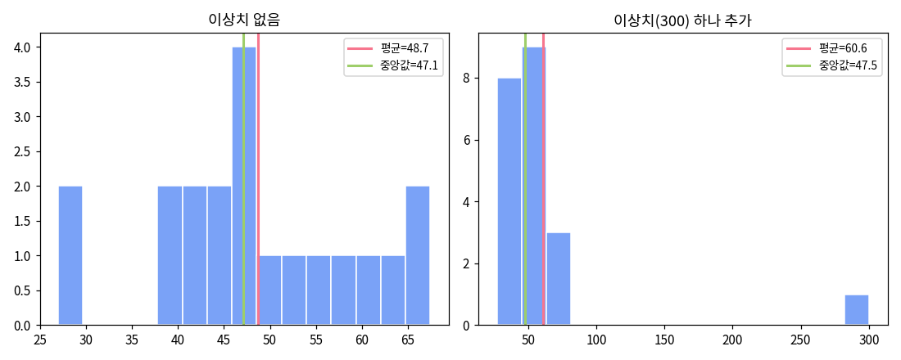
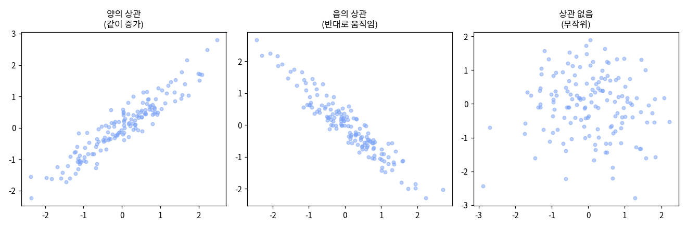

# 통계학 기초 입문

수식보다 비유와 그림으로, "왜 이런 개념이 필요한가"부터 시작합니다. 이 개념들은 이후 [Module 2](/module02)·[Module 4](/module04)에서 그대로 코드로 등장합니다.

## 1. 왜 통계가 필요한가

친구 30명 점수를 하나하나 보는 것보다 "평균 82점" 한마디가 이해가 빠릅니다.

::: tip
통계 = 많은 숫자를 몇 개의 대표값으로 요약해 숨은 패턴을 읽어내는 도구.
:::

## 2. 모집단과 표본

전체(모집단)를 다 조사할 수 없으니 일부(표본)만 뽑아 추정합니다.

::: tip 비유
국이 짠지 알려고 다 마실 필요 없이 한 숟갈(표본)만 떠먹어봐도 됩니다. 단, 잘 섞은 뒤 떠야 정확합니다 — 그게 "무작위 표본"이 중요한 이유입니다.
:::

우리 `plant_growth.csv`의 5,000개체도 "전체 반려식물"을 대표하는 표본입니다.

## 3. 변수의 종류

| 유형 | 뜻 | 예시 |
|---|---|---|
| 수치형 | 크기·순서 의미 있는 숫자 | 키, 나이, height_cm |
| 명목형 | 순서 없는 분류 | 성별, species |
| 순서형 | 순서 있는 분류 | 등급(Bronze<Silver<Gold) |

## 4. 중심 — 평균·중앙값·최빈값

평균은 극단값(이상치)에 쉽게 흔들리고, 중앙값은 거의 안 흔들립니다.

::: tip 비유
친구 9명 재산이 3천만 원인데 재벌 1명(100억)이 끼면 "평균 재산 10억" — 아무도 실제로 안 가진 숫자. 이럴 땐 중앙값이 더 대표적입니다.
:::

## 5. 퍼짐 — 분산·표준편차

평균이 같아도 데이터가 몰려있는지 퍼져있는지가 다릅니다.

::: tip 비유
양궁 선수 둘 다 평균 10점이어도, 한 명은 9~11점(표준편차 작음), 한 명은 5~15점(큼)일 수 있습니다.
:::

## 6. 분포 모양 — 정규분포와 왜도

`plant_growth.csv`의 height_cm도 오른쪽 꼬리(양의 왜도) — 크게 자란 대형 개체 소수 때문입니다.

## 7. 상관관계

+1에 가까우면 강한 양의 상관, 0이면 관계 없음, -1이면 강한 음의 상관.

## 8. 상관관계 ≠ 인과관계

::: warning 가장 흔한 함정
아이스크림 판매량과 익사 사고는 상관이 높지만, 진짜 원인은 "더운 날씨"(교란변수)입니다. 상관만 보고 인과를 단정하지 마세요.
:::

## 9. 가설검정 — 동전 던지기로

동전 10번에 앞면 9번 → "조작 아냐?"가 가설검정의 출발입니다.

1. 귀무가설: "공정하다" (일단 이게 맞다고 가정)
2. 공정하다면 9번 앞면 확률은 매우 낮음 (약 1%) ← 이게 **p-value**
3. p-value가 작으면(보통 5% 미만) 귀무가설 기각 → "조작됐다"

::: tip 비유
법정의 무죄추정. 일단 무죄(귀무가설)로 시작하되, 증거가 "무죄라면 설명 안 되는 수준"이면 유죄로 뒤집습니다.
:::

::: warning
p-value가 작다고 "차이가 크다"는 뜻은 아닙니다. "우연이 아닐 가능성이 높다"는 뜻일 뿐 — 차이의 크기는 효과크기(Module 4)로 따로 봅니다.
:::

## 미니 용어사전

| 용어 | 한 줄 설명 |
|---|---|
| 모집단 / 표본 | 알고 싶은 전체 / 그중 뽑은 일부 |
| 평균·중앙값·최빈값 | 대표값 3형제 |
| 분산·표준편차 | 얼마나 퍼져있는지 |
| IQR | Q3-Q1, 이상치 판단 기준 |
| 왜도 | 좌우로 얼마나 치우쳤는지 |
| 상관계수 | 함께 움직이는 정도(-1~1) |
| 교란변수 | 두 변수 모두에 몰래 영향 주는 제3변수 |
| p-value | 귀무가설 하에서 이 데이터가 나올 확률 |
