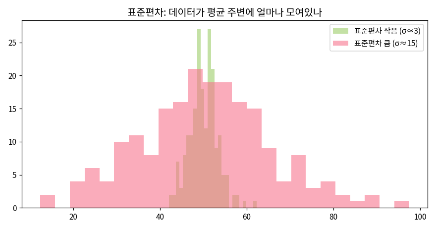
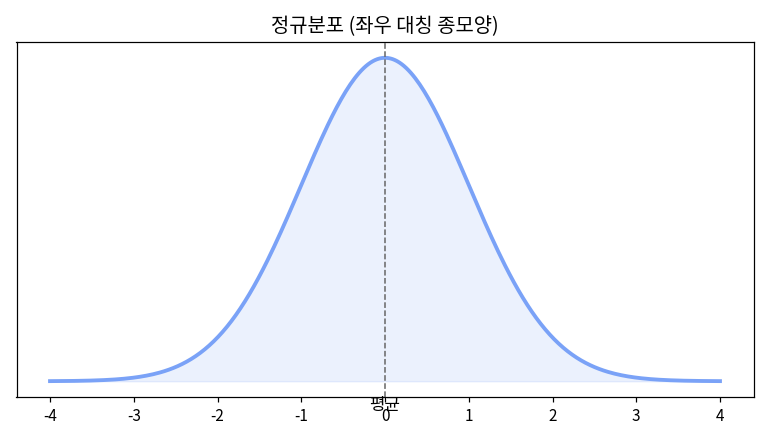
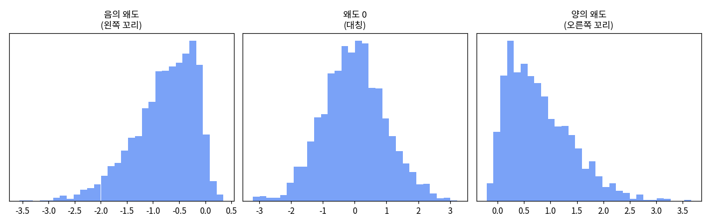
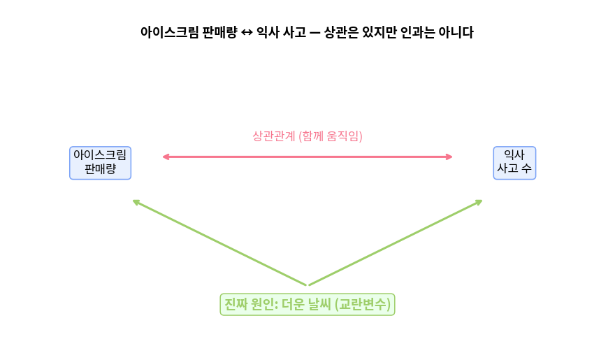

# 통계학 기초 입문

수식보다 비유와 그림으로 통계학을 입문합니다.  
이 페이지에서는 "공식을 외우는 것"보다 "왜 이런 개념이 필요한가"를 먼저 이해합니다.  
여기서 배우는 개념들은 이후 [Module 2](/module02), [Module 4](/module04), [Module 6](/module06)에서 그대로 코드와 머신러닝 개념으로 이어집니다.

우리는 `plant_growth.csv`라는 5,000행의 식물 생장 데이터를 사용합니다.  
각 행은 식물 한 개체를 의미한다고 생각합니다.  
각 열은 식물의 키, 잎 수, 물 주기, 햇빛 조건 같은 특징을 의미한다고 생각합니다.

::: tip 한 문장 요약
통계학은 많은 데이터를 사람이 이해하기 쉬운 몇 개의 숫자와 그림으로 요약해서, 데이터 속 패턴을 찾는 도구입니다.
:::

## 0. 이 페이지에서 배우는 것

이 페이지에서는 다음 질문에 답할 수 있도록 학습합니다.

- 식물 데이터 5,000행을 왜 한 줄씩 전부 읽지 않고 요약해서 보는지 이해합니다.
- 모집단과 표본이 무엇인지 이해합니다.
- 데이터의 열이 수치형인지, 명목형인지, 순서형인지 구분합니다.
- 평균, 중앙값, 최빈값이 각각 언제 유용한지 이해합니다.
- 분산과 표준편차가 "데이터가 얼마나 퍼져 있는지"를 나타낸다는 것을 이해합니다.
- 정규분포와 왜도가 데이터 모양을 설명하는 방법임을 이해합니다.

::: tip 비유
통계학은 어두운 방에서 손전등을 켜는 일과 비슷합니다.  
데이터가 너무 많으면 처음에는 아무것도 안 보이지만, 평균, 표준편차, 그래프 같은 도구를 쓰면 중요한 모양이 보이기 시작합니다.
:::

## 1. 왜 통계가 필요한가

친구 30명의 시험 점수를 하나하나 모두 읽는 것보다 "평균 82점"이라는 한마디가 이해하기 쉽습니다.  
식물 5,000개의 키를 한 줄씩 보는 것보다 "평균 키는 31cm이고, 대부분은 20cm에서 45cm 사이에 있습니다"라고 말하는 편이 훨씬 이해하기 쉽습니다.

즉, 통계는 많은 숫자를 사람이 판단할 수 있는 형태로 줄여주는 역할을 합니다.

::: tip 핵심
통계는 많은 숫자를 몇 개의 대표값과 그림으로 요약해서 숨은 패턴을 읽어내는 도구입니다.
:::

예를 들어 식물 데이터를 볼 때 우리는 다음과 같은 질문을 할 수 있습니다.

- 이 식물들은 보통 얼마나 자랍니다?
- 식물 키는 서로 비슷한가요, 아니면 차이가 큰가요?
- 물을 자주 준 식물이 더 잘 자라는 경향이 있나요?
- 햇빛을 많이 받은 식물의 잎 수가 더 많은가요?
- 어떤 식물은 왜 유난히 크게 자랐나요?

이 질문에 답하려면 데이터를 요약하고 비교해야 합니다.  
이때 사용하는 언어가 통계입니다.

::: tip 비유
통계는 데이터의 "요약 보고서"를 만드는 일과 비슷합니다.  
5,000장의 관찰 일지를 모두 읽기 전에, 먼저 한 장짜리 요약 보고서를 보면 전체 분위기를 빠르게 파악할 수 있습니다.
:::

## 2. 모집단과 표본

통계에서 가장 먼저 알아야 할 개념은 모집단과 표본입니다.

| 용어 | 쉬운 뜻 | 식물 데이터 예시 |
|---|---|---|
| 모집단 | 우리가 정말 알고 싶은 전체 대상입니다 | 세상에 있는 모든 반려식물입니다 |
| 표본 | 전체 중에서 실제로 관찰한 일부입니다 | `plant_growth.csv`의 5,000개 식물입니다 |

모집단은 우리가 궁금해하는 전체입니다.  
하지만 전체를 모두 조사하는 것은 현실적으로 어렵습니다.  
그래서 전체 중 일부를 뽑아서 조사합니다.  
이 일부가 표본입니다.

::: tip 비유
국이 짠지 확인하려고 냄비에 있는 국을 전부 마실 필요는 없습니다.  
잘 섞은 뒤 한 숟갈만 떠먹어도 전체 맛을 어느 정도 알 수 있습니다.  
여기서 냄비 전체의 국은 모집단이고, 한 숟갈은 표본입니다.
:::

하지만 중요한 조건이 있습니다.  
한 숟갈을 뜨기 전에 국이 잘 섞여 있어야 합니다.  
만약 소금이 바닥에 몰려 있는데 위쪽만 떠먹으면 싱겁다고 잘못 판단할 수 있습니다.

데이터도 마찬가지입니다.  
표본이 한쪽으로 치우치면 전체를 잘 대표하지 못합니다.  
이런 문제를 표본 편향이라고 합니다.

::: warning 표본 편향
표본 편향은 뽑힌 데이터가 전체를 공정하게 대표하지 못하는 상태를 말합니다.  
예를 들어 햇빛이 많은 온실 식물만 조사하고 "모든 반려식물은 잘 자랍니다"라고 말하면 잘못된 결론이 될 수 있습니다.
:::

그래서 통계에서는 무작위 표본이 중요합니다.  
무작위 표본은 특정 대상만 골라 뽑지 않고, 가능한 한 공정하게 뽑은 표본을 의미합니다.

::: tip 쉬운 설명
무작위 표본은 "마음에 드는 것만 고르는 방식"이 아니라 "제비뽑기처럼 공정하게 고르는 방식"입니다.
:::

우리의 `plant_growth.csv` 5,000행은 현실의 모든 식물을 완벽하게 담은 데이터는 아닙니다.  
하지만 데이터 분석을 연습할 때는 전체 반려식물을 이해하기 위한 표본처럼 사용합니다.  
이후 우리는 이 표본을 통해 식물 생장에 대한 패턴을 추정합니다.

## 3. 변수의 종류

데이터프레임에서 열 하나하나를 변수라고 합니다.  
변수는 관찰하고 싶은 특징을 담은 값입니다.  
예를 들어 식물 데이터에서 `height_cm`, `leaf_count`, `species`, `sunlight_level` 같은 열이 변수입니다.

변수는 크게 수치형, 명목형, 순서형으로 나눌 수 있습니다.  
변수의 종류를 구분해야 하는 이유는 종류에 따라 분석 방법과 그래프가 달라지기 때문입니다.

| 유형 | 쉬운 뜻 | 예시 | 자주 쓰는 분석 방법 |
|---|---|---|---|
| 수치형 | 더하기, 평균 계산이 의미 있는 숫자입니다 | 키, 나이, `height_cm`, `leaf_count` | 평균, 중앙값, 표준편차를 사용합니다 |
| 명목형 | 이름표처럼 구분만 하는 분류입니다 | 성별, 품종, `species`, 화분 종류 | 개수 세기, 비율 계산을 사용합니다 |
| 순서형 | 순서는 있지만 간격이 정확하지 않은 분류입니다 | 만족도, 등급, `sunlight_level` | 순서 비교, 그룹별 비교를 사용합니다 |

### 수치형 변수

수치형 변수는 숫자로 되어 있고 크기 비교와 계산이 의미 있는 변수입니다.  
예를 들어 `height_cm`가 40이고 20이면, 40cm 식물이 20cm 식물보다 두 배 더 큽니다.  
이런 변수는 평균이나 표준편차를 계산할 수 있습니다.

::: tip 예시
`height_cm`, `leaf_count`, `water_ml`, `growth_days`는 수치형 변수로 볼 수 있습니다.
:::

### 명목형 변수

명목형 변수는 순서가 없는 이름표입니다.  
예를 들어 `species`가 "Monstera", "Basil", "Rosemary"라면 이것은 품종을 구분하는 이름입니다.  
어떤 품종이 더 크거나 더 작다고 이름만으로 판단할 수는 없습니다.

::: tip 쉬운 설명
명목형 변수는 축구 유니폼 번호와 비슷합니다.  
등번호 10번이 7번보다 숫자는 크지만, 선수의 실력이 더 높다는 뜻은 아닙니다.
:::

### 순서형 변수

순서형 변수는 순서가 있는 분류입니다.  
예를 들어 햇빛 조건이 "Low", "Medium", "High"라면 High가 Medium보다 햇빛이 많다고 볼 수 있습니다.  
하지만 Low에서 Medium으로 갈 때의 차이와 Medium에서 High로 갈 때의 차이가 정확히 같다고 말하기는 어렵습니다.

::: tip 쉬운 설명
순서형 변수는 매운맛 단계와 비슷합니다.  
1단계보다 3단계가 더 맵다는 것은 알 수 있지만, 정확히 세 배 맵다고 말하기는 어렵습니다.
:::

::: warning 초보자가 자주 헷갈리는 부분
숫자로 적혀 있다고 항상 수치형 변수는 아닙니다.  
예를 들어 품종을 1, 2, 3으로 저장했다면 이 숫자는 계산용 숫자가 아니라 이름표입니다.  
이 경우에는 명목형 변수로 봐야 합니다.
:::

## 4. 중심 — 평균·중앙값·최빈값

데이터의 중심을 알고 싶을 때 대표값을 사용합니다.  
대표값은 데이터를 대표하는 하나의 값입니다.  
가장 많이 사용하는 대표값은 평균, 중앙값, 최빈값입니다.

| 대표값 | 쉬운 뜻 | 언제 유용한가요 |
|---|---|---|
| 평균 | 모든 값을 더한 뒤 개수로 나눈 값입니다 | 데이터가 대체로 고르게 퍼져 있을 때 유용합니다 |
| 중앙값 | 데이터를 크기순으로 정렬했을 때 가운데 값입니다 | 극단적으로 큰 값이나 작은 값이 있을 때 유용합니다 |
| 최빈값 | 가장 자주 등장하는 값입니다 | 카테고리 데이터에서 가장 흔한 값을 찾을 때 유용합니다 |

## 4-1. 평균

평균은 우리가 가장 익숙하게 사용하는 대표값입니다.  
식물 5개의 키가 20cm, 22cm, 23cm, 25cm, 30cm라면 평균은 전체적인 키 수준을 잘 보여줍니다.

하지만 평균은 이상치에 약합니다.  
이상치는 다른 값들과 비교했을 때 유난히 크거나 작은 값을 말합니다.

::: tip 쉬운 설명
이상치는 줄을 맞춰 서 있는 사람들 사이에 갑자기 키 3m인 사람이 나타난 것과 비슷합니다.  
그 한 명 때문에 전체 평균 키가 갑자기 올라갈 수 있습니다.
:::

## 4-2. 중앙값

중앙값은 값을 크기순으로 정렬했을 때 가운데에 있는 값입니다.  
중앙값은 극단값의 영향을 평균보다 덜 받습니다.

예를 들어 식물 대부분은 20cm에서 40cm 사이인데, 한 식물만 200cm까지 자랐다면 평균은 크게 올라갑니다.  
하지만 중앙값은 거의 흔들리지 않습니다.

::: tip 비유
친구 9명의 재산이 각각 3천만 원인데 재벌 1명이 100억 원을 가지고 있다고 가정합니다.  
이때 평균 재산은 매우 커지지만, 대부분의 친구가 실제로 가진 재산과는 거리가 멉니다.  
이럴 때는 가운데 사람의 재산인 중앙값이 더 현실적인 대표값이 됩니다.
:::

## 4-3. 최빈값

최빈값은 가장 자주 등장하는 값입니다.  
수치형 데이터에서도 사용할 수 있지만, 특히 명목형 데이터에서 유용합니다.

예를 들어 `species` 열에서 "Basil"이 가장 많이 등장한다면 최빈값은 "Basil"입니다.  
이 말은 데이터에서 가장 흔한 식물 품종이 Basil이라는 뜻입니다.

::: tip 쉬운 설명
최빈값은 반에서 가장 많은 학생이 고른 급식 메뉴를 찾는 것과 비슷합니다.  
평균 메뉴라는 말은 이상하지만, 가장 많이 고른 메뉴는 의미가 있습니다.
:::

::: tip 대표값 선택 기준
데이터가 대체로 고르게 퍼져 있으면 평균을 사용합니다.  
극단적으로 큰 값이나 작은 값이 있으면 중앙값을 함께 확인합니다.  
가장 흔한 분류를 알고 싶으면 최빈값을 사용합니다.
:::

## 5. 퍼짐 — 분산·표준편차

평균만으로는 데이터의 전체 모습을 알 수 없습니다.  
평균이 같아도 데이터가 평균 근처에 모여 있는지, 넓게 흩어져 있는지는 다를 수 있습니다.  
이때 사용하는 개념이 퍼짐입니다.

::: tip 비유
두 양궁 선수가 모두 평균 10점을 맞힌다고 가정합니다.  
A 선수는 항상 9점, 10점, 11점 근처를 맞힙니다.  
B 선수는 어떤 날은 5점, 어떤 날은 15점처럼 크게 흔들립니다.  
둘의 평균은 같아도 안정성은 완전히 다릅니다.
:::

퍼짐을 숫자로 표현하는 대표적인 방법이 분산과 표준편차입니다.

| 용어 | 쉬운 뜻 | 해석 |
|---|---|---|
| 분산 | 값들이 평균에서 얼마나 떨어져 있는지를 제곱해서 평균낸 값입니다 | 퍼짐을 계산하기 위한 기본 값입니다 |
| 표준편차 | 분산에 루트를 씌워 원래 단위로 되돌린 값입니다 | 실제 데이터 단위로 퍼짐을 이해할 때 유용합니다 |

분산은 평균에서 얼마나 떨어져 있는지를 계산합니다.  
하지만 차이를 제곱해서 계산하기 때문에 단위가 직관적이지 않을 수 있습니다.  
예를 들어 키의 단위가 cm라면 분산의 단위는 cm²처럼 느껴집니다.  
그래서 실제 해석에서는 표준편차를 더 자주 사용합니다.

표준편차는 데이터가 평균 주변에서 보통 얼마나 흔들리는지를 보여줍니다.  
식물 키의 평균이 30cm이고 표준편차가 3cm라면 많은 식물이 대략 27cm에서 33cm 근처에 있다고 이해할 수 있습니다.  
반대로 표준편차가 15cm라면 식물 키 차이가 꽤 크다고 이해할 수 있습니다.

::: tip 쉬운 설명
표준편차가 작으면 데이터가 평균 근처에 모여 있습니다.  
표준편차가 크면 데이터가 평균에서 멀리 퍼져 있습니다.
:::

::: warning 평균만 보면 놓치는 것
두 식물 그룹의 평균 키가 모두 30cm라고 해도, 한 그룹은 대부분 28cm에서 32cm 사이일 수 있습니다.  
다른 그룹은 10cm부터 60cm까지 넓게 퍼져 있을 수 있습니다.  
그래서 평균과 표준편차를 함께 봐야 합니다.
:::

## 6. 분포 모양 — 정규분포와 왜도

평균과 표준편차를 알면 데이터의 중심과 퍼짐을 이해할 수 있습니다.  
하지만 그것만으로는 데이터가 어떤 모양으로 퍼져 있는지까지는 알기 어렵습니다.  
이때 데이터의 전체적인 모양을 분포라고 합니다.

::: tip 쉬운 설명
분포는 데이터가 어디에 많이 모여 있고, 어디에 적게 있는지를 보여주는 모양입니다.  
식물 키 데이터를 예로 들면, 20cm 식물이 많은지, 40cm 식물이 많은지, 아주 큰 식물이 드문지 확인하는 일입니다.
:::

::: tip 비유
분포는 사람들이 줄을 서 있는 모습을 위에서 내려다보는 것과 비슷합니다.  
어떤 줄은 가운데에 사람이 많이 몰려 있고 양쪽 끝으로 갈수록 사람이 줄어듭니다.  
어떤 줄은 왼쪽에 사람이 몰려 있고 오른쪽으로 길게 늘어져 있습니다.  
데이터도 이런 식으로 모양을 가집니다.
:::

### 6-1. 정규분포

정규분포는 가운데가 가장 높고 양쪽으로 갈수록 낮아지는 종 모양의 분포입니다.  
영어로는 Normal Distribution이라고 합니다.  
여기서 Normal은 "정상"이라는 뜻보다는 "자주 나타나는 자연스러운 모양"이라는 뜻에 가깝습니다.

정규분포에서는 평균 근처의 값이 가장 많이 나타납니다.  
평균에서 멀어질수록 값은 점점 적게 나타납니다.

식물 키를 예로 들면 다음과 같이 생각할 수 있습니다.

- 평균 키가 30cm인 식물 데이터가 있습니다.
- 28cm, 29cm, 30cm, 31cm, 32cm 식물이 많이 있습니다.
- 10cm처럼 아주 작은 식물은 적게 있습니다.
- 60cm처럼 아주 큰 식물도 적게 있습니다.

이런 모양이면 정규분포에 가까운 데이터라고 볼 수 있습니다.

::: tip 쉬운 설명
정규분포는 "대부분은 평균 근처에 있고, 아주 작거나 아주 큰 값은 드문 모양"입니다.
:::

정규분포가 중요한 이유는 많은 통계 방법이 정규분포를 기본 가정으로 사용하기 때문입니다.  
가정은 어떤 분석을 시작할 때 "일단 이런 조건이라고 생각합니다"라는 전제입니다.  
예를 들어 Module 4에서 배우는 여러 통계 검정은 데이터가 정규분포에 가까운지 확인하는 과정과 연결됩니다.

::: warning 주의합니다
정규분포는 데이터가 반드시 따라야 하는 법칙이 아닙니다.  
현실 데이터는 정규분포와 다를 수 있습니다.  
그래서 그래프를 그려서 실제 모양을 확인해야 합니다.
:::

### 6-2. 꼬리

분포 그림에서 양쪽 끝부분을 꼬리라고 부릅니다.  
꼬리는 평균에서 멀리 떨어진 값들이 있는 부분입니다.

식물 키 데이터에서 대부분 식물이 20cm에서 40cm 사이에 있는데, 80cm나 100cm 식물이 조금 있다면 오른쪽 끝에 꼬리가 생깁니다.  
반대로 대부분 식물이 30cm 이상인데, 5cm나 10cm 식물이 조금 있다면 왼쪽 끝에 꼬리가 생깁니다.

::: tip 비유
꼬리는 줄 맨 끝에 드물게 서 있는 사람들과 비슷합니다.  
대부분의 사람은 가운데에 모여 있지만, 몇몇 사람은 아주 멀리 떨어져 서 있을 수 있습니다.
:::

### 6-3. 왜도

왜도는 분포가 좌우로 얼마나 치우쳐 있는지를 나타내는 값입니다.  
쉽게 말해 왜도는 데이터의 꼬리가 어느 쪽으로 길게 늘어져 있는지 보는 개념입니다.

| 왜도 종류 | 쉬운 설명 | 식물 데이터 예시 |
|---|---|---|
| 왜도 0에 가까움 | 좌우가 비슷한 모양입니다 | 평균 근처 식물이 많고 아주 작거나 큰 식물이 비슷하게 적습니다 |
| 양의 왜도 | 오른쪽 꼬리가 긴 모양입니다 | 대부분은 작거나 보통 크기이지만, 아주 크게 자란 식물이 조금 있습니다 |
| 음의 왜도 | 왼쪽 꼬리가 긴 모양입니다 | 대부분은 크게 자랐지만, 거의 자라지 못한 식물이 조금 있습니다 |

### 6-4. 양의 왜도

양의 왜도는 오른쪽 꼬리가 긴 분포입니다.  
오른쪽은 값이 큰 방향입니다.  
따라서 양의 왜도는 아주 큰 값이 일부 존재해서 오른쪽으로 길게 늘어진 모양을 의미합니다.

`plant_growth.csv`의 `height_cm`도 오른쪽 꼬리, 즉 양의 왜도를 가질 수 있습니다.  
대부분의 식물은 보통 키를 가지지만, 조건이 아주 좋았던 일부 식물이 유난히 크게 자랄 수 있기 때문입니다.

예를 들어 대부분 식물이 20cm에서 40cm 사이인데, 몇몇 식물이 80cm 이상까지 자랐다면 평균이 오른쪽으로 끌려갑니다.  
이 경우 평균은 중앙값보다 커질 가능성이 높습니다.

::: tip 쉬운 설명
양의 왜도에서는 소수의 큰 값이 평균을 위로 끌어올립니다.  
그래서 평균만 보면 일반적인 식물보다 더 크게 자란 것처럼 오해할 수 있습니다.
:::

### 6-5. 음의 왜도

음의 왜도는 왼쪽 꼬리가 긴 분포입니다.  
왼쪽은 값이 작은 방향입니다.  
따라서 음의 왜도는 아주 작은 값이 일부 존재해서 왼쪽으로 길게 늘어진 모양을 의미합니다.

식물 데이터를 예로 들면 대부분 식물이 30cm 이상 잘 자랐지만, 병충해나 물 부족 때문에 몇몇 식물이 5cm 정도밖에 자라지 못한 경우를 생각할 수 있습니다.  
이 경우 작은 값들이 평균을 아래로 끌어내릴 수 있습니다.  
그래서 평균은 중앙값보다 작아질 가능성이 높습니다.

::: tip 쉬운 설명
음의 왜도에서는 소수의 작은 값이 평균을 아래로 끌어내립니다.  
그래서 평균만 보면 전체 식물이 실제보다 덜 자란 것처럼 보일 수 있습니다.
:::

### 6-6. 평균과 중앙값으로 왜도 감 잡기

왜도는 그래프를 보면 가장 이해하기 쉽습니다.  
하지만 평균과 중앙값을 비교해도 대략적인 방향을 짐작할 수 있습니다.

| 분포 모양 | 평균과 중앙값 관계 | 해석 |
|---|---|---|
| 좌우가 비슷함 | 평균과 중앙값이 비슷합니다 | 정규분포에 가까울 수 있습니다 |
| 오른쪽 꼬리가 김 | 평균이 중앙값보다 큰 경우가 많습니다 | 양의 왜도일 수 있습니다 |
| 왼쪽 꼬리가 김 | 평균이 중앙값보다 작은 경우가 많습니다 | 음의 왜도일 수 있습니다 |

예를 들어 `height_cm`의 평균이 34cm이고 중앙값이 29cm라면, 일부 큰 식물이 평균을 끌어올렸을 가능성이 있습니다.  
이 경우 히스토그램을 그려서 오른쪽 꼬리가 긴지 확인합니다.

::: tip 쉬운 설명
평균은 극단값에 잘 끌려갑니다.  
중앙값은 극단값에 덜 흔들립니다.  
그래서 평균과 중앙값이 많이 다르면 분포가 한쪽으로 치우쳤는지 의심합니다.
:::

### 6-7. 왜 분포 모양을 확인해야 할까요

분포 모양을 확인해야 하는 이유는 분석 방법 선택에 영향을 주기 때문입니다.  
데이터가 정규분포에 가까우면 평균과 표준편차로 설명하기 좋습니다.  
하지만 왜도가 크면 평균만으로 대표하기 어렵습니다.  
이럴 때는 중앙값, 사분위수, 박스플롯을 함께 확인하는 것이 좋습니다.

사분위수는 데이터를 작은 값부터 큰 값까지 정렬한 뒤 4등분한 기준값입니다.  
박스플롯은 중앙값, 사분위수, 이상치를 한눈에 보여주는 그래프입니다.  
이상치는 다른 값들과 비교했을 때 유난히 크거나 작은 값입니다.

::: tip 식물 데이터에서의 해석
`height_cm`가 정규분포에 가까우면 "평균 키 30cm, 표준편차 5cm"처럼 설명하기 좋습니다.  
`height_cm`가 양의 왜도를 가지면 "대부분은 30cm 이하이지만, 일부 대형 개체가 평균을 올립니다"처럼 설명하는 것이 더 정확합니다.
:::

::: warning 초보자가 자주 하는 실수
분포가 심하게 치우쳐 있는데 평균만 보고 결론을 내리면 오해할 수 있습니다.  
예를 들어 평균 키가 40cm라고 해서 대부분의 식물이 40cm 근처에 있다고 단정하면 안 됩니다.  
소수의 매우 큰 식물이 평균을 올렸을 수 있습니다.
:::

### 6-8. 이 섹션의 핵심 정리

- 분포는 데이터가 어떤 모양으로 퍼져 있는지 보여줍니다.
- 정규분포는 가운데가 높고 양쪽으로 갈수록 낮아지는 종 모양입니다.
- 꼬리는 평균에서 멀리 떨어진 값들이 있는 부분입니다.
- 왜도는 분포가 좌우로 얼마나 치우쳤는지를 나타냅니다.
- 양의 왜도는 오른쪽 꼬리가 긴 모양입니다.
- 음의 왜도는 왼쪽 꼬리가 긴 모양입니다.
- 왜도가 크면 평균만 보지 말고 중앙값과 그래프를 함께 확인해야 합니다.

## 7. 상관관계

+1에 가까우면 강한 양의 상관, 0이면 관계 없음, -1이면 강한 음의 상관.

## 8. 상관관계 ≠ 인과관계

::: warning 가장 흔한 함정
아이스크림 판매량과 익사 사고는 상관이 높지만, 진짜 원인은 "더운 날씨"(교란변수)입니다. 상관만 보고 인과를 단정하지 마세요.
:::

## 9. 가설검정 — 동전 던지기로

동전 10번에 앞면 9번 → "조작 아냐?"가 가설검정의 출발입니다.

1. 귀무가설: "공정하다" (일단 이게 맞다고 가정)
2. 공정하다면 9번 앞면 확률은 매우 낮음 (약 1%) ← 이게 **p-value**
3. p-value가 작으면(보통 5% 미만) 귀무가설 기각 → "조작됐다"

::: tip 비유
법정의 무죄추정. 일단 무죄(귀무가설)로 시작하되, 증거가 "무죄라면 설명 안 되는 수준"이면 유죄로 뒤집습니다.
:::

::: warning
p-value가 작다고 "차이가 크다"는 뜻은 아닙니다. "우연이 아닐 가능성이 높다"는 뜻일 뿐 — 차이의 크기는 효과크기(Module 4)로 따로 봅니다.
:::

## 미니 용어사전

| 용어 | 한 줄 설명 |
|---|---|
| 모집단 / 표본 | 알고 싶은 전체 / 그중 뽑은 일부 |
| 평균·중앙값·최빈값 | 대표값 3형제 |
| 분산·표준편차 | 얼마나 퍼져있는지 |
| IQR | Q3-Q1, 이상치 판단 기준 |
| 왜도 | 좌우로 얼마나 치우쳤는지 |
| 상관계수 | 함께 움직이는 정도(-1~1) |
| 교란변수 | 두 변수 모두에 몰래 영향 주는 제3변수 |
| p-value | 귀무가설 하에서 이 데이터가 나올 확률 |
